# Lab 1: Using GitHub Copilot to Build and Improve Automated Tests for a Java REST API

### Estimated Duration: 90 Minutes

## Overview

This Lab helps developers learn how to **use GitHub Copilot effectively and responsibly** while working with an existing Java Spring Boot application. Rather than generating code blindly, learners will practice using Copilot to understand unfamiliar APIs, create unit tests across multiple layers, extend functionality, and improve test quality - while retaining full developer judgment and control.

## Objectives

In this Lab, you will complete the following tasks:

   - Task 0: Activate and Configure GitHub Copilot Subscription
   - Task 1: Understand the API
   - Task 2: Create Repository Layer Unit Tests
   - Task 3: Create Service Layer Unit Tests
   - Task 4: Create Controller Layer Unit Tests
   - Task 5: Add a New API Operation

**Prerequisites**

Before starting this Lab, ensure the following are installed and configured:

- Visual Studio Code (or another Copilot-supported IDE)

- GitHub Copilot extension (authenticated)

- Java Development Kit (JDK) 17 or higher

- Apache Maven

- GitHub account with Copilot access

**Lab Environment**

- Operating System: Any

- Programming Language: Java

- Framework: Spring Boot

- Build Tool: Maven

- Testing Libraries: JUnit, Mockito

### Task 0: Activate and Configure GitHub Copilot Subscription

In this task, you will activate GitHub Copilot and configure it within Visual Studio Code to enable AI-assisted software development. You will sign in with your GitHub account, authenticate your access, and install the GitHub Copilot Chat extension in VS Code.

**If you still do not have an active Copilot license, a 30-day trial can be requested with the following steps. Make sure to cancel your license before the trial ends to avoid getting billed**.

> **Note:** This task is intended only for users who have not yet activated or configured GitHub Copilot. If your setup is already complete, you may skip these steps.

1. Open a new tab in your browser and navigate to the GitHub Copilot sign-up page: `https://github.com/github-copilot/signup`

1. Click on the **"Get access to GitHub Copilot"** button.

   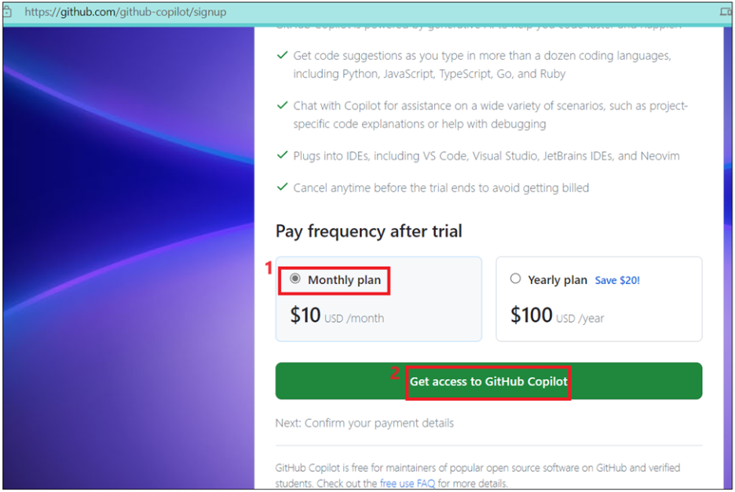

1. Enter billing information with your personal credit card and then click on **Save**.

   

1. Enter your billing information and then click on the **Save payment information** button.

   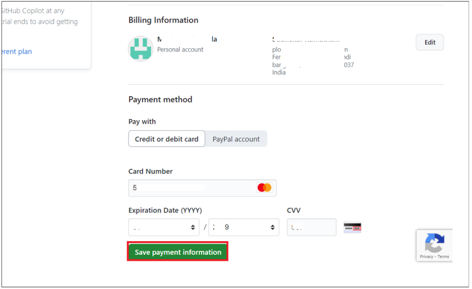

   > **IMPORTANT:** Make sure to deactivate the account after you complete the labs to avoid billing for usage.

1. Open **Visual Studio Code** from the Windows Start menu. Click on **Accounts → Backup and Sync Settings** and select **Sign in**.

   

1. Select the **Sign in with GitHub** option.

   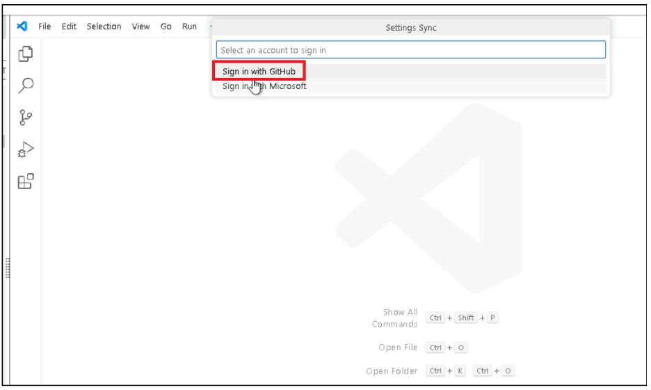

1. Select the browser option and sign in with your Copilot-enabled GitHub account.

   

   

1. Complete two-factor authentication by entering the verification code sent to your registered email or authenticator app.

   

1. When prompted in the browser, click **Open Visual Studio Code** to return to the editor.

   

1. In VS Code, click the **Extensions** icon in the left navigation bar. Search for `GitHub Copilot Chat`, select the extension from the results, and click **Install**.

   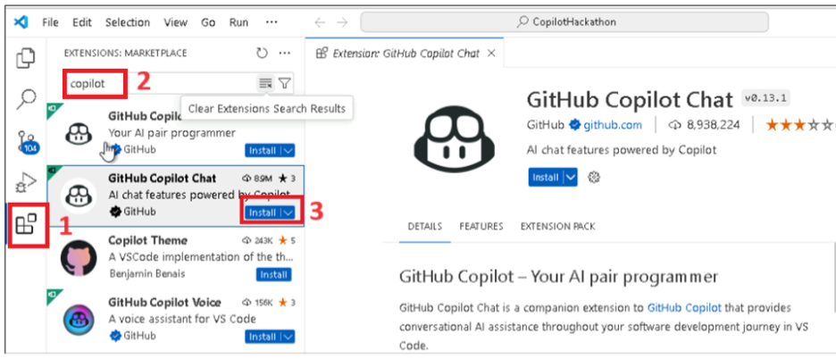

### Task 1: Understand the API

In this task, you will learn what the application does before writing any tests. This task focuses on using **GitHub Copilot as a comprehension assistant** to analyze an existing REST API, identify endpoints, and document expected behavior.

1. Open **Visual Studio Code** from the desktop.

1. Sign in to GitHub via GitHub Enterprise:

   1. In VS Code, click the **Accounts** icon at the bottom-left of the Activity Bar.

   1. Click **Sign in with GitHub** (or **Sign in to GitHub Enterprise**).

   1. In the browser window that opens, sign in using the **GitHub Enterprise** credentials provided in the **Environment Details** tab of your lab guide:

      - **GitHub Enterprise URL:** `https://github.com`
      - **Username:** <inject key="GitHubUsername"></inject>
      - **Password:** <inject key="GitHubPassword"></inject>

   1. If prompted for **two-factor authentication**, check your registered email or authenticator app and enter the code.

   1. Click **Authorize Visual-Studio-Code** when prompted to grant VS Code access to your GitHub account.

   1. Return to VS Code - you should see your GitHub username appear in the **Accounts** section at the bottom-left, confirming successful authentication.

      > **Note:** If you already see your GitHub username in VS Code's Accounts menu, you are already signed in and can skip the sign-in steps above.

1. In VS Code, go to **File → Open Folder**, navigate to `C:\Labfiles`, and select the **github-copilot-workshops-labs-java** folder.

   > **Note:** The lab files have already been extracted to `C:\Labfiles` by the lab setup script - no manual extraction is required.

   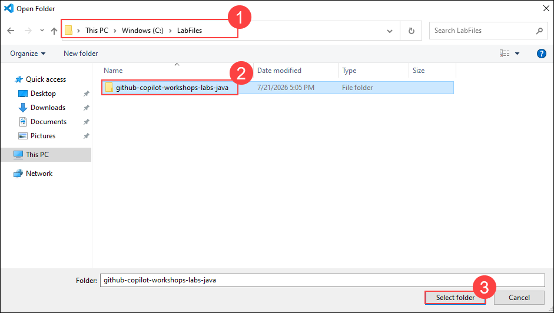

1. In the Explorer panel, navigate to and open the following file:

   `lab-01-testing → java → src → main → java → controller → EmployeeController.java`

   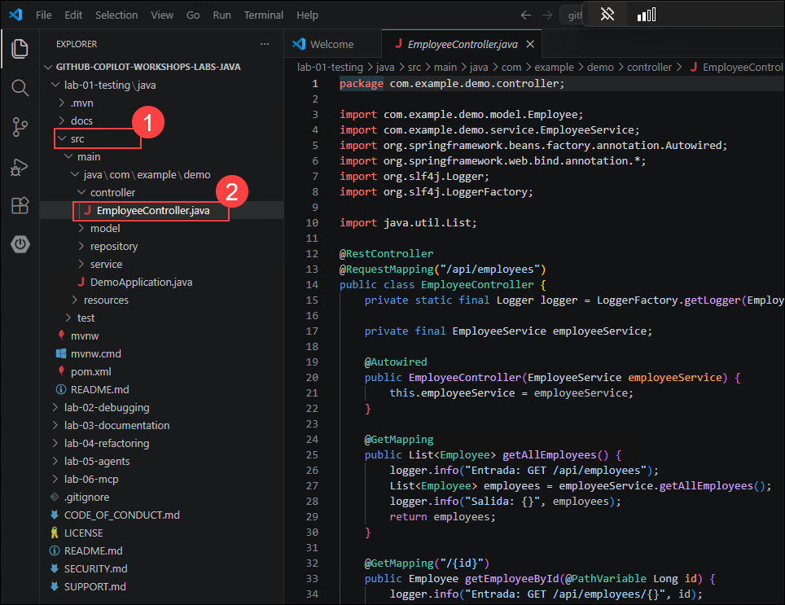

1. Read through the controller annotations (e.g., `@RestController`, `@RequestMapping`, `@GetMapping`) and identify the following for each endpoint:

   - **Base URL** — the common path prefix shared by all endpoints in this controller
   - **HTTP methods** — the operation type (GET, POST, PUT, DELETE) for each endpoint
   - **Request Body** — the JSON data sent by the client to the server (where applicable)
   - **Response** — the data the API returns to the client

     

1. Based on your review, the controller exposes the following API:

   **Base URL:** `/api/employees`

   | **HTTP Method** | **Purpose** | **Endpoint** |
   |--|--|--|
   | GET | Retrieve all employees | /api/employees |
   | GET | Retrieve one employee by ID | /api/employees/{id} |
   | POST | Create a new employee | /api/employees |
   | PUT | Update an existing employee | /api/employees/{id} |
   | DELETE | Delete an employee | /api/employees/{id} |

   Key method signatures:
   - **Get all:** `public List<Employee> getAllEmployees()` — `@GetMapping`
   - **Create:** `public Employee createEmployee(@RequestBody Employee employee)` — `@PostMapping`

1. Select the entire contents of **EmployeeController.java**. Open **Copilot Chat**, ensure **Ask** mode is selected with the **Claude Sonnet 4.5** model, and enter the following prompt:

   ```
   Explain this Spring Boot REST controller
   Identify:
   - Base URL
   - All endpoints
   - HTTP methods
   - Request bodies
   - Response payloads
   Explain it as if I am preparing to write tests.
   ```

   

1. Copilot will return a structured explanation of the API. Read and evaluate the response. It should include information similar to the following:

   - **Base URL:** Employee Model (Request/Response shape) - All endpoints consume and produce Employee objects serialized as JSON

      | **Field** | **Type** | **Notes** |
      |--|--|--|
      | id | Long | Auto-generated (DB identity), not sent on create |
      | name | string | Required for meaningful data |
      | Surname | String | Required for meaningful data |
      | email | String | Required for meaningful data |

   - **Get All Employees**

      | **Method** | **GET** |
      |--|--|
      | URL | /api/employees |
      | Request body | None |
      | Response | 200 OK + JSON array of Employee objects (empty array [] if none exist) |

   - Similarly prepare for all other endpoints as shown in the image.

     

1. Now you will use Copilot **Agent mode** to automatically generate and create an `api-docs.md` file documenting all endpoints with curl commands and expected behavior.

   1. In the Copilot Chat panel, switch the mode dropdown to **Agent**.

   1. Type the following prompt and press **Enter**:

      ```
      Using the EmployeeController.java file in this project, create a new file called api-docs.md in the lab-01-testing/java folder.

      For each endpoint in the controller, document:
      1. The HTTP method and endpoint URL
      2. A sample curl command showing the full HTTP request with example data
      3. The expected HTTP response code
      4. A brief description of what the endpoint does

      Format the file as clean Markdown with a heading for each endpoint.
      ```

      

   1. Agent mode will analyze `EmployeeController.java`, generate the documentation, and **automatically create the `api-docs.md` file** in your project. You will see it appear in the Explorer panel on the left.

      

   1. Once Agent mode finishes, click **Keep** to accept the created file. Open `api-docs.md` from the Explorer to verify it contains documentation for all 5 endpoints: GET all, GET by ID, POST (create), PUT (update), and DELETE.

      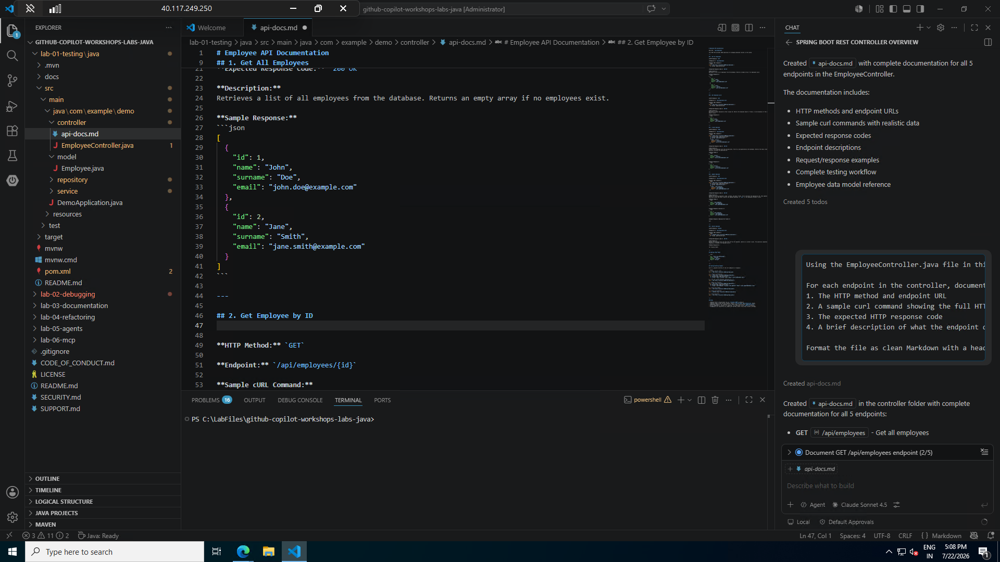

   > **Note:** Agent mode creates the file for you - no manual copy-pasting needed. If the file appears in the wrong location, you can drag it to the correct folder in Explorer.

### Task 2: Create Repository Layer Unit Tests

The repository layer is responsible for data persistence. This task focuses on testing data access logic in isolation, without involving business logic or REST endpoints.

1. Navigate to `src/test/java/com/example/demo` and create the file `EmployeeRepositoryTest.java`.

   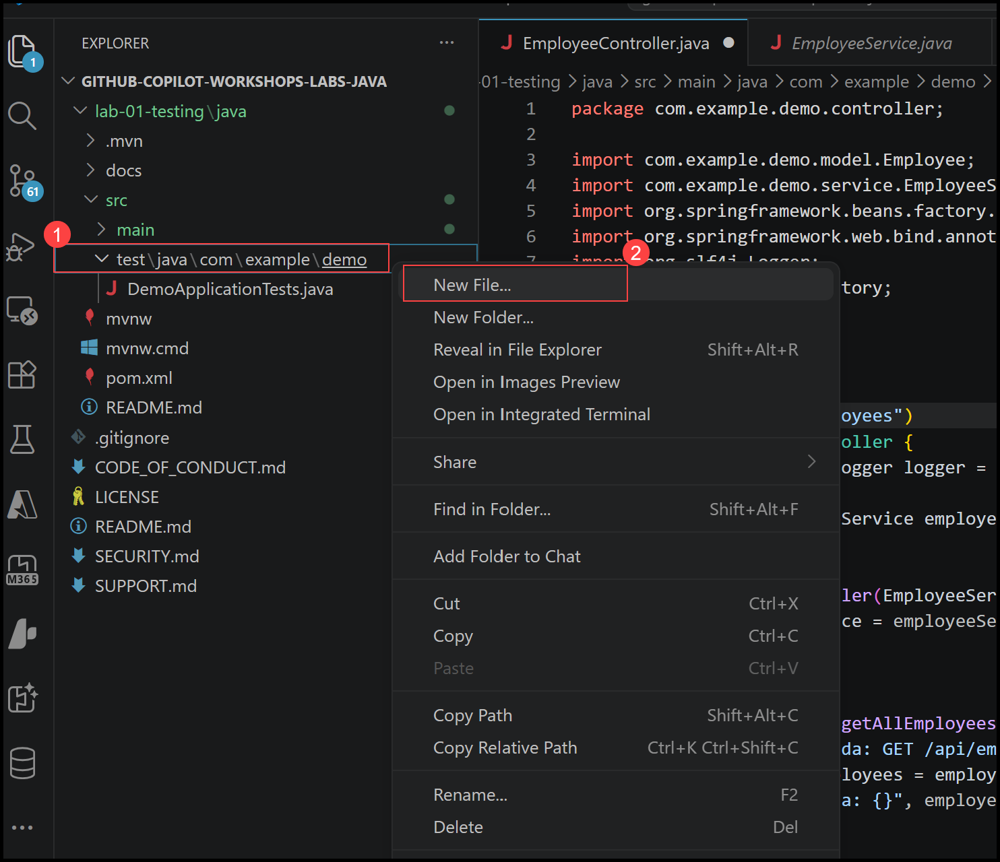

   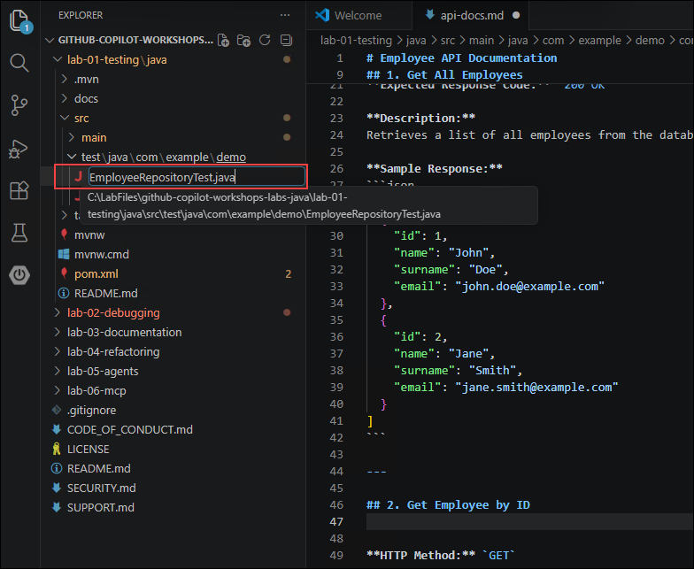

1. At the top of **EmployeeRepositoryTest.java**, manually type the following comment and then stop typing. Copilot will begin suggesting completions such as `@DataJpaTest`, an autowired repository, and sample save/find tests:

   ```java
   // Write JUnit tests for EmployeeRepository using @DataJpaTest.
   ```

   

1. Open **Copilot Chat**, switch to **Agent** mode, select the **Claude Sonnet 4.5** model, and enter the following prompt:

   ```
   Create JUnit 5 tests for EmployeeRepository
   Requirements:
   - Use @DataJpaTest
   - Test basic CRUD operations (save, findAll, findById, delete)
   - Use an in-memory database
   - Follow Spring Boot testing best practices
   ```

   

1. Copilot will generate the test code and update **EmployeeRepositoryTest.java** automatically.

   

1. Review the generated tests to ensure they cover the required CRUD operations, then click **Keep** to accept them.

   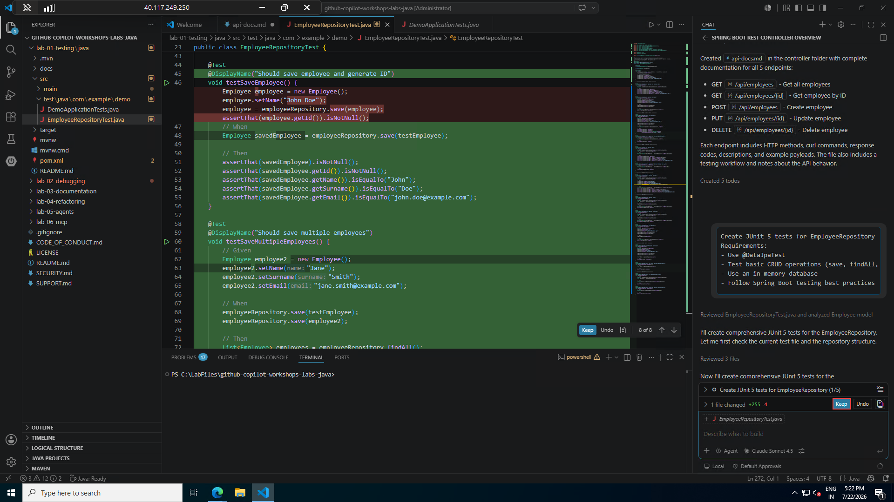

   

1. Open a terminal in VS Code by going to **Terminal → New Terminal**. In the terminal panel, click the dropdown and switch to **Git Bash**.

   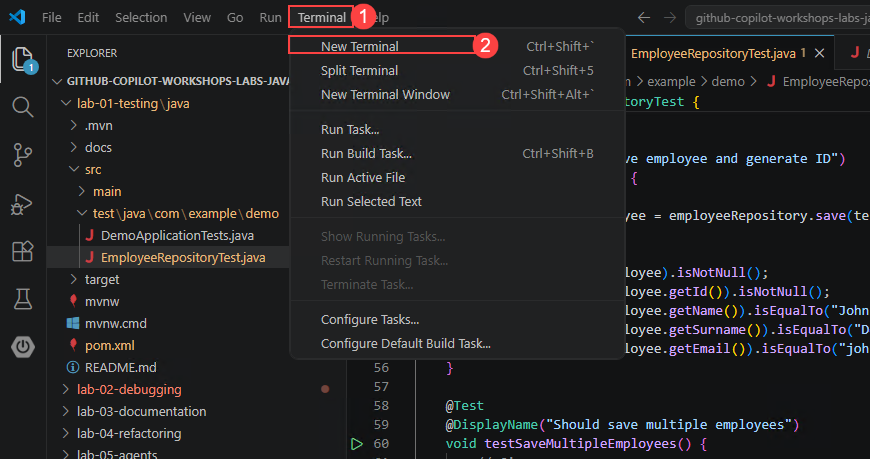

   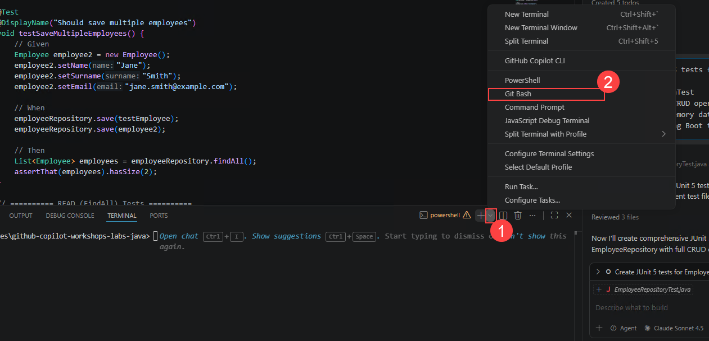

1. Navigate to the lab project folder:

    ```
    cd lab-01-testing/java
    ```
    > **Note:** This command navigates into the Maven project directory for Lab 01. All subsequent Maven commands must be run from this folder.

1. Set up Maven for this terminal session. Maven is pre-installed on the lab VM at the path below - run both commands to configure it:

    ```
    export MAVEN_HOME="/c/Users/Admin/Documents/maven-mvnd-1.0.5-windows-amd64/maven-mvnd-1.0.5-windows-amd64"
    ```

    ```
    export PATH="$MAVEN_HOME/bin:$PATH"
    ```

      > **Note:** These two commands only need to be run once per terminal session. If you open a new terminal later, run them again before using `mvn`.

1. Run the tests with Maven:

    ```
    mvn test
    ```

   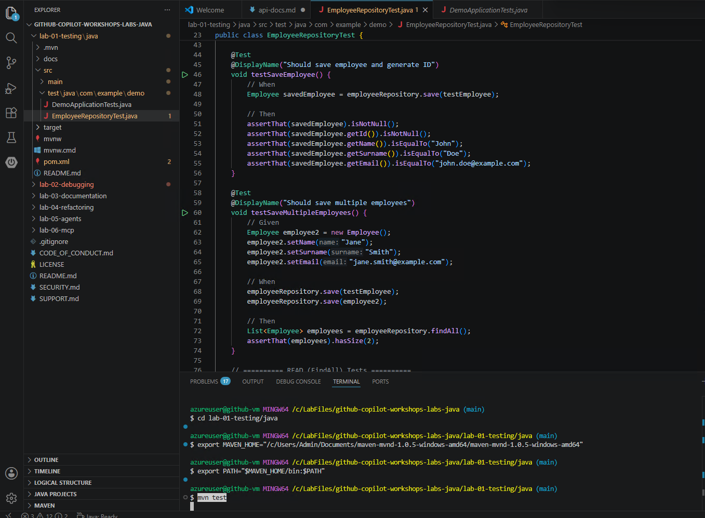

   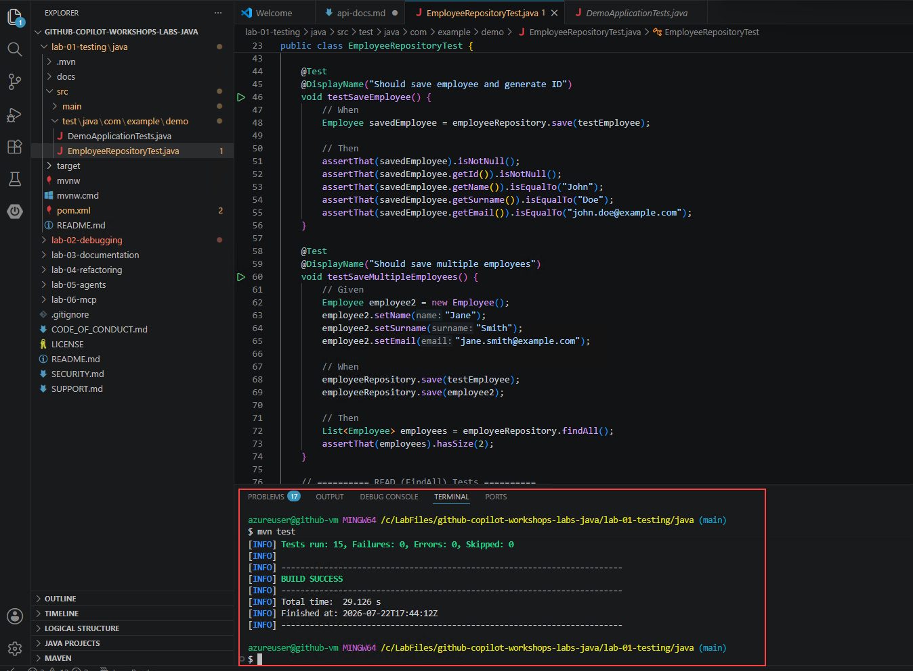

### Task 3: Create Service Layer Unit Tests

The service layer contains business logic and coordinates interactions with the repository. This task teaches how to test logic independently of infrastructure by mocking dependencies.

1. Navigate to `src/test/java/com/example/demo` and create a new file named `EmployeeServiceTest.java`. Then open **Copilot Chat** in **Agent** mode and enter the following prompt:

   ```
   Create unit tests for EmployeeService
   Requirements:
   - Use Mockito
   - Mock EmployeeRepository
   - Use @Mock and @InjectMocks
   - Include positive and negative scenarios
   - Follow JUnit 5 best practices
   ```

   

   

1. Review the generated tests carefully before accepting. When reviewing Copilot-generated unit tests, always check the following:

   - Package declarations match the main application package
   - Import statements are correct and reference existing classes
   - Imported classes exist under `src/main/java`
   - Any mismatches are fixed before running tests

   Once satisfied, click **Keep** to accept the generated tests.

   > **Note:** Always review Copilot suggestions before executing them. Do not accept changes blindly.

   

   

1. In the terminal, navigate to the project folder (as suggested by Copilot if prompted) and run the following command to execute the tests:

   ```
   mvn test
   ```

   

   

### Task 4: Create Controller Layer Unit Tests

The controller layer exposes the REST API. This task focuses on verifying HTTP behavior without starting the full application.

1. Navigate to `src/test/java/com/example/demo` and create a test class named `EmployeeControllerTest.java`.

   

1. Open **Copilot Chat** in **Agent** mode and enter the following prompt:

   ```
   Create unit tests for EmployeeController
   Use:
   - @WebMvcTest
   - MockMvc
   - Mock EmployeeService
   Test:
   - GET /api/employees
   - GET /api/employees/{id}
   - POST /api/employees
   Validate:
   - HTTP status codes
   - JSON response content
   ```

   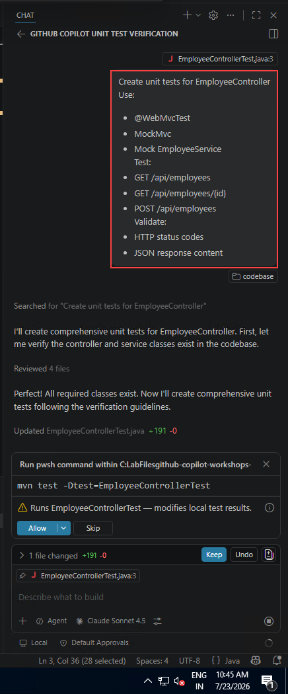

1. Review the generated controller tests and, once satisfied, click **Keep** to accept them.

   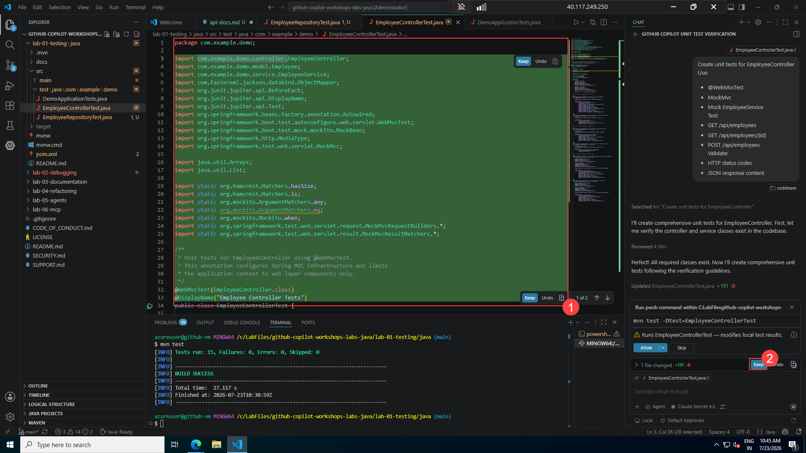

1. When GitHub Copilot generates controller tests:

   1. Verify the test's `package` declaration
   1. It MUST match the main application package

   For example:
   - Main application: `com.example.demo`
   - Test class MUST also be in: `com.example.demo`

   If packages do not match, Spring Boot will fail to locate `@SpringBootApplication` and tests will not start.

   

1. Run the following command to execute the tests:

   ```
   mvn test
   ```

   

   > **Two outcomes are possible depending on the package Copilot generated:**
   >
   >- **If the build passes (BUILD SUCCESS)** — Copilot already generated the correct package declaration (`com.example.demo`). You can proceed to the next task.
   >
   >- **If the build fails with an error** — This typically means Copilot used a wrong package (`com.example` instead of `com.example.demo`). Open `EmployeeControllerTest.java` and check line 1. If you see `package com.example;`, follow the steps below to fix it.

1. *(Only if build failed)* Open `EmployeeControllerTest.java` and verify the package declaration on line 1. It must match the main application package:

   - **Incorrect:** `package com.example;`
   - **Correct:** `package com.example.demo;`

   If the package is wrong, change it manually or ask Copilot to fix it:

   - Select the test class, then in Copilot Chat (Agent mode) type `/fix` and let Copilot suggest the correction.

     

1. *(Only if build failed)* GitHub Copilot may suggest improvements beyond fixing the package error, such as recommending better REST semantics (e.g., returning 404 instead of 200). These suggestions are advisory — only apply them if the lab explicitly asks for API refactoring.

   

1. *(Only if build failed)* Change line 1 from `package com.example;` to `package com.example.demo;`, save the file, and then re-run:

   ```
   mvn test
   ```

   The build should now pass with **BUILD SUCCESS**.

   

### Task 5: Add a New API Operation

This task simulates a real development scenario: extending an existing application with a new feature. You will add a new operation to find an employee by email and ensure it is properly tested at every layer.

1. Open **Copilot Chat** in **Agent** mode and enter the following prompt:

   ```
   Add a new feature to find an employee by email
   Requirements:
   - Add a repository method to find employee by email
   - Add a corresponding service method
   - Add a REST endpoint to fetch employee by email
   - Generate unit tests for repository, service and controller layers
   - Follow existing coding style
   ```

   

1. Review Copilot's response carefully, then click **Keep** to accept the changes.

   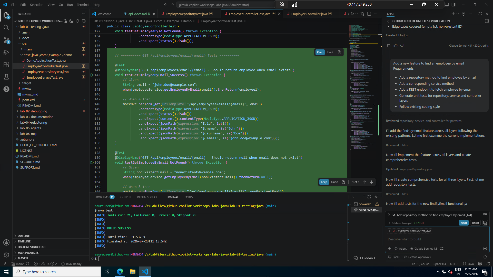

1. Review the generated test files to ensure they cover the new email lookup feature, then click **Keep** to accept them.

   

1. Review the code changes Copilot made to the repository and service classes, then click **Keep** to accept them.

   

   

1. Run the following command to clean the build and execute all tests:

   ```
   mvn clean test
   ```

   Verify that the build succeeds and all tests — including the new email lookup tests — pass.

   

   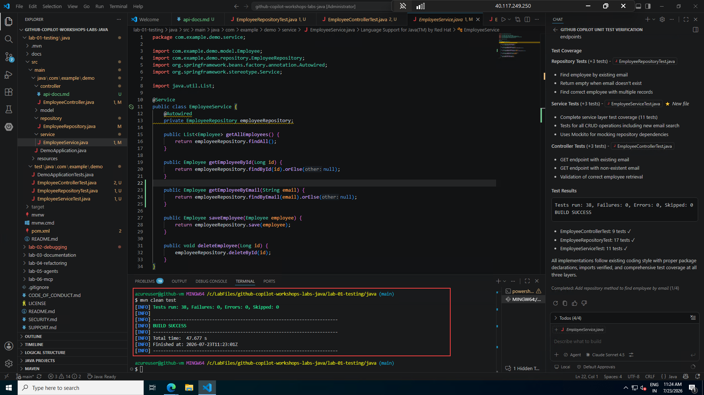

## Review

In this Lab, you have completed the following:

   - Used Copilot to understand and document existing APIs
   - Written unit tests for repository, service, and controller layers
   - Used mocking to isolate logic and avoid brittle tests
   - Extended an application with new functionality using Copilot assistance
   - Analyzed and improved test quality and coverage

### You have successfully completed the Lab!
### In the Lab Guide section, click the **Next >>** button to proceed to Lab 2.


