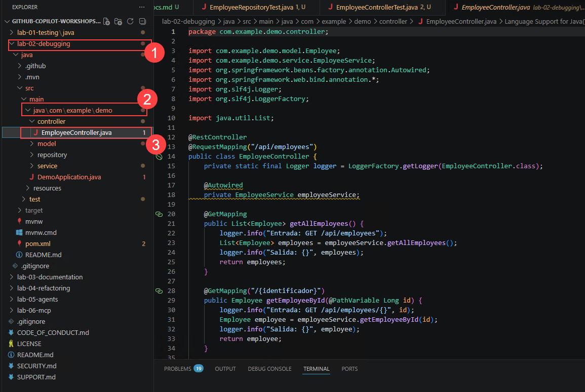
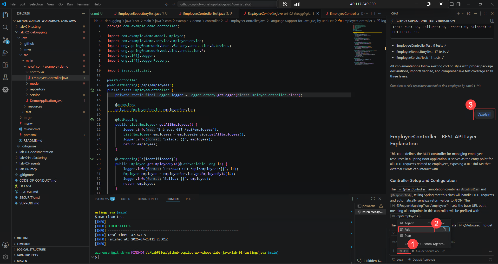
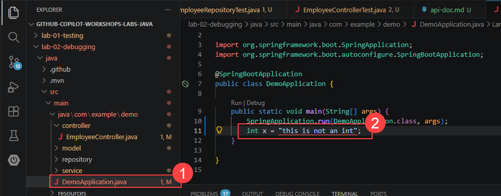
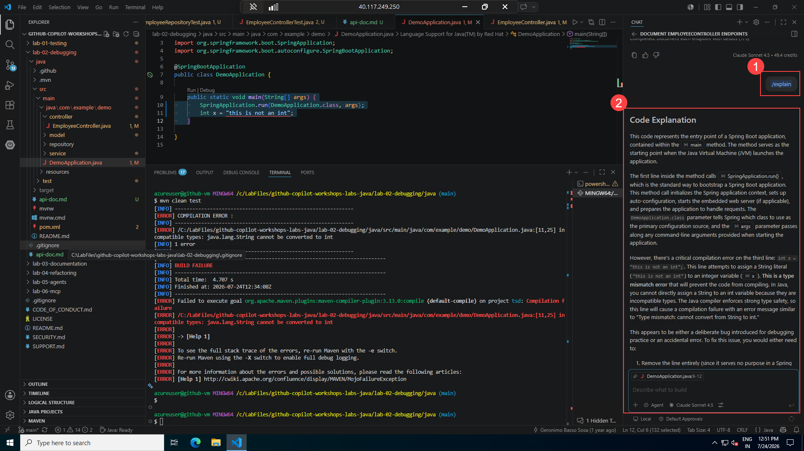
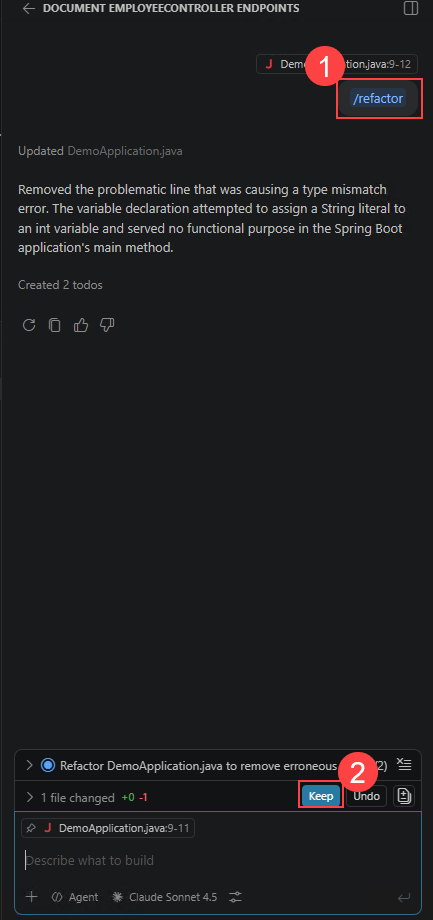
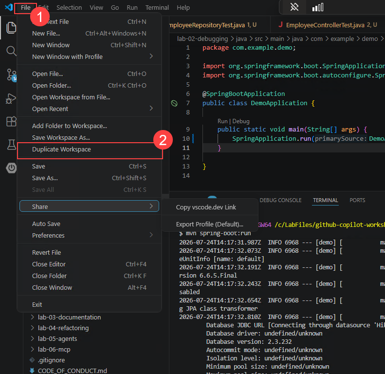

## Lab 2: Diagnosing and Fixing Java Application Errors Using GitHub Copilot

### Estimated Duration: 90 Minutes

## Overview

In this lab, you will focus on **troubleshooting, debugging, and validating a Java Spring Boot application** with the assistance of GitHub Copilot. Rather than writing new functionality, the emphasis is on **understanding failures, identifying root causes, and applying fixes responsibly**.

Modern developers spend a significant portion of their time debugging broken builds, failing tests, and incorrect application behavior. This lab demonstrates how **GitHub Copilot can act as a debugging partner** — helping developers analyze errors, explain failures, and propose fixes — while **developers retain decision-making authority**.

## Objectives

In this lab, you will complete the following tasks:

   - Task 1: Understand the API (Reinforcement)
   - Task 2: Debug and Solve Compile Errors Using GitHub Copilot

**Prerequisites**

Before starting this lab, ensure the following are available:

- Visual Studio Code (or another Copilot-supported IDE)

- GitHub Copilot extension (authenticated)

- Java Development Kit (JDK) 17 or higher

- Apache Maven (or Maven wrapper mvnw)

- GitHub account with Copilot access

### Task 1: Understand the API (Reinforcement)

Before debugging or fixing anything, developers must understand **what the application is supposed to do**. Debugging without understanding expected behavior leads to incorrect fixes.

This task reinforces API comprehension using **GitHub Copilot as a code understanding assistant**.

> **Note:** Some API behaviors and documentation issues are intentionally incorrect. Use GitHub Copilot (/explain, /fix) and your own reasoning to identify and correct them.

1. Navigate to **lab-02-debugging -> java/src/main/java/com/example/demo/controllers/** and open **EmployeeController.java**.

   

1. Use Copilot's `/explain` to understand endpoints.

1. Identify:

   - Base URL

   - Endpoints

   - Expected input/output

1. Open Copilot Chat and enter +++/explain+++ in Ask mode. Read the response and understand the API to prepare the md file.

   

   

1. Create or update API documentation and update with Base URL, Endpoints and Expected input/output. Sample given for your reference but suggest to prepare on your own.

   ```
   # Employee Rest API document
   ## Base URL :
   /api/employees
   ## End point
   ## Get all employees
   **HTTP Method:** GET
   **End Point:** /api/employees
   ### Retrieve the list of all the employees in the system

   # Sample curl command
   curl -X GET "http://localhost:8080/api/employees

   ## Expected behaviour
   -   HTTP status : 200 Ok
   -    Return JSON array of employees
   [
       {
           "id": 1,
           "name": "John",
           "surname":"ton",
           "email": "jont@test.com"
           }
   ]

   # Get employee ID

   **HTTPS Method:** GET
   **End Point:**  /api/employees/{id}
   ## get employee details

   ### sample URL
   curl -X GET "http://localhost:8080/api/employees/1"
   ## Expected behaviour
   -   HTTP Status : 200 OK
   -   Returns an employee object as JSON

   # Get Employee with employee email
   **HTTP Method:** GET
   **End point:** /api/employees/email/{email}

   ## Sample curl
   curl -X GET "http://localhost:8080//api/employees/email/john.doe%40example.com

   ## Expected behaviour
   -   HTTP Status : 200 OK
   -   Returns an employee object as JSON

   # Create employee

   **HTTP Method:** POST
   **End point:** /api/employees
   ## sample curl command
   curl -X POST "http://localhost:8080/api/employees" \
   -H "Content-type:application/json" \
   -d `{
       "name": "alan",
       "surname": "Brown",
       "email":"elanb@test.com"
   }`

   ## Expected behaviour
   -   HTTP Status : 200 ok
   -   Returns newly created employee with generated ID

   # Update employee
   **HTTP Method:** PUT
   **End point:** /api/employees/{id}

   ## sample curl method

   curl -X PUT "http:///localhost:8080/api/employees/1" \
   -H "Content-type:application/json" \
   -d `{
       "name": "alan",
       "surname": "brown",
       "email": "alanb@teststw.com"
   }

   ## Expected behaviour
   -   HTTP Status : 200 ok
   -   Returns updated employee object json

   # Delete employee

   **HTTP Method:** DELETE
   **End point:** api/employees/1

   ## sample curl

   curl -X DELETE "http://localhost:8080/api/employees/1"

   ## Expected behaviour

   -   HTTP Status : 200 ok
   -   No response body

   # Get externalEmployees

   **HTTP Method:** GET
   **End point:** /api/employees/GetExternalEmployees

   # sample curl command

   curl - X GET "http://localhost:8080/api/employees/GetExternalEmployees"

   ## Expected behaviour
   -   HTTP Status: 200 OK
   -   Returns external employee list
   ```

   

> **Congratulations** on completing the task! Now, it's time to validate it. Here are the steps:
> - Hit the Validate button for the corresponding task. If you receive a success message, you can proceed to the next task.
> - If not, carefully read the error message and retry the step, following the instructions in the lab guide.
> - If you need any assistance, please contact us at cloudlabs-support@spektrasystems.com. We are available 24/7 to help you out.
<validation step="ex2-task1-lab02-understand-api" />

### Task 2: Debug and Solve Compile Errors Using GitHub Copilot

In real-world development, code often **fails to compile** due to syntax errors, incorrect method signatures, mismatched annotations, or package inconsistencies. These errors block progress completely and must be resolved before any testing or validation can occur.

This task focuses on using **GitHub Copilot as a troubleshooting assistant** to:

- Interpret Java and Maven compilation errors

- Identify the **root cause** of failures

- Propose **correct and minimal fixes**

- Validate fixes through a successful build

- Recognize common Java and Spring Boot compile-time errors

- Understand Maven error output

- Use GitHub Copilot (/explain and /fix) to analyze failures

- Validate Copilot's suggestions before applying fixes

- Confirm a clean build using Maven

1. Open terminal -> Git Bash and navigate to the **lab2** folder with the below command. The build fails as Maven prints one or more **COMPILATION ERROR** messages. Tests do not start running. Do not immediately try to "fix by guessing". First, understand the error.

   +++cd "github-copilot-workshops-labs-java/lab-02-debugging/"+++

   ```
   mvn clean test
   ```

   

   

1. Select the Maven error message, open Copilot Chat and enter the command +++/terminalexplain+++ (or you can also copy the maven error message and ask Copilot in chat to explain the error).

   

1. To fix the error, you can ask Copilot to fix it by entering the command +++/fix+++ or +++/terminalfix+++. Copilot will provide a fix and also give extra suggestions. Review the response.

   

   

1. Developers must first identify the compilation issue and explicitly ask Copilot for assistance if needed.

1. Open **DemoApplication.java** file and add +++; +++ at the end of line 10, save the file and run mvn test again. Now you will see a different error:

   

1. Analyze the error and take Copilot's help now. Enter +++/explain+++ to understand why you are getting the error, enter +++/fix+++ to fix the error, or enter +++/refactor+++ — Fixes the constructor, Ensures getters/setters match field types, Cleans up redundant code, and Keeps API intact.

   +++/explain+++

   

   Run +++/fix+++

   

   Copilot found the error and fixed the issue — email field from long to string on setEmail and getEmail methods in **Employee.java** class. You can press Keep to accept the fix. Let's not accept it for now and try the /refactor capability for better understanding.

   

   

1. If you undo, Copilot will revert changes back in the class file.

   

1. Accept the fix or add **private String email;** to the **Employee** class and save the file.

   

1. Now run again +++mvn clean test+++. Tests failed with error. Take Copilot help to fix:

   

1. Copilot suggests to compile with the command - +++mvn clean compile+++. Run the command.

   

   The build is successful now:

   

1. To see functional errors, run the application with the command - +++mvn spring-boot:run+++. Application will start.

   

   

1. Open a browser and navigate to +++http://localhost:8080+++. You can see a functional error — it's not a crash, it is a **missing root endpoint**.

   

1. Ask Copilot about the Whitelabel error with the prompt below. Copilot will suggest valid endpoints (this is only to show how Copilot helps). Review the response.

   ```
   Why am I getting a Whitelabel Error Page when accessing http://localhost:8080? Check this Spring Boot project and explain.
   ```

   

   

1. Review the suggested fix and make necessary changes and save the file.

   

1. Now run the application again with the command - +++mvn spring-boot:run+++.

   

1. Now open a browser and enter +++http://localhost:8080/api/employees+++. Your application is running and endpoint mapped correctly.

   

1. Now let's validate the tests. Run +++mvn clean test+++. Build fails — let's fix the issues with the help of Copilot.

   

1. Open **EmployeeControllerTest.java** class and review the tests and ask Copilot `/fix`. Copilot found the bug and fixed it. Review the fix.

   

1. Run test with +++mvn clean test+++ again and take Copilot help to fix the issues.

   

   

1. Review the fix and keep the fix.

   

1. Now, re-run +++mvn clean test+++. The build is successful now and all tests passed.

   

1. Run the application now with - +++mvn spring-boot:run+++. Application will start up and running.

   

1. On Visual Studio, go **File -> Duplicate workspace**.

   

1. Open Git Bash from terminal. Run below command in the terminal and run below commands to create a new employee:

   +++cd Lab-02-debugging\java+++

   ```
   curl -X POST http://localhost:8080/api/employees \
   -H "Content-Type: application/json" \
   -d '{
   "name": "John",
   "surname": "Doe",
   "email": "john.doe@example.com"
   }'
   ```

   

1. Add another employee record:

   ```
   curl -X POST http://localhost:8080/api/employees \
   -H "Content-Type: application/json" \
   -d '{
   "name": "Alan",
   "surname": "Tom",
   "email": "Alant@example.com"
   }'
   ```

   

1. Run below command to get all employees:

   ```
   curl -X GET http://localhost:8080/api/employees
   ```

   

1. Run below command to update the employee:

   ```
   curl -X PUT http://localhost:8080/api/employees/{2} \
   -H "Content-Type: application/json" \
   -d '{
   "name": "Jane",
   "surname": "Doe",
   "email": "jane.doe@example.com"
   }'
   ```

   

1. Run below command to get employee details by id:

   ```
   curl -X GET http://localhost:8080/api/employees/{2}
   ```

   

1. Run below command to show all employees:

   ```
   curl -X GET http://localhost:8080/api/employees
   ```

   

1. Run below command to delete the employee record:

   +++curl -X DELETE http://localhost:8080/api/employees/{2}+++

   

> **Congratulations** on completing the task! Now, it's time to validate it. Here are the steps:
> - Hit the Validate button for the corresponding task. If you receive a success message, you can proceed to the next task.
> - If not, carefully read the error message and retry the step, following the instructions in the lab guide.
> - If you need any assistance, please contact us at cloudlabs-support@spektrasystems.com. We are available 24/7 to help you out.
<validation step="ex2-task2-lab02-debug-compile-errors" />

## Review

In this lab, you have completed the following:

   - Analyzed API behavior and prepared documentation using GitHub Copilot
   - Interpreted Maven and Java compilation errors
   - Identified the true root causes of failures using Copilot's /explain and /fix
   - Validated fixes using automated tests and curl commands
   - Applied responsible AI-assisted debugging in real-world development workflows

### You have successfully completed the lab!
### In the Lab Guide section, click the **Next >>** button to proceed to Lab 3.


