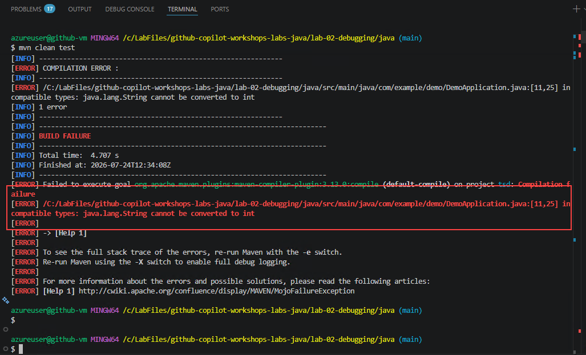
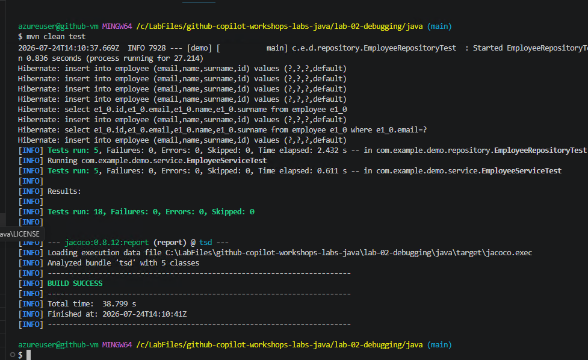

# Lab 2: Diagnosing and Fixing Java Application Errors Using GitHub Copilot

### Estimated Duration: 90 Minutes

## Overview

In this lab, you will focus on **troubleshooting, debugging, and validating a Java Spring Boot application** with the assistance of GitHub Copilot. Rather than writing new functionality, the emphasis is on **understanding failures, identifying root causes, and applying fixes responsibly**.

Modern developers spend a significant portion of their time debugging broken builds, failing tests, and incorrect application behavior. This lab demonstrates how **GitHub Copilot can act as a debugging partner** - helping developers analyze errors, explain failures, and propose fixes - while **developers retain decision-making authority**.

## Objectives

In this lab, you will complete the following tasks:

   - Task 1: Understand the API (Reinforcement)
   - Task 2: Debug and Solve Compile Errors Using GitHub Copilot

**Prerequisites**

Before starting this lab, ensure the following are available:

- Visual Studio Code (or another Copilot-supported IDE)

- GitHub Copilot extension (authenticated)

- Java Development Kit (JDK) 17 or higher

- Apache Maven (or Maven wrapper mvnw)

- GitHub account with Copilot access

### Task 1: Understand the API (Reinforcement)

Before debugging or fixing anything, developers must understand **what the application is supposed to do**. Debugging without understanding expected behavior leads to incorrect fixes.

This task reinforces API comprehension using **GitHub Copilot as a code understanding assistant**.

> **Note:** Some API behaviors and documentation issues are intentionally incorrect. Use GitHub Copilot (/explain, /fix) and your own reasoning to identify and correct them.

1. Navigate to `lab-02-debugging/java/src/main/java/com/example/demo/controllers/` and open **EmployeeController.java**.

   

1. Select the entire contents of **EmployeeController.java**, then open **Copilot Chat** and use the `/explain` command to understand what each endpoint does.

1. From the Copilot explanation, identify the following:

   - **Base URL** - the common path prefix shared by all endpoints
   - **Endpoints** - each route exposed by the controller
   - **Expected input/output** - the request body and response format for each endpoint

1. Open **Copilot Chat**, ensure you are in **Ask (2)** mode, and enter `/explain` **(3)**. Read and review the full response to understand the API before preparing the documentation file.

   

   

1. Create or update the API documentation file **api-doc.md**, including the Base URL, Endpoints, and Expected Input/Output for each. A sample is provided for reference, but you're encouraged to prepare your own version, similar to the approach used in Lab 1.

   ```
   # Employee Rest API document
   ## Base URL :
   /api/employees
   ## End point
   ## Get all employees
   **HTTP Method:** GET
   **End Point:** /api/employees
   ### Retrieve the list of all the employees in the system

   # Sample curl command
   curl -X GET "http://localhost:8080/api/employees

   ## Expected behaviour
   -   HTTP status : 200 Ok
   -    Return JSON array of employees
   [
       {
           "id": 1,
           "name": "John",
           "surname":"ton",
           "email": "jont@test.com"
           }
   ]

   # Get employee ID

   **HTTPS Method:** GET
   **End Point:**  /api/employees/{id}
   ## get employee details

   ### sample URL
   curl -X GET "http://localhost:8080/api/employees/1"
   ## Expected behaviour
   -   HTTP Status : 200 OK
   -   Returns an employee object as JSON

   # Get Employee with employee email
   **HTTP Method:** GET
   **End point:** /api/employees/email/{email}

   ## Sample curl
   curl -X GET "http://localhost:8080//api/employees/email/john.doe%40example.com

   ## Expected behaviour
   -   HTTP Status : 200 OK
   -   Returns an employee object as JSON

   # Create employee

   **HTTP Method:** POST
   **End point:** /api/employees
   ## sample curl command
   curl -X POST "http://localhost:8080/api/employees" \
   -H "Content-type:application/json" \
   -d `{
       "name": "alan",
       "surname": "Brown",
       "email":"elanb@test.com"
   }`

   ## Expected behaviour
   -   HTTP Status : 200 ok
   -   Returns newly created employee with generated ID

   # Update employee
   **HTTP Method:** PUT
   **End point:** /api/employees/{id}

   ## sample curl method

   curl -X PUT "http:///localhost:8080/api/employees/1" \
   -H "Content-type:application/json" \
   -d `{
       "name": "alan",
       "surname": "brown",
       "email": "alanb@teststw.com"
   }

   ## Expected behaviour
   -   HTTP Status : 200 ok
   -   Returns updated employee object json

   # Delete employee

   **HTTP Method:** DELETE
   **End point:** api/employees/1

   ## sample curl

   curl -X DELETE "http://localhost:8080/api/employees/1"

   ## Expected behaviour

   -   HTTP Status : 200 ok
   -   No response body

   # Get externalEmployees

   **HTTP Method:** GET
   **End point:** /api/employees/GetExternalEmployees

   # sample curl command

   curl - X GET "http://localhost:8080/api/employees/GetExternalEmployees"

   ## Expected behaviour
   -   HTTP Status: 200 OK
   -   Returns external employee list
   ```

   

### Task 2: Debug and Solve Compile Errors Using GitHub Copilot

In real-world development, code often **fails to compile** due to syntax errors, incorrect method signatures, mismatched annotations, or package inconsistencies. These errors block progress completely and must be resolved before any testing or validation can occur.

This task focuses on using **GitHub Copilot as a troubleshooting assistant** to:

   - Interpret Java and Maven compilation errors
   - Identify the **root cause** of failures
   - Propose **correct and minimal fixes**
   - Validate fixes through a successful build
   - Recognize common Java and Spring Boot compile-time errors
   - Understand Maven error output
   - Use GitHub Copilot (/explain and /fix) to analyze failures
   - Validate Copilot's suggestions before applying fixes
   - Confirm a clean build using Maven

1. Open **Terminal → Git Bash** in VS Code and navigate to the lab folder by running the following command:

   ```
   cd lab-02-debugging/java
   ```

   Then run the Maven build:

   ```
   mvn clean test
   ```

   The build will fail - Maven will print one or more **COMPILATION ERROR** messages and tests will not run. Do not attempt to fix the error by guessing. Instead, take time to read and understand the error output first.

   

   

1. Select the Maven error message in the terminal. Open **Copilot Chat** and enter the `/terminalexplain` command to have Copilot explain the error. Alternatively, copy the error message and paste it directly into the Copilot Chat to ask for an explanation.

   

1. To apply a fix, enter `/fix` or `/terminalfix` in Copilot Chat. Copilot will suggest a fix along with additional recommendations. Review the response carefully before accepting any changes.

   

   

   > **Note:** Always identify the compilation issue yourself first, then use Copilot explicitly for assistance when needed. Avoid applying suggestions without understanding what they change.

1. Open the **DemoApplication.java** file. Inside the `main` method, add the following line **below** `SpringApplication.run(...)` and save the file:

   ```java
   int x = "this is not an int";
   ```

   The method should now look like this:

   ```java
   public static void main(String[] args) {
       SpringApplication.run(DemoApplication.class, args);
       int x = "this is not an int";
   }
   ```

   Then run:

   ```
   mvn clean test
   ```

   This introduces a **type mismatch** - assigning a `String` to an `int` - which will cause a compilation error:

   

   

1. Analyze the new error using the following Copilot commands:

   - Enter `/explain` to understand why the error is occurring.
   - Enter `/fix` to have Copilot propose a targeted fix.
   - Enter `/refactor` for a broader cleanup - this fixes the constructor, ensures getters/setters match field types, removes redundant code, and keeps the API intact.

   - **Using `/explain`:**

      

   - **Using `/fix`:**

      

   - Copilot identifies the issue - **The code has a type mismatch error**. For now, skip the fix and instead try `/refactor` to explore a broader correction.

1. Accept Copilot's fix by clicking **Keep**.

   

1. Run the following command:

   ```
   mvn clean compile
   ```
   
   The build is successful now:

   

1. To expose functional (runtime) errors, start the application with the following command:

   ```
   mvn spring-boot:run
   ```

   Wait for the application to start successfully.

   

   

1. Open a browser and navigate to `http://localhost:8080`. You will see a functional error - this is not a crash, but rather a **missing root endpoint** (`/`). The application is running, but no handler is mapped to the base URL.

   

1. In **Copilot Chat**, switch to **Agent** mode and enter the following prompt. This will instruct Copilot to fix the issue by adding a root endpoint that redirects to the employees API:

   ```
   I'm getting a Whitelabel Error Page when accessing http://localhost:8080 in this Spring Boot project. Add a root endpoint (GET /) to the EmployeeController that redirects to /api/employees so that accessing the base URL works correctly.
   ```

   

   

1. Review the changes Copilot made to the controller file, then click **Keep** to accept them.

   

1. Restart the application to apply the changes:

   ```
   mvn spring-boot:run
   ```

   

1. Open a browser and navigate to `http://localhost:8080/api/employees`. The application is now running and the endpoint is correctly mapped.

   

1. Validate the tests by running:

   ```
   mvn clean test
   ```

   > **Two outcomes are possible at this point:**
   >
   > - **If the build passes (BUILD SUCCESS)** — All tests passed. You can proceed to the next step.
   >
   > - **If the build fails** — There are test failures that need to be resolved. Open **EmployeeControllerTest.java**, review the test code, and enter `/fix` in Copilot Chat. Copilot will identify the bug and propose a fix. Review the suggested changes before accepting.

   

   

   

1. Re-run the tests and use Copilot to fix any remaining issues:

   ```
   mvn clean test
   ```

   

   

1. Review Copilot's suggested fix and click **Keep** to accept it.

   

1. Re-run the full test suite to confirm all issues are resolved:

   ```
   mvn clean test
   ```

   The build should now succeed and all tests should pass.

   

1. Start the application to confirm it runs correctly end-to-end:

   ```
   mvn spring-boot:run
   ```

   The application should start up without errors.

   

1. In Visual Studio Code, go to **File → Duplicate Workspace** to open a second window alongside your running application.

   

1. Open **Git Bash** from the terminal in the duplicated workspace. Navigate to the project folder and run the following command to create a new employee record:

   ```
   curl -X POST http://localhost:8080/api/employees \
   -H "Content-Type: application/json" \
   -d '{
   "name": "John",
   "surname": "Doe",
   "email": "john.doe@example.com"
   }'
   ```

   

1. Run the following command to add a second employee record:

   ```
   curl -X POST http://localhost:8080/api/employees \
   -H "Content-Type: application/json" \
   -d '{
   "name": "Alan",
   "surname": "Tom",
   "email": "Alant@example.com"
   }'
   ```

   

1. Run the following command to retrieve all employee records:

   ```
   curl -X GET http://localhost:8080/api/employees
   ```

   

1. Run the following command to update an existing employee record:

   ```
   curl -X PUT http://localhost:8080/api/employees/{2} \
   -H "Content-Type: application/json" \
   -d '{
   "name": "Jane",
   "surname": "Doe",
   "email": "jane.doe@example.com"
   }'
   ```

   

1. Run the following command to retrieve a specific employee by their ID:

   ```
   curl -X GET http://localhost:8080/api/employees/{2}
   ```

   

1. Run the following command to confirm all current employee records:

   ```
   curl -X GET http://localhost:8080/api/employees
   ```

   

1. Run the following command to delete an employee record:

   ```
   curl -X DELETE http://localhost:8080/api/employees/{2}
   ```

   

## Review

In this lab, you have completed the following:

   - Analyzed API behavior and prepared documentation using GitHub Copilot
   - Interpreted Maven and Java compilation errors
   - Identified the true root causes of failures using Copilot's /explain and /fix
   - Validated fixes using automated tests and curl commands
   - Applied responsible AI-assisted debugging in real-world development workflows

### You have successfully completed the lab!
### In the Lab Guide section, click the **Next >>** button to proceed to Lab 3.


