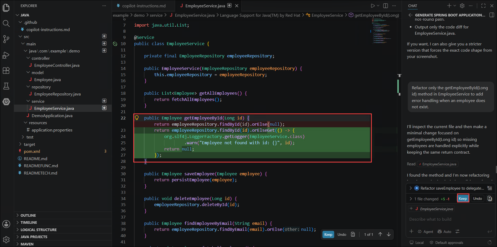
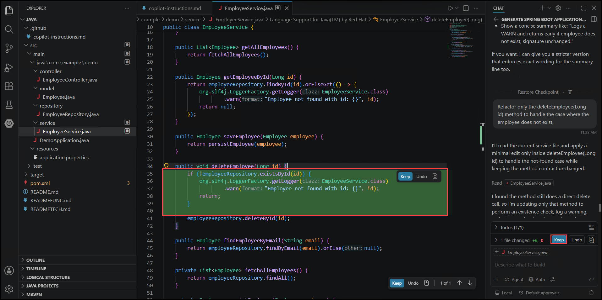

# Lab 4: Refactoring Documentation and Technical Design Using GitHub Copilot

### Estimated Duration: 75 Minutes

## Overview

In this lab, you will learn how GitHub Copilot improves **developer productivity** by:

- Migrating code from documentation into a working project

- Refactoring methods for readability and maintainability

- Improving error handling

- Extracting reusable logic

- Enhancing documentation and tests

This mirrors real-world development, where **documentation exists before or alongside code**.

## Objectives

In this lab, you will complete the following tasks:

   - Task 1: Prepare Copilot Instructions
   - Task 2: Generate Code from Documentation
   - Task 3: Method Refactoring
   - Task 4: Add Error Handling
   - Task 5: Function Extraction
   - Task 6: Add Repository Features
   - Task 7: Add Documentation with Copilot

**Prerequisites**

- Visual Studio Code

- GitHub Copilot enabled and authenticated

- Java 17+

- Maven

- Basic familiarity with Spring Boot concepts

### Task 1: Prepare Copilot Instructions

In this task, you will populate the copilot-instructions.md file with the project's architecture and coding conventions. You will ensure Copilot follows a layered Spring Boot structure with best practices.

1. Open Visual Studio Code and navigate to the folder **lab-04-refactoring/java** and review the below files:

   - README.md → exercises

   - READMEFUNC.md → functional API documentation

   - READMETECH.md → technical design documentation

   - copilot-instructions.md → currently empty

     

1. Open **copilot-instructions.md** under the .github folder, add the following content and save the file:

   ```
   You are building a Spring Boot REST API using layered architecture.

   Follow this structure:
   - Controller layer for REST endpoints
   - Service layer for business logic
   - Repository layer using Spring Data JPA
   - Model layer for entity classes

   Follow best practices:
   - Use dependency injection
   - Keep methods small and readable
   - Follow REST conventions
   - Apply basic error handling
   - Do not add features not described in the documentation

   Use an H2 in-memory database.
   ```

   

> **Congratulations** on completing the task! Now, it's time to validate it. Here are the steps:
> - Hit the Validate button for the corresponding task. If you receive a success message, you can proceed to the next task.
> - If not, carefully read the error message and retry the step, following the instructions in the lab guide.
> - If you need any assistance, please contact us at cloudlabs-support@spektrasystems.com. We are available 24/7 to help you out.
<validation step="ex4-task1-lab04-copilot-instructions" />

### Task 2: Generate Code from Documentation

In this task, you will use Copilot Agent mode to generate the full Spring Boot application from the README functional and technical docs. You will resolve port conflicts and confirm the generated app runs successfully.

1. Open **Copilot Chat** (Agent mode - Claude Sonnet 4.5 model) and enter the below prompt:

   ```
   Using READMEFUNC.md and READMETECH.md, generate a Spring Boot application for this project.
   Create the required Controller, Service, Repository, and Model classes.
   Follow the architecture defined in copilot-instructions.md.
   Do not add behavior not mentioned in the documentation.
   ```

   

1. Copilot followed instructions and extracted the code from the md file and created the below files. Review them and click on **Keep** to accept:

   - Employee.java

   - EmployeeRepository.java

   - EmployeeService.java

   - EmployeeController.java

   - Required package structure

     

1. Open PowerShell and kill any service running on port 8080: After running the first command, you will receive a Process ID (PID). Copy the Process ID for use in the next step.

   ```
   netstat -ano | findstr :8080
   ```
   
   ```
   taskkill /PID XXXX /F
   ```

   > **Note:** Replace XXXX with your PID

1. Open the **Terminal -> Git Bash** and run the app with the below commands. The app will be up and running:

   ```
   cd "github-copilot-workshops-labs-java/lab-04-refactoring/java/"
   ```

   ```
   mvn spring-boot:run
   ```

   

   > **Note:** If you see any errors, use Copilot capabilities /explain and /fix. Review before accepting fixes.

> **Congratulations** on completing the task! Now, it's time to validate it. Here are the steps:
> - Hit the Validate button for the corresponding task. If you receive a success message, you can proceed to the next task.
> - If not, carefully read the error message and retry the step, following the instructions in the lab guide.
> - If you need any assistance, please contact us at cloudlabs-support@spektrasystems.com. We are available 24/7 to help you out.
<validation step="ex4-task2-lab04-generate-code" />

### Task 3: Method Refactoring

In this task, you will use Copilot to refactor the getAllEmployees and saveEmployee methods for improved readability. You will ensure the refactoring preserves existing behavior.

1. Navigate to **src/main/java/com/examples/demo/service** and open the file **EmployeeService.java**. Select the method *getAllEmployees* and enter the below prompt in Copilot Agent mode to refactor:

   ```
   Refactor this method to use a private helper method for employee retrieval. Keep behavior unchanged.
   ```

   

1. Select the method **saveEmployee** and enter the below prompt in Copilot to refactor. Review the change and accept:

   ```
   Refactor this method to extract saving logic into a private method. Keep behavior unchanged.
   ```

   

> **Congratulations** on completing the task! Now, it's time to validate it. Here are the steps:
> - Hit the Validate button for the corresponding task. If you receive a success message, you can proceed to the next task.
> - If not, carefully read the error message and retry the step, following the instructions in the lab guide.
> - If you need any assistance, please contact us at cloudlabs-support@spektrasystems.com. We are available 24/7 to help you out.
<validation step="ex4-task3-lab04-method-refactoring" />

### Task 4: Add Error Handling

In this task, you will use Copilot to add error handling to getEmployeeById and deleteEmployee for missing employees. You will review each change before accepting it.

1. Select **getEmployeeById** and enter the below prompt in Copilot Chat. Review and accept the change:

   ```
   Refactor only the getEmployeeById(Long id) method in EmployeeService to add error handling when an employee does not exist.
   ```

   

1. Select the *deleteEmployee* method and enter the below prompt in Copilot Chat. Review the change and accept:

   ```
   Refactor only the deleteEmployee(Long id) method to handle the case where the employee does not exist.
   ```

   

> **Congratulations** on completing the task! Now, it's time to validate it. Here are the steps:
> - Hit the Validate button for the corresponding task. If you receive a success message, you can proceed to the next task.
> - If not, carefully read the error message and retry the step, following the instructions in the lab guide.
> - If you need any assistance, please contact us at cloudlabs-support@spektrasystems.com. We are available 24/7 to help you out.
<validation step="ex4-task4-lab04-error-handling" />

### Task 5: Function Extraction

In this task, you will use Copilot to extract duplicated logic for finding employees by email and sorting by last name into reusable private methods. You will reduce duplication while keeping the public API unchanged.

1. Keep **EmployeeService.java** open and enter the below prompt in Copilot Chat to reduce duplication and improve reuse in the finding employees method:

   ```
   Extract the logic for finding employees by email into a reusable private method.
   ```

    

1. Enter the below prompt in Copilot Chat for sorting employees by last name. Review the change and accept:

   ```
   Extract the logic for sorting employees by last name into a reusable private method.
   ```

    

> **Congratulations** on completing the task! Now, it's time to validate it. Here are the steps:
> - Hit the Validate button for the corresponding task. If you receive a success message, you can proceed to the next task.
> - If not, carefully read the error message and retry the step, following the instructions in the lab guide.
> - If you need any assistance, please contact us at cloudlabs-support@spektrasystems.com. We are available 24/7 to help you out.
<validation step="ex4-task5-lab04-function-extraction" />

### Task 6: Add Repository Features 

In this task, you will use Copilot to add new Spring Data JPA repository methods for searching and sorting employees. You will wire these methods into the service layer to implement a new feature.

Extend functionality safely.

1. Open **EmployeeRepository.java** under the repository folder and enter the below prompt. Review the change and accept:

   ```
   Add Spring Data JPA repository methods to search employees by name and sort by last name.
   ```

   

1. Enter the below prompt to implement new features. It adds new methods to EmployeeService.java. Review and accept the features:

   ```
   Use these repository methods in the service to implement a new feature.
   ```

   

> **Congratulations** on completing the task! Now, it's time to validate it. Here are the steps:
> - Hit the Validate button for the corresponding task. If you receive a success message, you can proceed to the next task.
> - If not, carefully read the error message and retry the step, following the instructions in the lab guide.
> - If you need any assistance, please contact us at cloudlabs-support@spektrasystems.com. We are available 24/7 to help you out.
<validation step="ex4-task6-lab04-repository-features" />

### Task 7: Add Documentation with Copilot

In this task, you will use Copilot's /doc command to generate JavaDoc for all undocumented EmployeeService methods. You will fix any missing or failing tests before closing out the lab.

1. Select **EmployeeService** and enter `/doc` in Copilot Chat Agent mode to add JavaDoc for all undocumented methods:

   ```
   /doc
   ```

   

   > **Note:** If tests are missing or failing, use /setupTests and /tests.
   > Close all the Lab 04 files and terminal before continuing with Exercise 5.

> **Congratulations** on completing the task! Now, it's time to validate it. Here are the steps:
> - Hit the Validate button for the corresponding task. If you receive a success message, you can proceed to the next task.
> - If not, carefully read the error message and retry the step, following the instructions in the lab guide.
> - If you need any assistance, please contact us at cloudlabs-support@spektrasystems.com. We are available 24/7 to help you out.
<validation step="ex4-task7-lab04-add-documentation" />

## Review

In this lab, you have completed the following:

   - Prepared Copilot custom instructions using copilot-instructions.md
   - Generated a Spring Boot application from existing Markdown documentation
   - Refactored service methods to improve readability without changing behavior
   - Added minimal error handling and extracted reusable logic
   - Extended repository capabilities using Spring Data JPA
   - Generated JavaDoc documentation with Copilot assistance

### You have successfully completed the lab!
### In the Lab Guide section, click the **Next >>** button to proceed to Lab 5.

 
