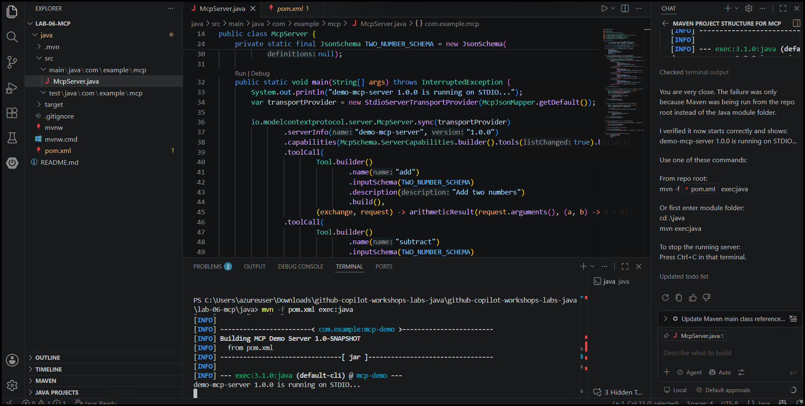
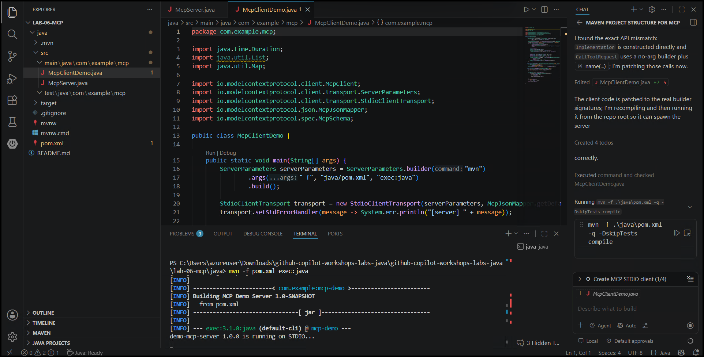
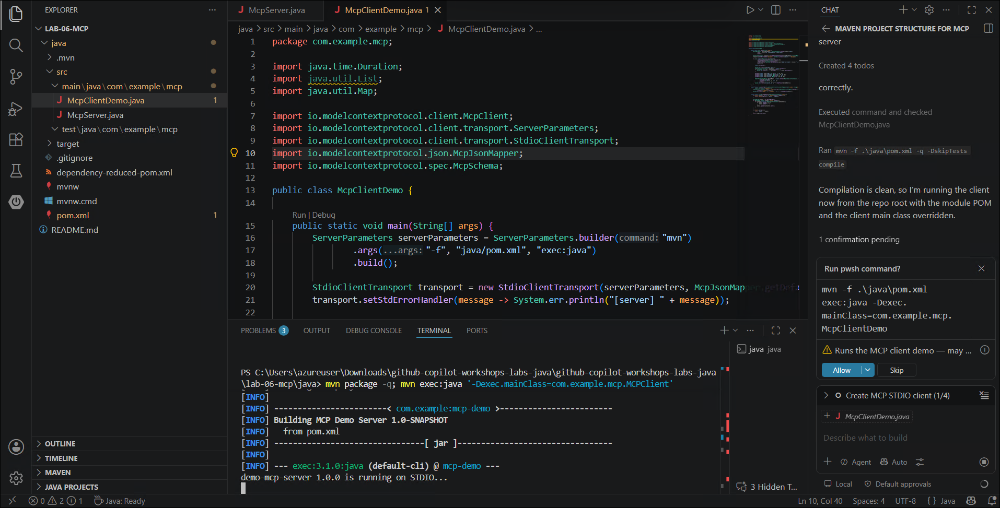

# Lab 6: Building and Using MCP Servers with GitHub Copilot (Optional)

### Estimated Duration: 60 Minutes

## Overview

In this lab, you will learn how to:

- Understand the **Model Context Protocol (MCP)**

- Build a **custom MCP server** using Java

- Expose tools that GitHub Copilot can discover and invoke

- Use **GitHub Copilot Agent Mode** with MCP servers

- Consume both **custom MCPs** and **prebuilt MCPs** (Playwright, Microsoft Learn)

## Objectives

In this lab, you will complete the following tasks:

   - Task 1: Create Your First MCP Server using GitHub Copilot
   - Task 2: Create MCPClient.java

### Task 1: Create Your First MCP Server using GitHub Copilot

In this task, you will use Copilot Agent mode to scaffold a Java MCP server project and implement math tools (add, subtract, multiply, divide) using the MCP Java SDK with STDIO transport. You will build and run the server, ensuring division-by-zero is handled as an error.

1. In Visual Studio Code, navigate to the **lab-06-MCP** folder in the Explorer panel. Open **Copilot Chat** in **Agent** mode with the **Claude Sonnet 4.6** model selected, and enter the below prompt:

   ```
   @workspace I need to create a Maven project structure for lab-06-mcp.
   The project should be a Model Context Protocol (MCP) server in Java.
   Please create:
   - src/main/java/com/example/mcp directory structure
   - src/test/java/com/example/mcp directory structure
   - Basic McpServer.java main class
   ```

1. Copilot will provide terminal commands or file creation instructions. Review them and allow the actions.

1. In Visual Studio Code, navigate to **lab-06-mcp/java/src/main/java/com/example/mcp/** in the Explorer panel and create a file named `MCPServer.java`.

   

1. In **Copilot Chat** in **Agent** mode with **Claude Sonnet 4.6** selected, enter the below prompt:

   ```
   Create a minimal MCP server using the MCP Java SDK (0.16.0).
   Use STDIO transport.
   Set server name to demo-mcp-server and version 1.0.0.
   Extend MCPServer.java to register the following tools:
   add, subtract, multiply, divide.
   Each tool:
   - Accepts two numbers
   - Returns the result
   - Handles division by zero as an error
   ```

    

1. Copilot will work through multiple steps. Click **Continue** or **Allow** as prompted for each step. You should see Copilot perform the following actions:

   - Analyzed MCP SDK structure

   - Adjusted JSON mapper usage

   - Updated pom.xml

   - Created MCPServer.java

   - Removed .gitkeep placeholders

     

     

1. Review the response and allow Copilot to create the below tools:

   - add - adds two numbers

   - subtract - subtracts two numbers

   - multiply - multiplies two numbers

   - divide - divides two numbers (with error handling for division by zero)

     

1. Open **Terminal → New Terminal** in VS Code and click the dropdown to select **Git Bash**. Navigate to the lab folder and run the server:

   ```
   cd github-copilot-workshops-labs-java/lab-06-mcp/java/
   ```

   ```
   mvn exec:java
   ```

   Verify that the server starts up and is running without errors.

   

   > **Note:** If you encounter any errors in the terminal, select the error message and use Copilot's `/terminalfix` command to resolve them.

### Task 2: Create MCPClient.java

In this task, you will use Copilot to generate an MCP client that connects to the server over STDIO, lists its available tools, and calls each math tool. You will run the client to confirm it invokes the tools correctly and demonstrates the division-by-zero error handling.

1. In **Copilot Chat** in **Agent** mode, enter the below prompt:

   ```
   Create a Java MCP client in package com.example.mcp that:
   - Connects to the MCP server via STDIO
   - Lists available tools
   - Calls each math tool
   - Demonstrates division by zero error handling
   ```

   

1. Allow Copilot to create the required files. Click **Continue** or **Allow** as prompted:

   

   

   

1. Once the `MCPClient.java` file is created, allow Copilot to compile the project:

   

1. Now run the client using the following command:

   ```
   mvn package -q; mvn exec:java '-Dexec.mainClass=com.example.mcp.MCPClient'
   ```

   Verify that the client connects to the server, lists all available tools, calls each math operation, and demonstrates the division-by-zero error.

   

## Review

In this lab, you have completed the following:

   - Understood MCP concepts and architecture
   - Used GitHub Copilot Agent Mode to create a custom Java-based MCP server
   - Exposed executable math tools (add, subtract, multiply, divide) discoverable by Copilot
   - Created an MCP client to connect to the server, list available tools, and invoke them programmatically
   - Handled error scenarios such as division by zero

### You have successfully completed the lab!
### In the Lab Guide section, click the **Next >>** button to proceed to Lab 7.

 
