# Lab 9: Building Rapid Full-Stack Application Prototyping with GitHub Copilot

### Estimated Duration: 90 Minutes

## Overview

In this lab, you will use GitHub Copilot to rapidly scaffold a demo-ready Flask customer health scoring dashboard from a vague business request. You will steer every design decision yourself, using Copilot's Ask and Agent modes to move from idea to working prototype quickly.

It's **Thursday at 2:15 PM.** Your engineering director drops this into your team's channel:

*"The VP of Sales wants a quick demo of our new customer health scoring idea at tomorrow's 10 AM leadership meeting. Nothing production-grade — just something visual that shows a list of customers with health scores, color-coded risk levels, and a detail view when you click a customer. Can someone throw together a prototype by end-of-day? Doesn't need real data — mock data is fine."*

You have **roughly 30 minutes** of focused time before your next meeting. No boilerplate exists. No design mockups. Just a Teams message and a deadline.

This is exactly the kind of **rapid prototyping task** where GitHub Copilot transforms a vague idea into a working, demo-ready application — with you steering every decision.

## Objectives

In this lab, you will complete the following tasks:

   - Task 0: Environment Setup
   - Task 1: Understand the Problem — Think Before You Prompt
   - Task 2: Use Ask Mode for Design Decisions
   - Task 3: Agent Mode — Scaffold the Entire Application
   - Task 4: Validate and Fix — The Developer Is Still the Pilot
   - Task 5: Iterative Enhancement — Add a Feature with Edit Mode
   - Task 6: Document the Prototype with /doc

     > **Note:** This lab starts from a **completely empty folder**. That is the point — we're testing Copilot's ability to scaffold from zero.

### Task 0: Environment Setup

In this task, you will create a new project folder and set up a Python virtual environment with Flask installed. You will prepare the workspace so Copilot can scaffold the application from a completely empty folder.

1. Create a folder **Lab09** in your `C:/` drive and open it in Visual Studio Code.

   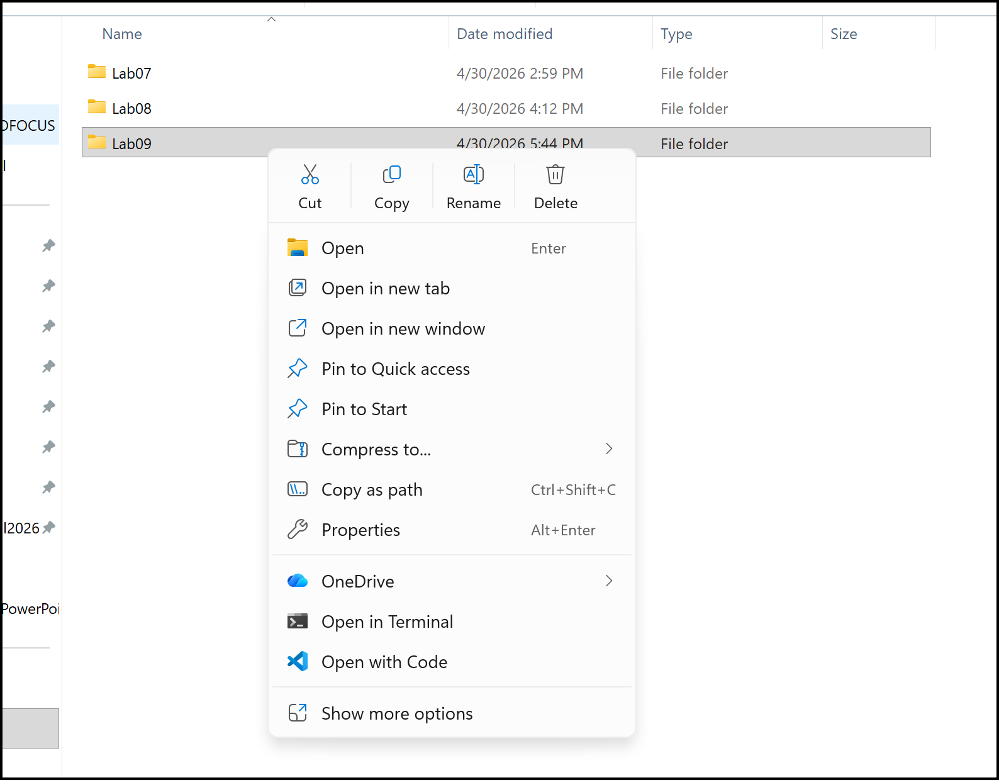

1. Open a terminal -> GitBash and run the below commands:

   ```
      mkdir customer-health-demo && cd customer-health-demo
      python -m venv venv
      .\venv\Scripts\Activate.ps1
      pip install flask
   ```

   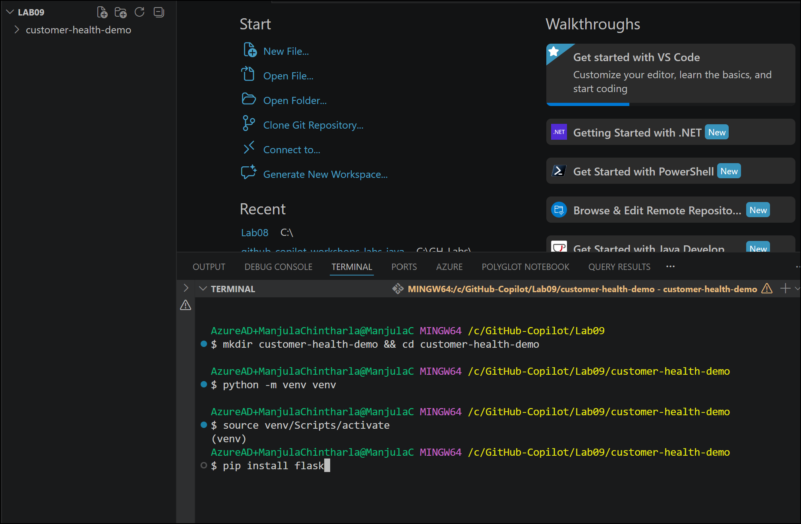

1. Switch to **Agent Mode** in the Copilot Chat panel dropdown.

### Task 1: Understand the Problem — Think Before You Prompt

In this task, you will decompose the VP's vague demo request into concrete requirements, constraints, and tech decisions before touching Copilot. You will decide on Flask, Jinja2, Bootstrap, and mock data as your own architectural choices.

**Decompose the Ask:**

WHAT the VP needs to SEE at tomorrow's demo:

- A dashboard page showing a list of ~10 customers

- Each customer shows: name, industry, health score (0-100), risk level

- Risk levels color-coded: Green (70-100), Yellow (40-69), Red (0-39)

- Clicking a customer shows a detail page with more info

- Looks professional (not raw HTML)

WHAT this is NOT:

- Not a REST API (no JSON endpoints needed)

- Not production code (mock data is fine)

- Not a database application (in-memory is fine)

- Not mobile-responsive (desktop demo only)

TECH DECISIONS (mine, not Copilot's):

- Flask with Jinja2 templates (server-rendered HTML)

- Bootstrap 5 via CDN (instant professional styling)

- Mock data as a Python list of dictionaries

- Two pages: dashboard + customer detail

   > **Note:** Before writing a prompt, first give Copilot a broad description of the goal or scenario. Then list any specific requirements. This decomposition step is what separates a productive Copilot session from an aimless one. The developer must **know the destination** before asking Copilot to drive.

### Task 2: Use Ask Mode for Design Decisions

In this task, you will use Copilot's Ask mode to get pros and cons for implementing color-coded risk levels (backend, template, or CSS). You will choose the approach yourself, using Copilot as a consultant rather than a code generator.

1. Before scaffolding, use **Ask Mode** to validate one design choice. Switch the Copilot Chat dropdown to **Ask** and type:

   **Ask Mode Prompt:**

   ```
   I'm building a Flask prototype with a customer health score dashboard.
   Each customer has a health score from 0-100.
   I want to color-code risk levels: Green (70-100), Yellow (40-69), Red
   (0-39).
   What's the cleanest way to implement this color logic —
   in the Python backend, in the Jinja2 template, or in CSS classes?
   Give me pros and cons of each approach for a quick prototype.
   ```

   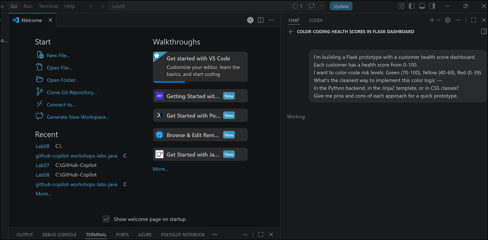

1. Copilot should outline 3 approaches and recommend one. Likely recommendation: use **CSS classes mapped in the backend** (cleanest separation for a prototype).

   Ask mode is the simplest of the three modes. You highlight some code, type a question into Copilot Chat, and it generates an answer.

   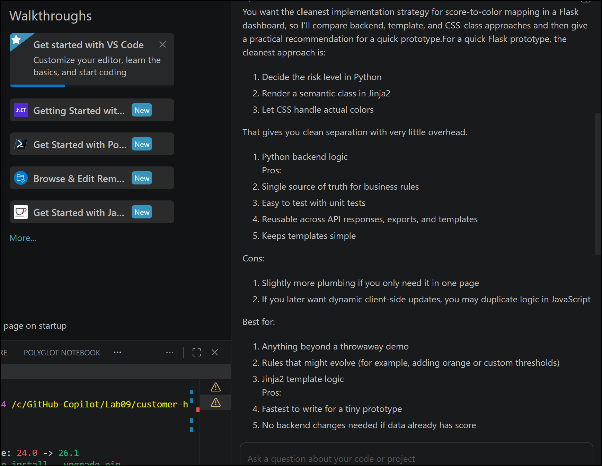

1. Choose the approach that makes sense to YOU. For this exercise, we'll use **CSS classes determined in the Python data layer** (e.g., each customer dict includes a `risk_class` field like "success", "warning", "danger" mapping to Bootstrap colors).

1. This is a **developer decision** — Copilot advised, you decided.

   > **Note:** This step demonstrates using Ask Mode for **design consultation** without generating any code. There's no project commitment, no architectural decisions, and no code changes. Just answers, right when you need them.

> **Congratulations** on completing the task! Now, it's time to validate it. Here are the steps:
> - Hit the Validate button for the corresponding task. If you receive a success message, you can proceed to the next task.
> - If not, carefully read the error message and retry the step, following the instructions in the lab guide.
> - If you need any assistance, please contact us at cloudlabs-support@spektrasystems.com. We are available 24/7 to help you out.
<validation step="ex9-task2-lab09-design-decisions" />

### Task 3: Agent Mode — Scaffold the Entire Application

In this task, you will write a detailed, structured prompt for Copilot Agent mode to scaffold the full Flask app — routes, mock data, and templates — in one pass. You will watch Agent mode create the files, run the app, and self-correct any errors.

1. Switch the Copilot Chat dropdown back to **Agent**. Type the following carefully structured prompt:

   **Prompt:**
   ```
   Build a Flask web application prototype for a Customer Health Score
   Dashboard.
   PROJECT STRUCTURE:
   - app.py (Flask application with routes)
   - data.py (mock customer data — 10 customers)
   - templates/base.html (Bootstrap 5 base layout via CDN)
   - templates/dashboard.html (customer list with health scores)
   - templates/customer_detail.html (single customer detail view)
   REQUIREMENTS:
   1. data.py should contain a list of 10 mock customers. Each customer dict should have: id, name, industry, health_score (0-100), risk_level
   ("healthy"/"at-risk"/"critical"), risk_class ("success"/"warning"/"danger"), revenue (string like "$1.2M"), last_contact_date, and account_manager. Make the data realistic — use real-sounding company names and varied industries.
   2. app.py should have two routes:
   - GET / → renders dashboard.html showing all customers in a table
   - GET customer/<customer_id> → renders customer_detail.html for one customer
   Return 404 if customer not found.
   3. templates/base.html should include Bootstrap 5 via CDN, a navbar with "CustomerIQ" as the brand name, and a content block.
   4. templates/dashboard.html should show a Bootstrap table with columns:
   Customer Name (clickable link to detail page), Industry, Health Score,
   Risk Level (displayed as a colored Bootstrap badge using risk_class),
   Revenue.
   5. templates/customer_detail.html should show all customer fields in a
   Bootstrap card layout with a "Back to Dashboard" link.
   Do NOT use any database. Do NOT create a REST API. This is
   server-rendered HTML only.
   ```

   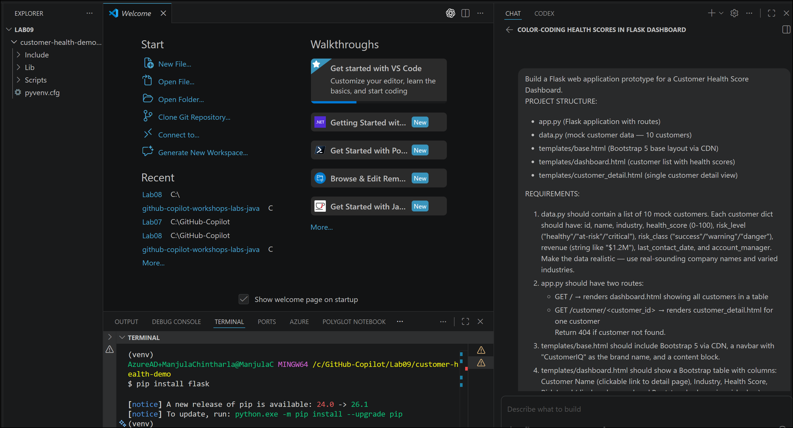

   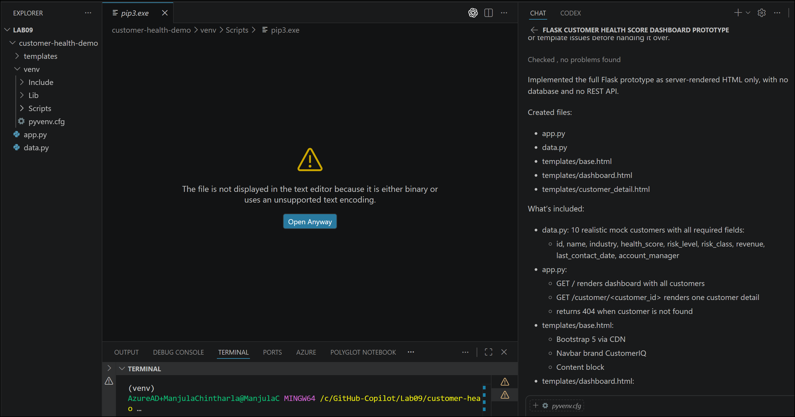

   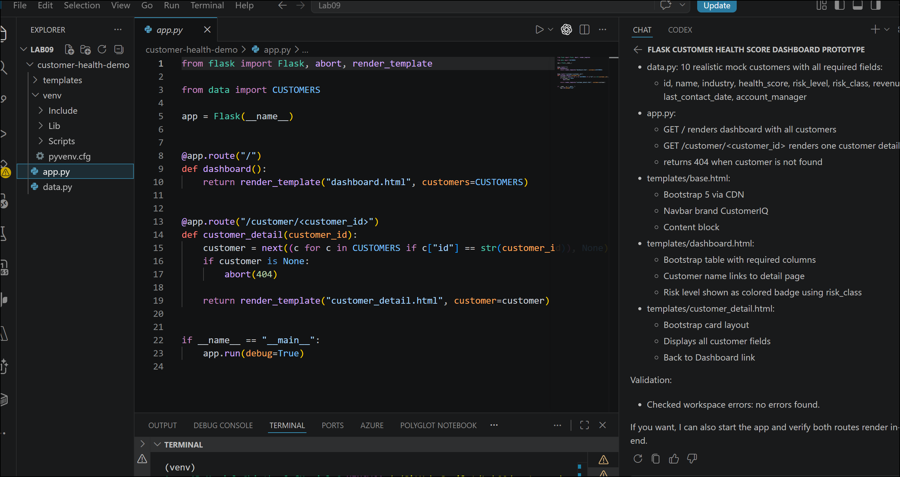

1. After creating all files, run the app with: `python app.py` in the terminal, or you can ask Copilot to start the app.

   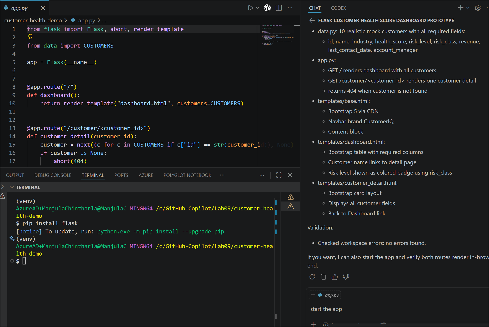

1. Agent mode can analyze your codebase to grasp the full context, plan and execute multi-step solutions, run commands or tests, and refine its own work through an agentic loop, including planning, applying changes, testing, and iterating.

   Watch Agent Mode work. You should see it:

   - **Create** data.py with 10 mock customer records

   - **Create** app.py with Flask routes

   - **Create** templates/ directory with 3 HTML files

   - **Run** python app.py in the terminal

   - **Detect** any errors and self-correct

      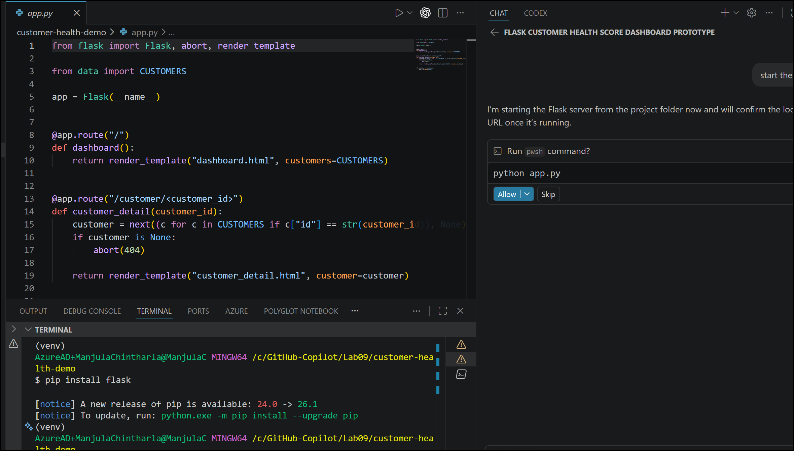

      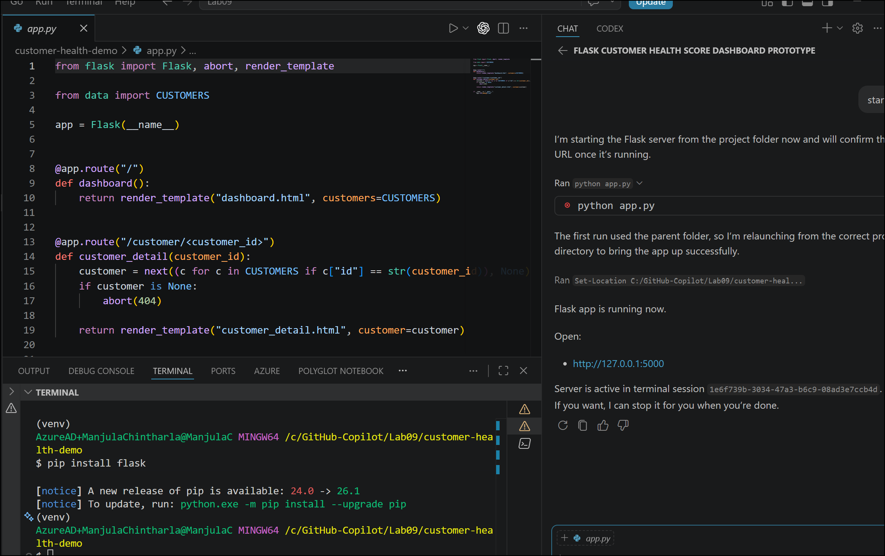

      > **IMPORTANT — Do NOT walk away.** Watch the Agent's terminal output. When it runs the app, it will need to confirm that Flask starts on port 5000 without errors.

1. **Review the Generated Files:** While the app runs, quickly scan each file.

   > **Note:** Like working with any other developer, the more context you give and the more specific you are about your intended outcome, the better results you'll get from GitHub Copilot — and that's particularly true with agent mode. The detailed prompt structure (project structure → requirements → constraints) is what makes Agent Mode produce a usable result on the first pass.

> **Congratulations** on completing the task! Now, it's time to validate it. Here are the steps:
> - Hit the Validate button for the corresponding task. If you receive a success message, you can proceed to the next task.
> - If not, carefully read the error message and retry the step, following the instructions in the lab guide.
> - If you need any assistance, please contact us at cloudlabs-support@spektrasystems.com. We are available 24/7 to help you out.
<validation step="ex9-task3-lab09-scaffold-app" />

### Task 4: Validate and Fix — The Developer Is Still the Pilot

In this task, you will manually test the running dashboard in the browser and document what works and what's broken. You will use /explain and /fix to diagnose and correct data or visual issues Copilot can't detect on its own.

1. Open your browser to `http://localhost:5000`. Check:

   - Dashboard table renders with 10 customers

   - Health scores are visible as numbers

   - Risk badges are color-coded (green/yellow/red)

   - Clicking a customer name navigates to the detail page

   - Detail page shows all customer fields

   - "Back to Dashboard" link works

   - Navbar shows "CustomerIQ" brand

   **Document what works and what doesn't.**

   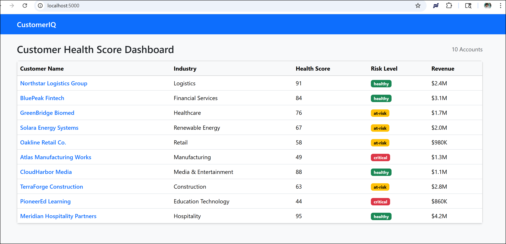

1. Select the customer list in **data.py**. In Copilot Chat (Ask Mode), type the standardized prompt:

   **Prompt:**
   ```
   /explain What does this code do and why might it fail?
   ```

   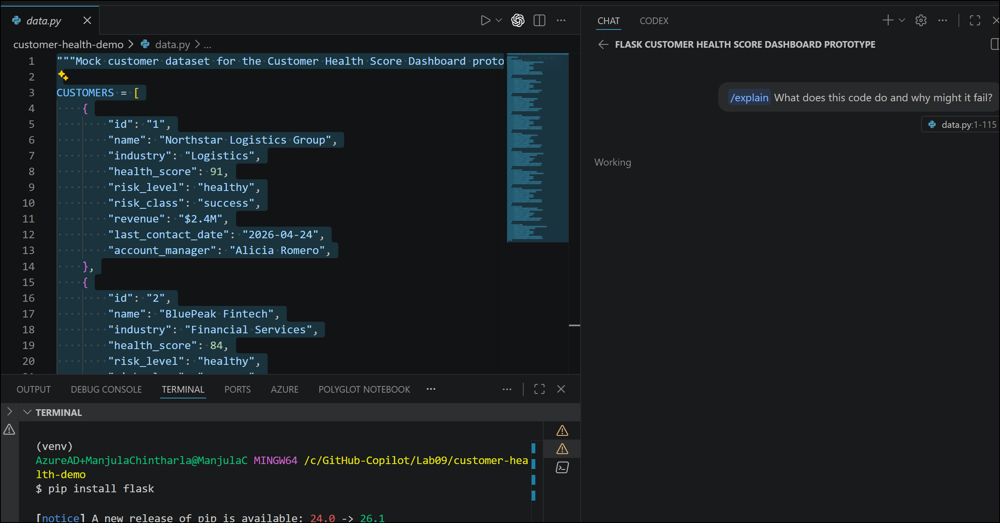

1. Copilot should explain the data structure and may flag that:

   - customer_id values need to be consistent between data.py and URL routing

   - Date strings may not parse if used in calculations later

   - risk_class must exactly match Bootstrap class names

      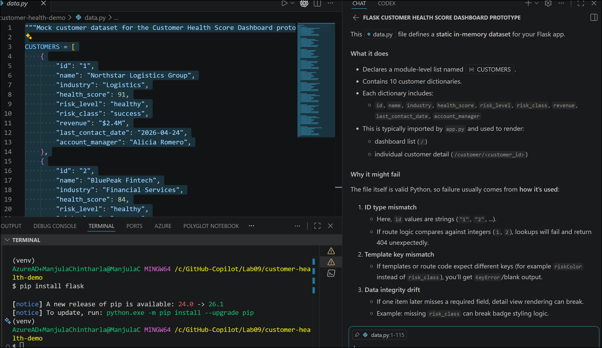

1. Note any mismatches Copilot identifies. We'll fix them next.

1. If the dashboard has visual bugs (e.g., badges aren't colored, links are broken), select the problematic template and type:

   **Prompt — Fix Code:**
   ```
   /fix Identify and fix only the issues causing this failure. Do not
   rewrite unrelated logic.
   ```

   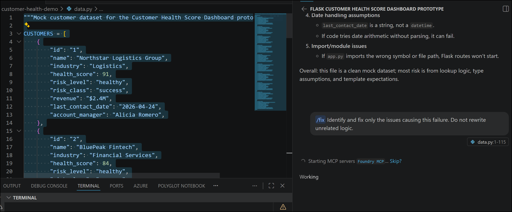

1. **Common fixes needed:**

   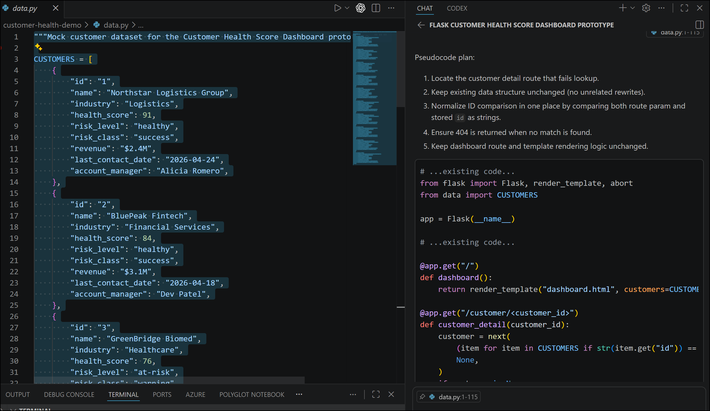

> **Note:** Visual bugs (wrong colors, layout issues) can't be auto-detected by Agent Mode because it doesn't see the browser. **This is why human validation is irreplaceable.**

### Task 5: Iterative Enhancement — Add a Feature with Edit Mode

In this task, you will prompt Agent mode to add a summary metrics bar with calculated stats to the dashboard. You will review the revenue-parsing logic, correct it with a follow-up prompt, and verify the metrics render correctly.

1. In the Copilot Chat dropdown, select **Agent**. Select **dashboard.html** and **app.py** to the **Working Set** (drag the file tabs into the Edit panel).

   **Prompt:**
   ```
   Add a summary metrics bar at the top of the dashboard page, above the
   table.
   Show 4 Bootstrap cards in a row:
   - Total Customers (count)
   - Average Health Score (calculated from data, rounded to 1 decimal)
   - At-Risk Customers (count where risk_level is "at-risk" or "critical")
   - Total Revenue (sum of all customer revenue — parse from strings)
   Calculate these metrics in app.py and pass them to the template.
   Style the cards with Bootstrap's card component. Use a colored top
   border:
   blue for total, green for average score, orange for at-risk, purple for
   revenue.
   ```

   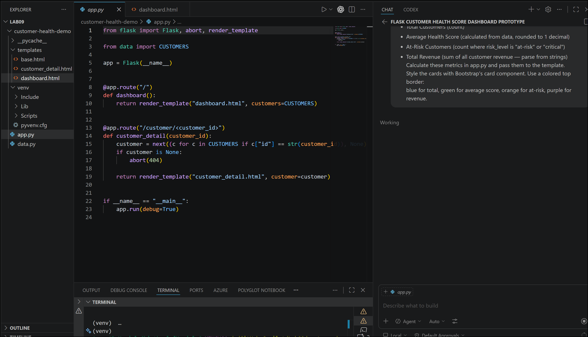

1. Agent Mode should show inline diffs in both app.py (new metric calculations) and dashboard.html (new card row).

   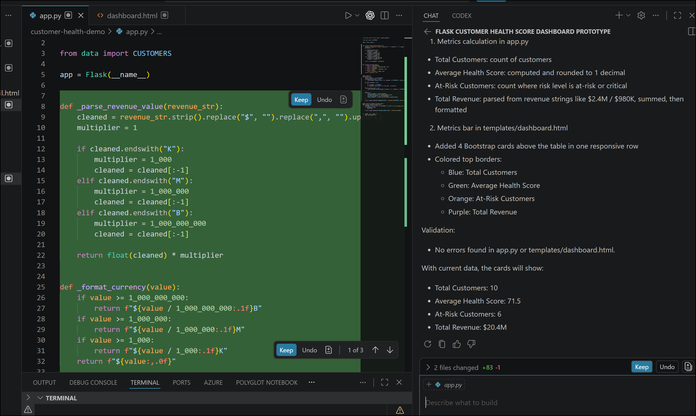

1. If the revenue calculation looks wrong, **this is your moment to exercise developer judgment:**

   **Follow-up Edit Prompt:**
   ```
   The revenue parsing is incorrect. Revenue strings are formatted like
   "$1.2M" or "$850K". Parse them by:
   - Removing the $ sign
   - Converting M to multiply by 1,000,000 and K to multiply by 1,000
   - Display total as formatted currency like "$12.5M"
   Fix only the revenue parsing in app.py. Do not change other metrics.
   ```

1. After accepting edits, **refresh the browser** and verify the metrics display correctly.

   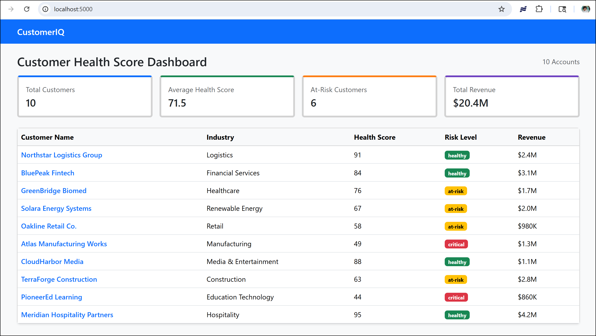

> **Congratulations** on completing the task! Now, it's time to validate it. Here are the steps:
> - Hit the Validate button for the corresponding task. If you receive a success message, you can proceed to the next task.
> - If not, carefully read the error message and retry the step, following the instructions in the lab guide.
> - If you need any assistance, please contact us at cloudlabs-support@spektrasystems.com. We are available 24/7 to help you out.
<validation step="ex9-task5-lab09-iterative-enhancement" />

### Task 6: Document the Prototype with /doc

In this task, you will select app.py and use Copilot's /doc command to generate module- and function-level documentation. You will review the generated docstrings for accuracy before finalizing them.

1. Select the **entire app.py** file. In Copilot Chat, type:

   **Prompt — Documentation:**
   ```
   /doc Generate clear documentation explaining this module's behavior.
   ```

   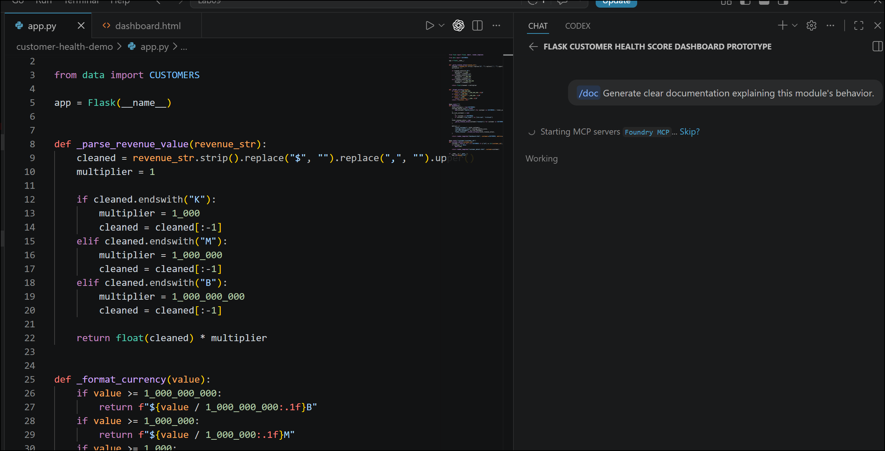

1. Copilot should generate:

   - A module-level docstring explaining the Customer Health Dashboard prototype

   - Function-level docstrings for each route

   - Parameter descriptions for the detail route's customer_id

   /doc quickly generates documentation for a single method or entire file. Best for quick, no-fuss documentation. May need edits for accuracy.

   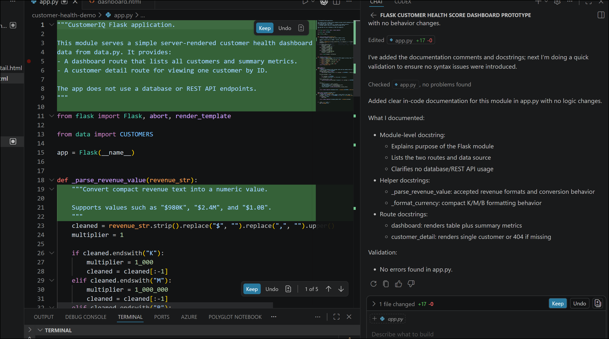

> **Congratulations** on completing the task! Now, it's time to validate it. Here are the steps:
> - Hit the Validate button for the corresponding task. If you receive a success message, you can proceed to the next task.
> - If not, carefully read the error message and retry the step, following the instructions in the lab guide.
> - If you need any assistance, please contact us at cloudlabs-support@spektrasystems.com. We are available 24/7 to help you out.
<validation step="ex9-task6-lab09-documentation" />

## Review

In this lab, you have completed the following:

   - Decomposed a vague business request into a clear technical spec before using Copilot
   - Used Ask Mode to validate design decisions (color logic, data structure)
   - Used Agent Mode to scaffold an entire multi-file Flask application from a single prompt
   - Validated and fixed visual bugs that Copilot couldn't auto-detect
   - Iteratively enhanced the prototype by adding a summary metrics bar
   - Generated module and route documentation using /doc

### You have successfully completed the lab!
### In the Lab Guide section, click the **Next >>** button to proceed to Lab 10.


