# Lab 10: Debugging and Fixing a Buggy Node.js REST API with GitHub Copilot

### Estimated Duration: 120 Minutes

## Overview

In this lab, you will use GitHub Copilot to systematically identify, understand, and fix bugs, security vulnerabilities, and missing validation across a buggy Node.js Express REST API. You will add test coverage and documentation once all issues are resolved.

You have just joined a mid-size development team as a backend developer. Your team lead has assigned you a **Node.js Express REST API** for an e-commerce **Order Management System** that a junior developer built before leaving the company. The API is riddled with bugs — it crashes on certain endpoints, returns incorrect data, has security vulnerabilities, lacks input validation, and has no unit tests.

Your task is to **use GitHub Copilot** as your AI pair-programming assistant to systematically identify, understand, and fix all the bugs — then add proper test coverage and documentation before the next sprint review.

**This is NOT a coding fundamentals exercise.** You are expected to understand JavaScript/Node.js. The exercise teaches you **how to leverage GitHub Copilot effectively** for real-world debugging workflows.

## Objectives

In this lab, you will complete the following tasks:

   - Task 1: Understand the Problem (Human Reasoning First)
   - Task 2: Use GitHub Copilot to Analyze and Explore the Codebase
   - Task 3: Use Copilot to Generate Fixes in src/app.js
   - Task 4: Use Copilot to Generate Fixes in src/server.js
   - Task 5: Use Copilot to Generate Fixes in src/models/order.js
   - Task 6: Use Copilot to Generate Fixes in src/controllers/orderController.js
   - Task 7: Use Copilot to Generate Fixes in src/routes/orderRoutes.js
   - Task 8: Use Copilot to Generate Fixes in src/middleware/auth.js
   - Task 9: Use Copilot to Generate Fixes in src/utils/helpers.js

### Task 1: Understand the Problem (Human Reasoning First)

In this task, you will clone the buggy Order Management API, attempt to start the server, and diagnose the startup crash yourself before using Copilot. You will note the error, the file it points to, and why Express is rejecting the route definition.

1. Open the project in VS Code. Open Terminal -> GitBash and run the below command to clone the repo:

   ```
   git clone https://github.com/technofocus-pte/buggy-order-api-lab.git
   ```

1. Attempt to start the server:

   ```
   cd buggy-order-api/
   npm start
   ```

1. The server will crash on startup due to route configuration errors.

   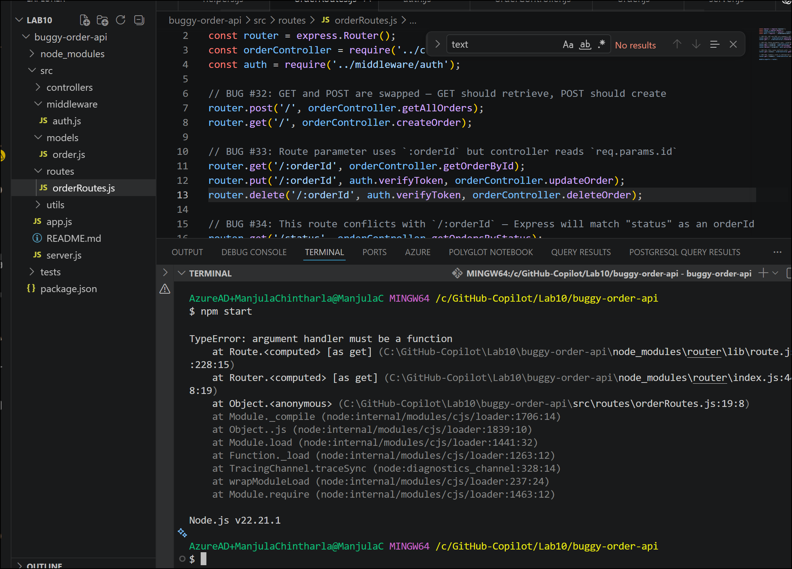

1. Route handlers are validated during startup. An undefined controller method can crash the app before any API calls occur.

1. **Before using Copilot**, write down:

   - Does the server start? (No)

   - What error occurs?

   - Which file is referenced in the stack trace?

   - Why would Express reject a route definition?

1. Do not move on to endpoint testing until startup-level issues are resolved.

1. Open terminal and run the below command to create a new branch for your fixes:
   
   ```
   git checkout -b fix/debug-with-copilot
   ```

> **Congratulations** on completing the task! Now, it's time to validate it. Here are the steps:
> - Hit the Validate button for the corresponding task. If you receive a success message, you can proceed to the next task.
> - If not, carefully read the error message and retry the step, following the instructions in the lab guide.
> - If you need any assistance, please contact us at cloudlabs-support@spektrasystems.com. We are available 24/7 to help you out.
<validation step="ex10-task1-lab10-understand-problem" />

### Task 2: Use GitHub Copilot to Analyze and Explore the Codebase

In this task, you will use Copilot's /explain on order.js and targeted questions on specific methods to understand bugs like a broken findByStatus filter. You will also ask Copilot to review the auth middleware for security vulnerabilities and evaluate its findings.

1. Open **src/models/order.js** in the editor. Select **all the code** in the file. Open Copilot Chat and type:

   ```
   /explain
   ```

   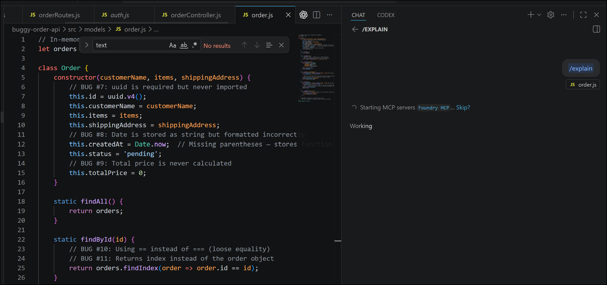

1. Read Copilot's explanation carefully. It should identify:

   - Missing uuid import

   - Date.now vs Date.now()

   - findById returning index instead of object

   - splice misuse

1. Use /explain for a step-by-step breakdown of a complex function. Does Copilot catch ALL the bugs? Note which ones it misses — this is where developer expertise matters.

   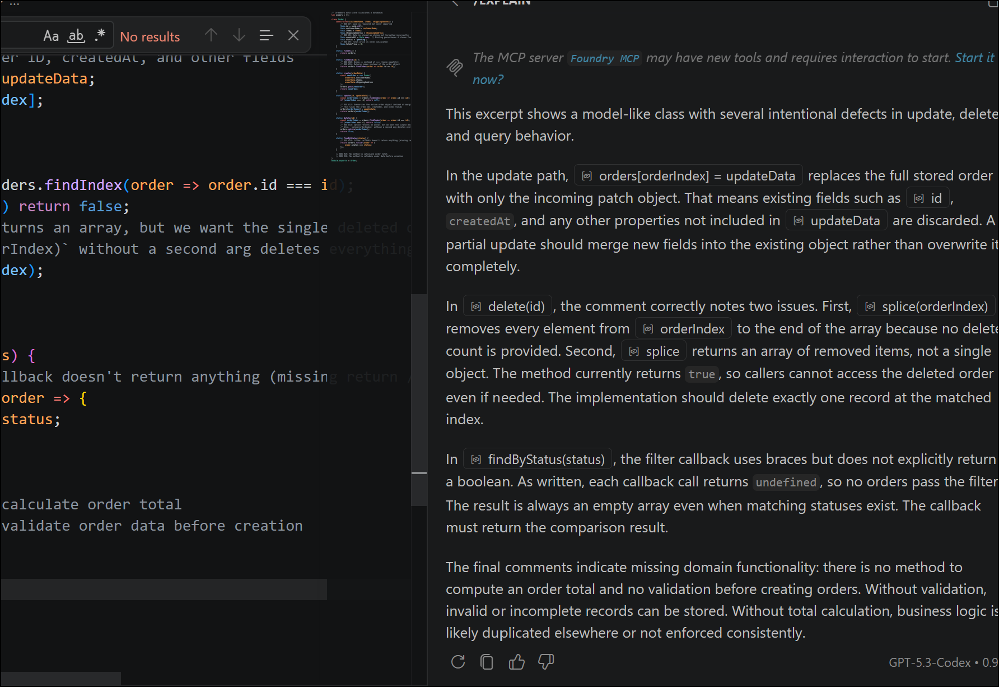

1. Highlight the **findByStatus** method in order.js. In Copilot Chat, ask:

   ```
   Why does this filter method always return an empty array?
   ```

   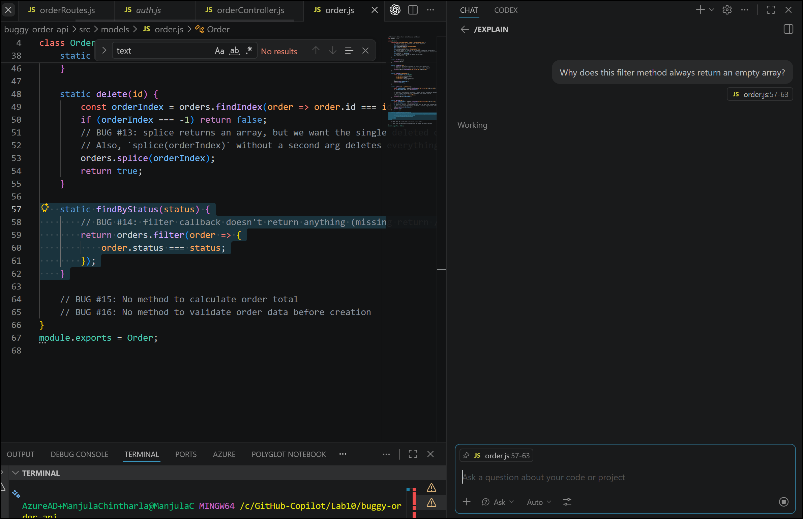

1. Copilot should explain that the arrow function body with curly braces needs an explicit return statement, or the curly braces should be removed.

   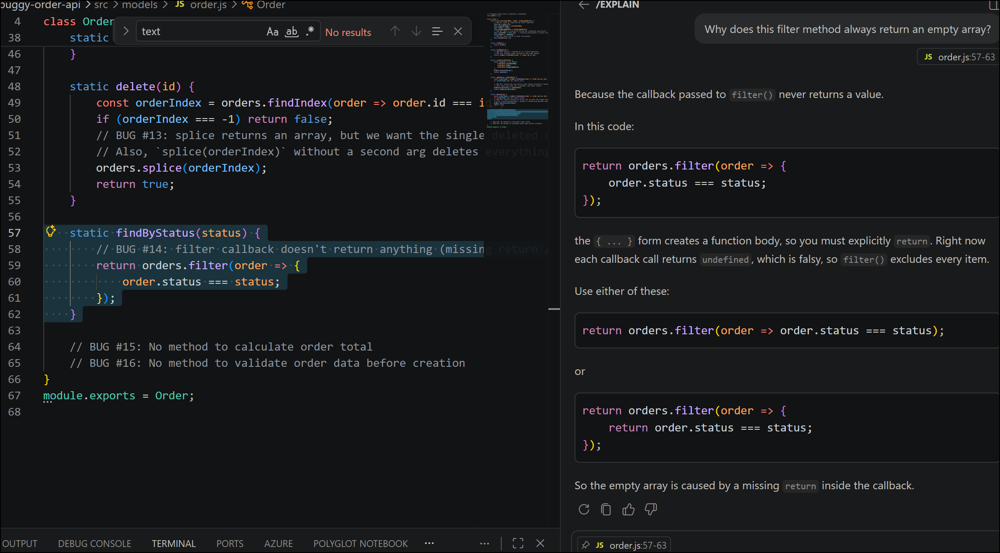

1. Open **src/middleware/auth.js**. In Copilot Chat, type:

   ```
   Analyze this authentication middleware for security vulnerabilities and best practice violations
   ```

   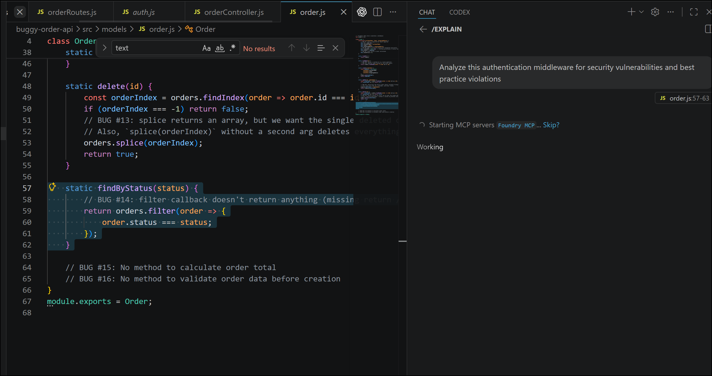

1. **Evaluate Copilot's response.** It should identify:

   - No actual token verification (JWT or otherwise)

   - Wrong HTTP status code (403 vs 401)

   - Case-sensitive header access

   - No user info extraction from token

      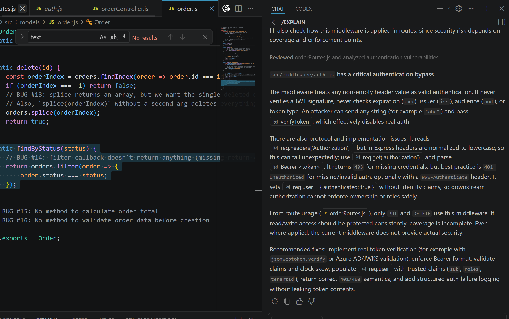

      > **Note:** Copilot may suggest implementing full JWT verification. For this exercise, decide whether a simple token check is sufficient for a prototype or if you should implement proper JWT. **This is your call, not Copilot's.**

> **Congratulations** on completing the task! Now, it's time to validate it. Here are the steps:
> - Hit the Validate button for the corresponding task. If you receive a success message, you can proceed to the next task.
> - If not, carefully read the error message and retry the step, following the instructions in the lab guide.
> - If you need any assistance, please contact us at cloudlabs-support@spektrasystems.com. We are available 24/7 to help you out.
<validation step="ex10-task2-lab10-analyze-codebase" />

### Task 3: Use Copilot to Generate Fixes in src/app.js

In this task, you will use Copilot's /fix to add missing middleware, correct a route prefix typo, and add CORS and global error handling to app.js. You will install any required packages and update your bug tracker once fixed.

1. **Open** **src/app.js** in the editor. **Select all code** in the file and type in Copilot Chat in Agent mode:

   ```
   /fix Review this Express app configuration. It is missing critical middleware and has a route prefix typo. Fix all issues.
   ```

   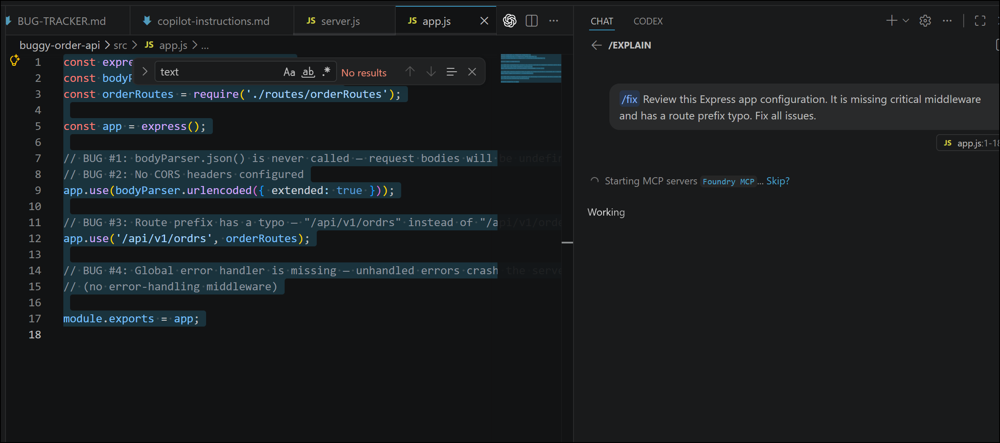

1. **Review Copilot's suggestions.** It should propose and fix the issues:

   - Adding `app.use(bodyParser.json());` before routes

   - Adding CORS middleware (either cors package or manual headers)

   - Fixing '/api/v1/ordrs' → '/api/v1/orders'

   - Adding a global error-handling middleware at the bottom

      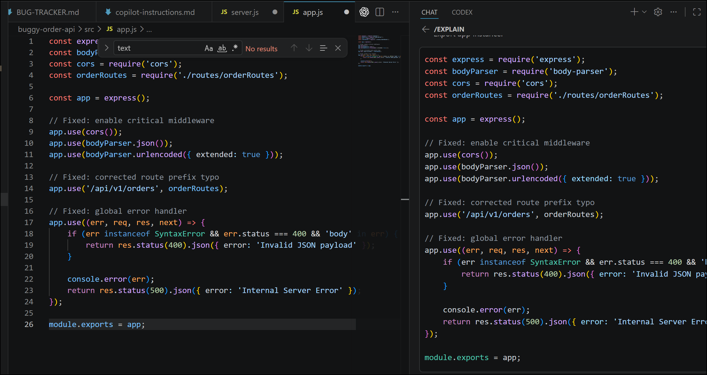

1. Open Terminal and install the CORS package if Copilot suggested it:

   ```
   npm install cors
   ```

   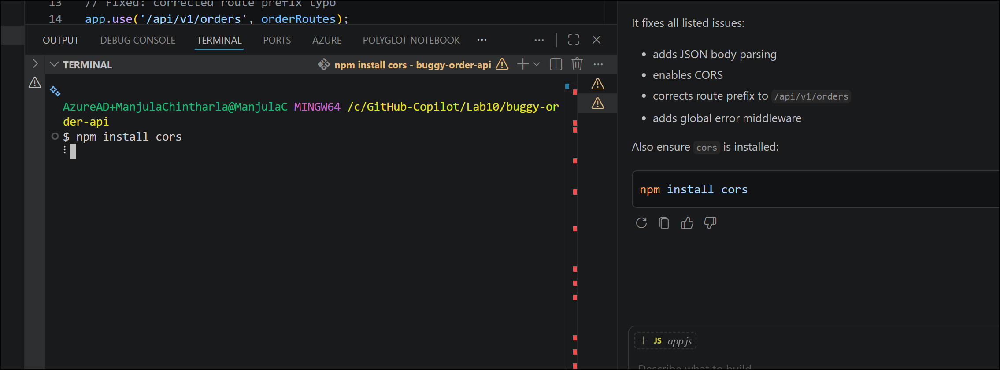

1. **Update your Bug Tracker:** Mark Bugs #1–#4 as fixed and note which Copilot feature you used.

   > **Note:** Copilot may suggest various CORS configurations. For a development API, permissive CORS is fine. For production, you'd restrict origins. **This decision is yours**, not Copilot's.

> **Congratulations** on completing the task! Now, it's time to validate it. Here are the steps:
> - Hit the Validate button for the corresponding task. If you receive a success message, you can proceed to the next task.
> - If not, carefully read the error message and retry the step, following the instructions in the lab guide.
> - If you need any assistance, please contact us at cloudlabs-support@spektrasystems.com. We are available 24/7 to help you out.
<validation step="ex10-task3-lab10-fix-appjs" />

### Task 4: Use Copilot to Generate Fixes in src/server.js

In this task, you will use Copilot to replace the hardcoded port with environment variable support and add graceful shutdown/signal handling. You will review and apply the fix, then mark the corresponding bugs resolved.

1. Open src/server.js. **Select all code** and use Copilot Chat Agent mode:

   ```
   /fix This server file has a hardcoded port and no graceful shutdown. Add environment variable support and proper signal handling.
   ```

   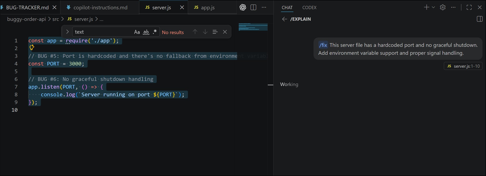

1. **Review and apply fixes.**

   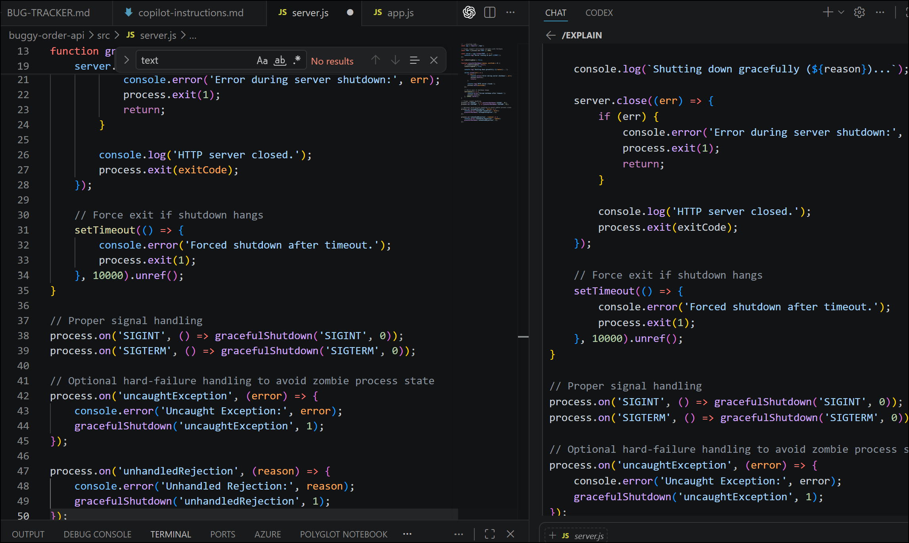

   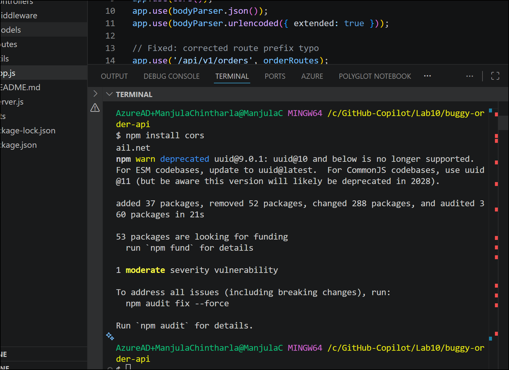

1. **Update Bug Tracker:** Mark Bugs #5–#6 as fixed.

> **Congratulations** on completing the task! Now, it's time to validate it. Here are the steps:
> - Hit the Validate button for the corresponding task. If you receive a success message, you can proceed to the next task.
> - If not, carefully read the error message and retry the step, following the instructions in the lab guide.
> - If you need any assistance, please contact us at cloudlabs-support@spektrasystems.com. We are available 24/7 to help you out.
<validation step="ex10-task4-lab10-fix-serverjs" />

### Task 5: Use Copilot to Generate Fixes in src/models/order.js

In this task, you will use Copilot's /fix and inline chat to resolve the constructor crash, a broken update method, and a faulty findByStatus filter across several stages. You will also use comment prompts to add missing calculateTotal and validateOrderData methods.

#### **Fix Critical Crashes (Bugs #7, #8)**

1. **Highlight the constructor** of the Order class. In Copilot Chat:

   ```
   /fix This constructor crashes because uuid is never imported and Date.now is missing parentheses. Also, totalPrice should be calculated from items.
   ```

   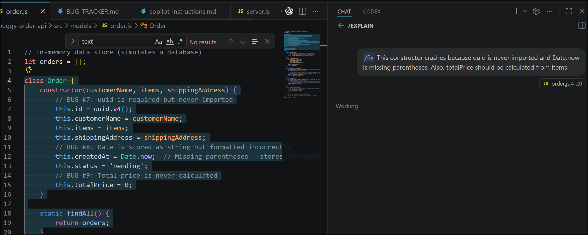

1. **Verify** Copilot adds `const { v4: uuidv4 } = require('uuid');` at the top and changes `Date.now` to `Date.now()` or `new Date()`.

   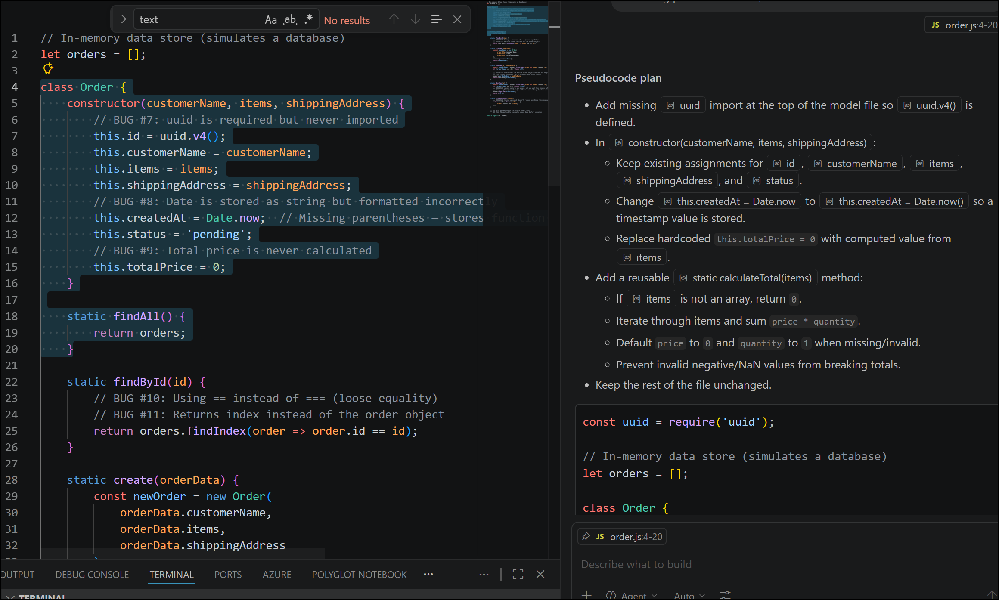

   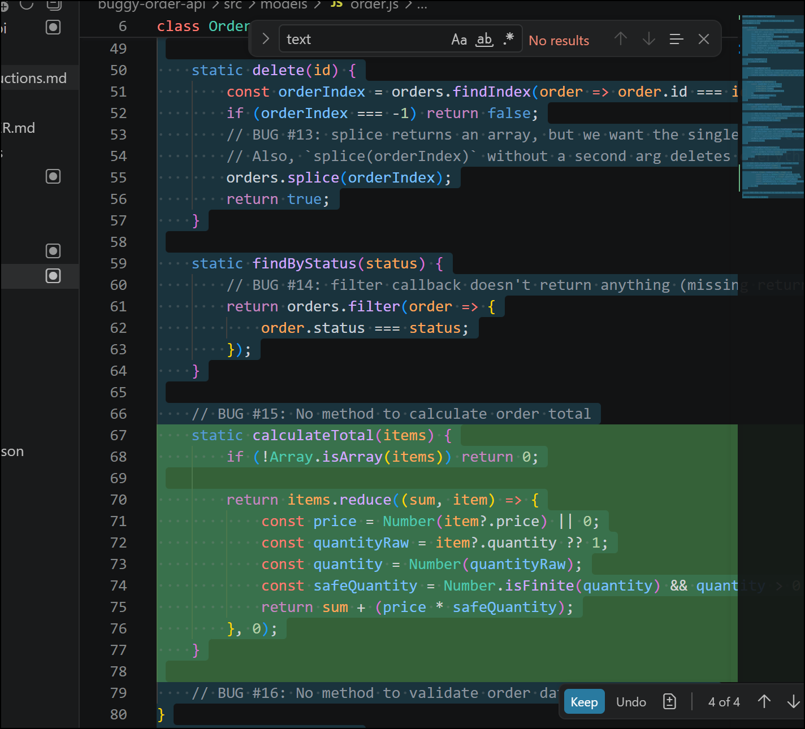

#### **Fix update Method (Bug #12)**

1. **Highlight** the update method. Use **inline chat** (press Ctrl+I / Cmd+I on the selection):

   ```
   Fix this: it overwrites the entire order with updateData, losing the original fields like id and createdAt. It should merge properties instead.
   ```

   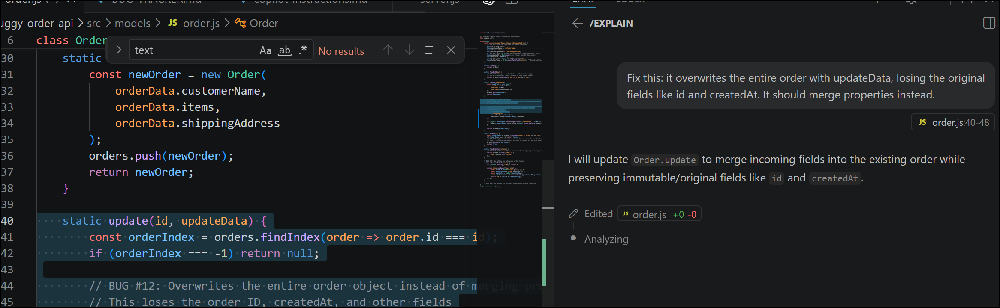

1. Review the suggested fix and accept it.

   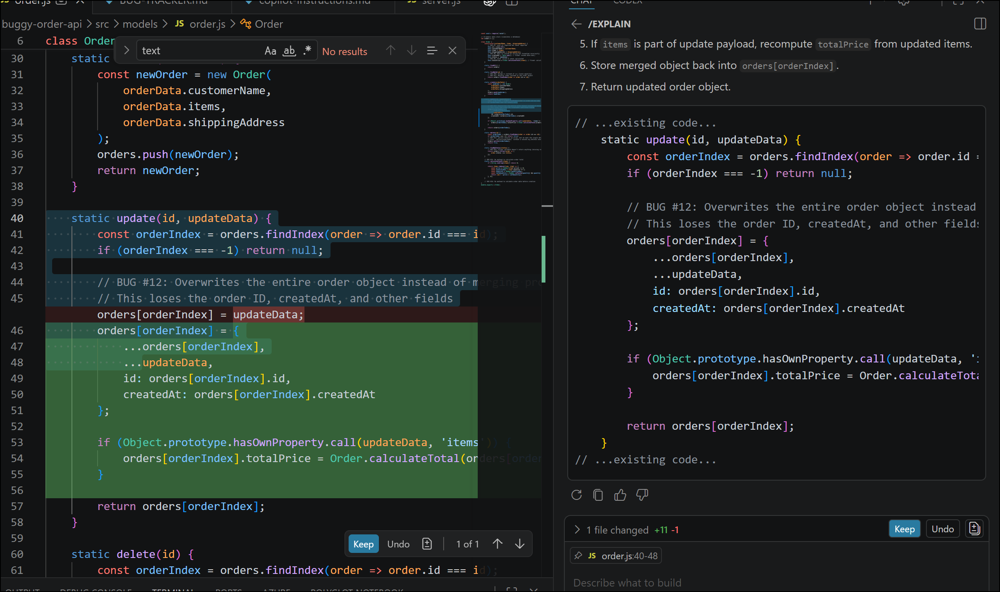

#### **Fix findByStatus (Bug #14)**

1. **Highlight** the findByStatus method. Copilot should have fixed it as shown.

   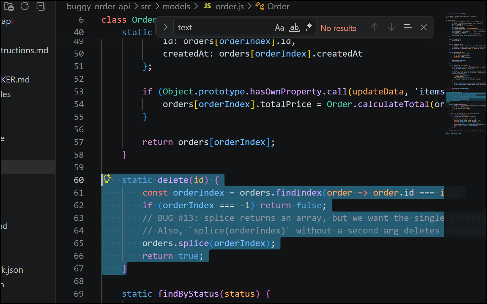

> **Note:** The bug was curly braces without a return statement. Copilot should explain that `=> { expression }` needs return, while `=> expression` returns implicitly.

#### **Add Missing Methods (Bugs #15, #16)**

1. Place your cursor at the bottom of the class, **before the closing }**.

1. Type the following **comment prompt** to trigger Copilot inline suggestions:

   ```
   // Calculate the total price of an order by summing price * quantity for each item
   ```

1. **Wait for Copilot's ghost text suggestion** and press Tab to accept if it looks correct.

   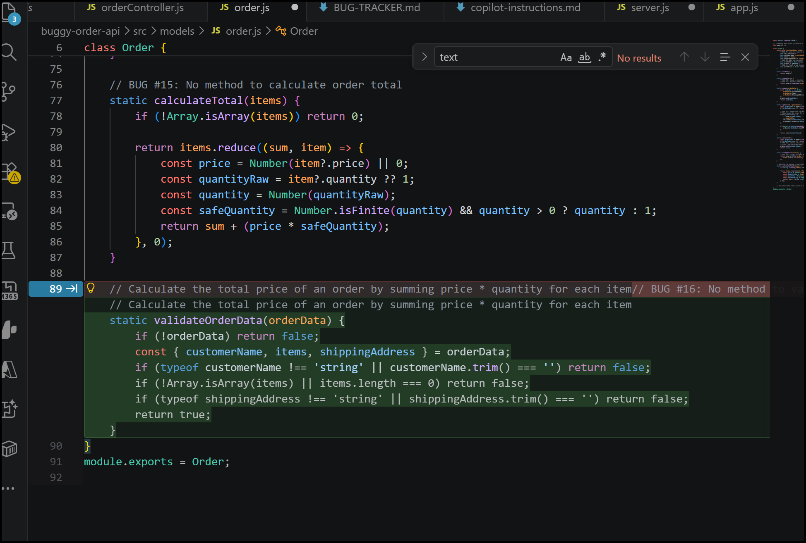

1. Then type another comment:

   ```
   // Validate order data: customerName, items (non-empty array), and shippingAddress are required
   ```

1. Accept or refine Copilot's suggestion.

1. **Update Bug Tracker:** Mark Bugs #7–#16 as fixed.

> **Congratulations** on completing the task! Now, it's time to validate it. Here are the steps:
> - Hit the Validate button for the corresponding task. If you receive a success message, you can proceed to the next task.
> - If not, carefully read the error message and retry the step, following the instructions in the lab guide.
> - If you need any assistance, please contact us at cloudlabs-support@spektrasystems.com. We are available 24/7 to help you out.
<validation step="ex10-task5-lab10-fix-orderjs" />

### Task 6: Use Copilot to Generate Fixes in src/controllers/orderController.js

In this task, you will use Copilot to add input validation, fix incorrect HTTP status codes, and correct error handling in createOrder, getOrdersByStatus, and getOrderSummary. You will review each fix against the specific bugs called out in your prompts.

#### **Fix createOrder (Bugs #20–#23)**

1. **Highlight** the createOrder method. In Copilot Chat:

   ```
   /fix This createOrder method has no input validation, returns wrong HTTP status code (200 instead of 201), and has incorrect error handling. Fix all issues and add proper validation using the helpers module.
   ```

   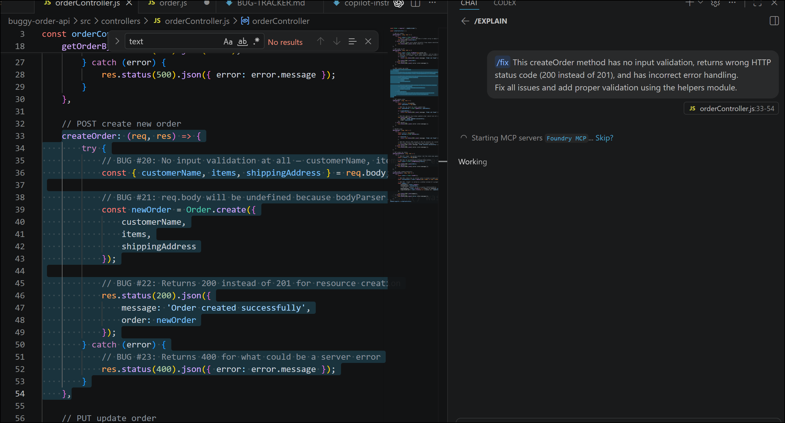

1. **Review** Copilot's output. Expected improvements:

   - Import helpers at the top

   - Validate customerName, items, shippingAddress before creating

   - Return 201 status code

   - Proper error handling with 500 for server errors

1. Fixed code should look like:

   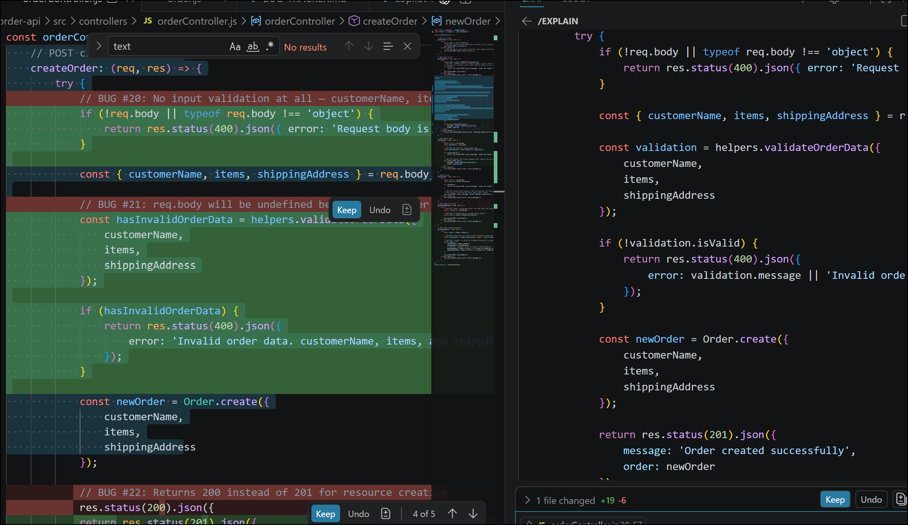

#### **Fix getOrdersByStatus (Bugs #27–#28)**

1. **Highlight** the getOrdersByStatus method. In Copilot Chat in Agent mode:

   ```
   /fix This reads status from req.params but the route sends it as a query parameter. Also add validation for allowed status values: pending, processing, shipped, delivered, cancelled.
   ```

   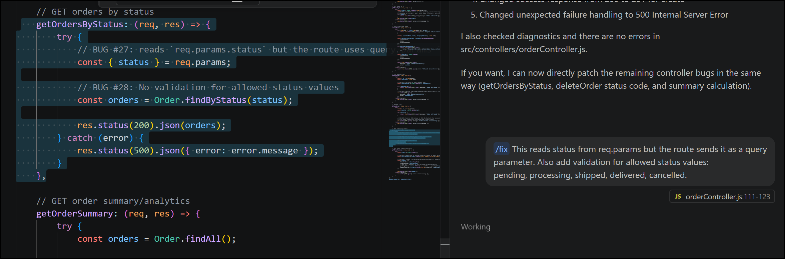

1. Review and accept the fix.

   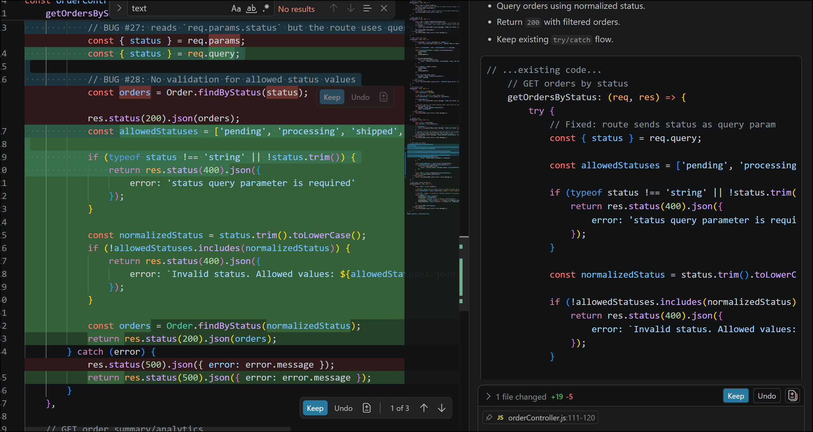

#### **Fix getOrderSummary (Bugs #29–#31)**

1. **Highlight** the **getOrderSummary** method.

1. In Copilot Chat:

   ```
   /fix This method has three bugs:
   1. reduce() crashes on empty array (no initial value)
   2. .length() is called as a method instead of a property
   3. 'pending' is not in quotes - it's a ReferenceError
   Fix all three.
   ```

   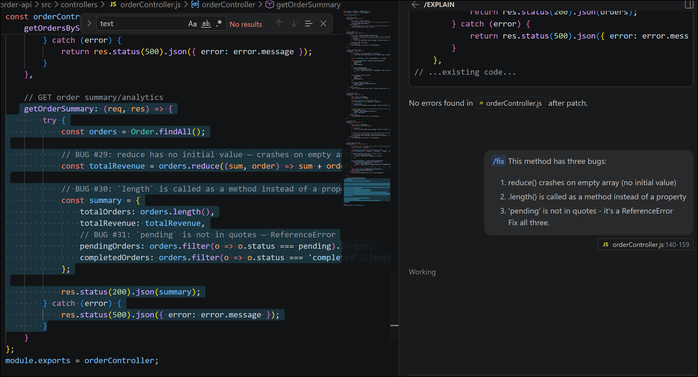

1. Review and accept the fix.

   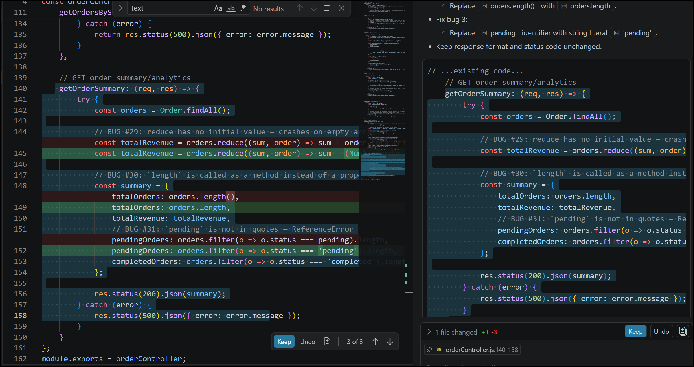

1. **Update Bug Tracker:** Mark Bugs #17–#31 as fixed.

> **Congratulations** on completing the task! Now, it's time to validate it. Here are the steps:
> - Hit the Validate button for the corresponding task. If you receive a success message, you can proceed to the next task.
> - If not, carefully read the error message and retry the step, following the instructions in the lab guide.
> - If you need any assistance, please contact us at cloudlabs-support@spektrasystems.com. We are available 24/7 to help you out.
<validation step="ex10-task6-lab10-fix-controller" />

### Task 7: Use Copilot to Generate Fixes in src/routes/orderRoutes.js

In this task, you will use Copilot to fix swapped HTTP methods, mismatched route parameters, a route-ordering conflict, and a wrong controller method reference. You will verify route ordering is corrected so specific routes don't get shadowed by dynamic ones.

1. **Open** orderRoutes.js and **select all code**. In Copilot Chat, use a comprehensive prompt:

   ```
   /fix This route file has the following issues:
    1. GET and POST methods are swapped on the root route
    2. Route parameter is :orderId but controllers expect :id
    3. /status route conflicts with /:orderId pattern (Express matches "status" as an orderId)
    4. Summary route references wrong controller method name (orderSummary vs getOrderSummary)
    Fix all issues and ensure route ordering prevents conflicts.
   ```

   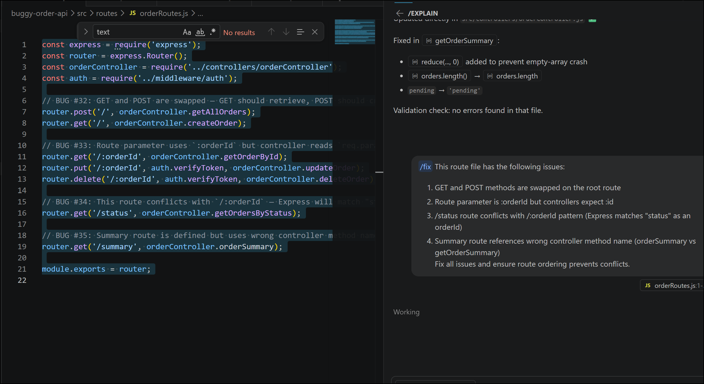

1. Review the fix and accept it.

   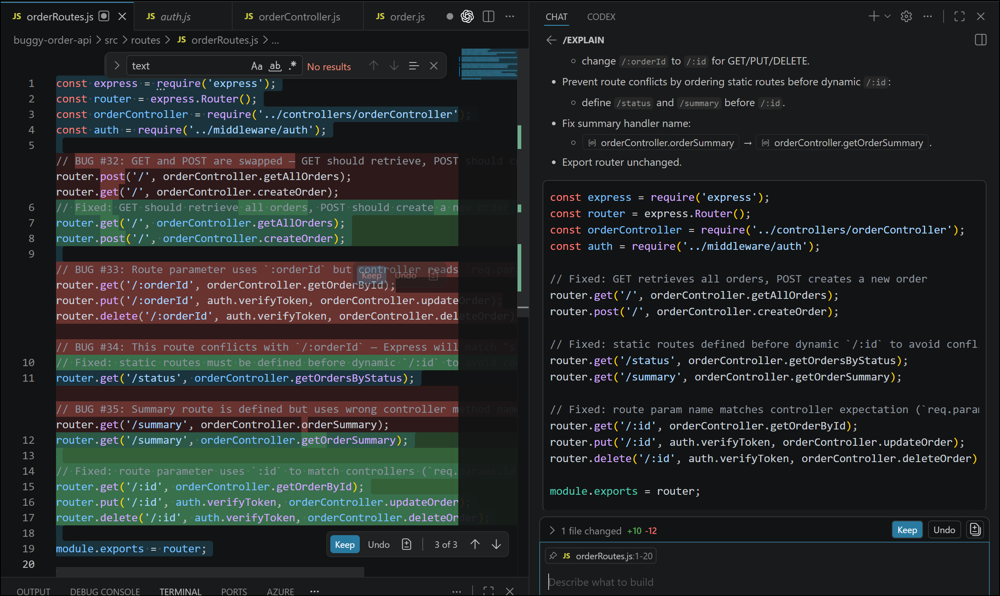

   > **Note:** Notice how route ordering matters in Express. Copilot is recognizing patterns and suggesting solutions based on what it has learned. But understanding **why** /status must come before /:id requires your knowledge of Express route matching.

1. **Update Bug Tracker:** Mark Bugs #32–#35 as fixed.

> **Congratulations** on completing the task! Now, it's time to validate it. Here are the steps:
> - Hit the Validate button for the corresponding task. If you receive a success message, you can proceed to the next task.
> - If not, carefully read the error message and retry the step, following the instructions in the lab guide.
> - If you need any assistance, please contact us at cloudlabs-support@spektrasystems.com. We are available 24/7 to help you out.
<validation step="ex10-task7-lab10-fix-routes" />

### Task 8: Use Copilot to Generate Fixes in src/middleware/auth.js

In this task, you will use Copilot to fix the case-sensitive header bug, correct the HTTP status code, and implement real JWT token verification. You will install the jsonwebtoken package and update your bug tracker.

1. **Open** auth.js and **select all code**. In Copilot Chat:

   ```
   /fix This auth middleware has security issues:
   1. req.headers['Authorization'] should be lowercase 'authorization'
   2. Returns 403 when it should return 401 (no token = unauthorized, not forbidden)
   3. No actual token verification — just checks if token exists
   4. Never extracts user info from token
   Implement proper JWT token verification using jsonwebtoken library.
   ```

   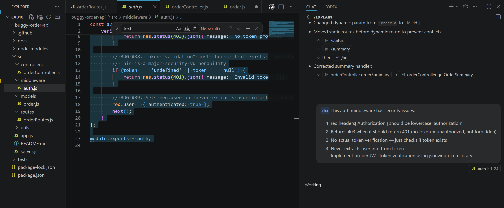

1. Review and accept the fix.

   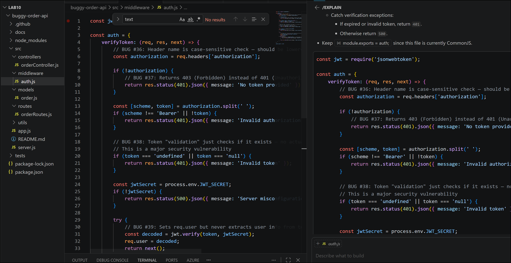

1. **Open terminal and run the below command to install jsonwebtoken:**

   ```
   npm install jsonwebtoken
   ```

   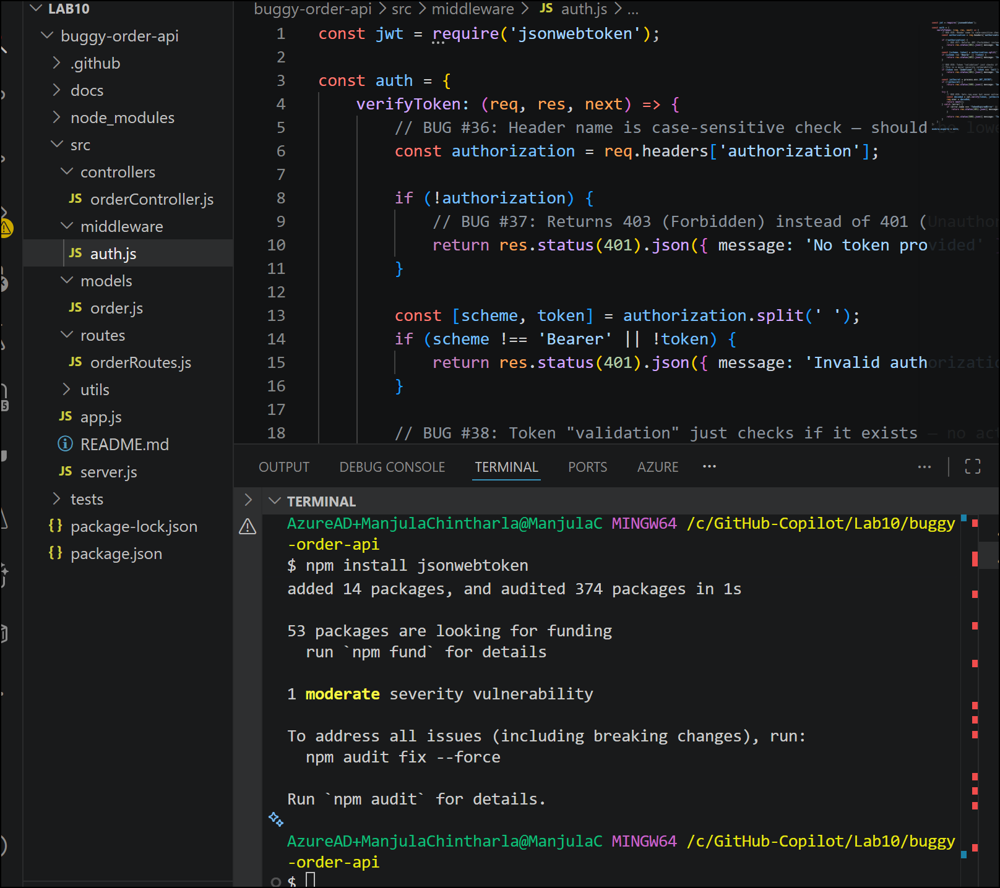

1. **Update Bug Tracker:** Mark Bugs #36–#39 as fixed.

   > **Note:** Copilot may suggest different JWT configurations. For this exercise, a simple HS256 token with environment-variable secret is fine. In production, you'd use RS256 with key rotation. **This architecture decision is yours.**

> **Congratulations** on completing the task! Now, it's time to validate it. Here are the steps:
> - Hit the Validate button for the corresponding task. If you receive a success message, you can proceed to the next task.
> - If not, carefully read the error message and retry the step, following the instructions in the lab guide.
> - If you need any assistance, please contact us at cloudlabs-support@spektrasystems.com. We are available 24/7 to help you out.
<validation step="ex10-task8-lab10-fix-auth" />

### Task 9: Use Copilot to Generate Fixes in src/utils/helpers.js

In this task, you will use Copilot Agent mode to fix multiple bugs at once calculation errors, inverted validation logic, status typos, pagination off-by-one issues, and missing XSS sanitization. You will start the server and validate all fixes by exercising the API endpoints with curl.

1. Select the full code from src/utils/helpers.js and enter the below prompt in Agent mode:

   ```
   Fix all bugs in helpers.js:
   1. calculateTotal: uses for...in instead of for...of, multiplies price*price instead of price*quantity, has floating point issues
   2. validateOrderData: validation logic is completely inverted (returns true for invalid, false for valid)
   3. isValidStatus: has typos ("shiped", "cancled"), and is case-sensitive without toLowerCase()
   4. paginate: off-by-one error, page should be 1-based for users, slice end index is wrong
   5. formatOrderResponse: calls toISOString() on a function reference. Add input sanitization to formatOrderResponse to prevent XSS.
   ```

   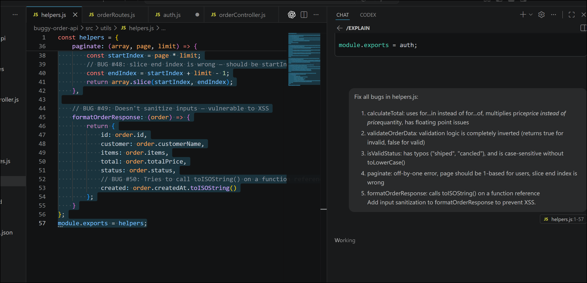

1. Review the proposed changes — every tool invocation is transparently displayed in the UI.

   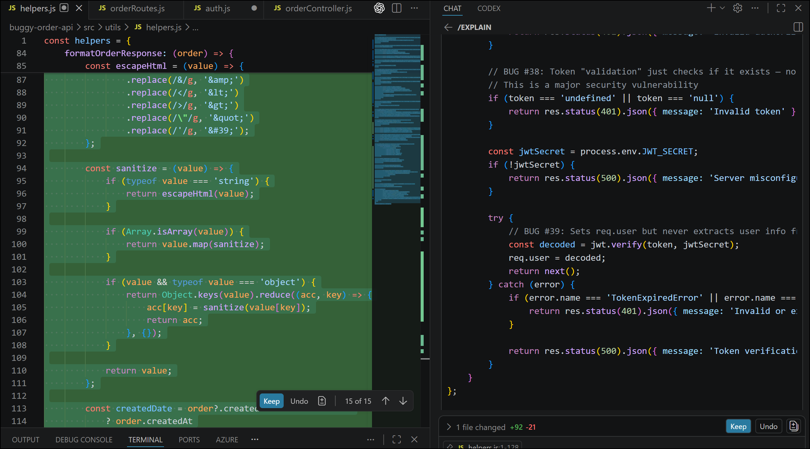

1. Use `/fix` in Agent mode and fix any pending issues.

1. Now run the server:

   ```
   npm start
   ```

   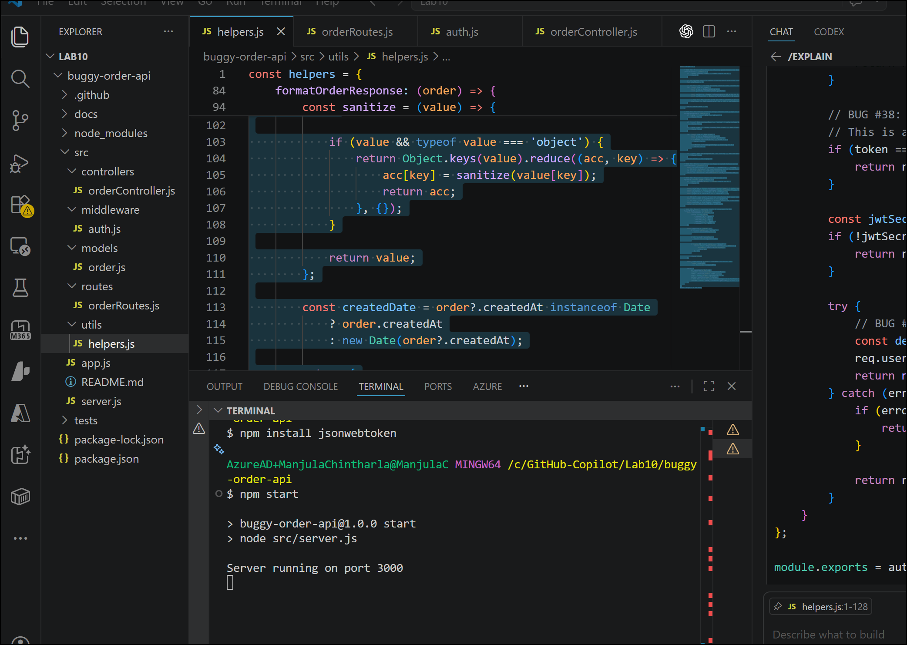

1. Duplicate a workspace and run the below command to create an order:

   ```
   curl -i -X POST http://localhost:3000/api/v1/orders -H "Content-Type: application/json" -d '{"customerName":"Alice","items":[{"name":"Book","price":10.5,"quantity":2}],"shippingAddress":"123 Main St"}'
   ```

   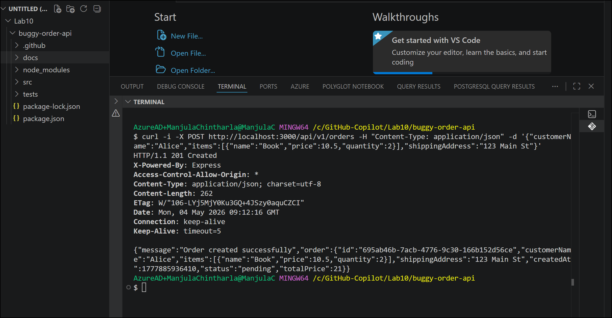

1. Run the below command to read all orders:

   ```
   curl -i http://localhost:3000/api/v1/orders
   ```

   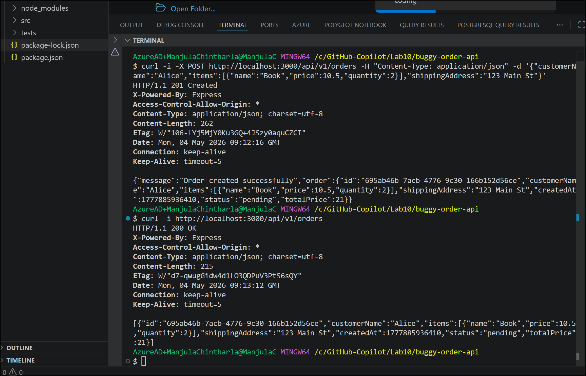

1. Validate the summary route:

   ```
   curl -i http://localhost:3000/api/v1/orders/summary
   ```

   Expected: 200 OK with totals.

   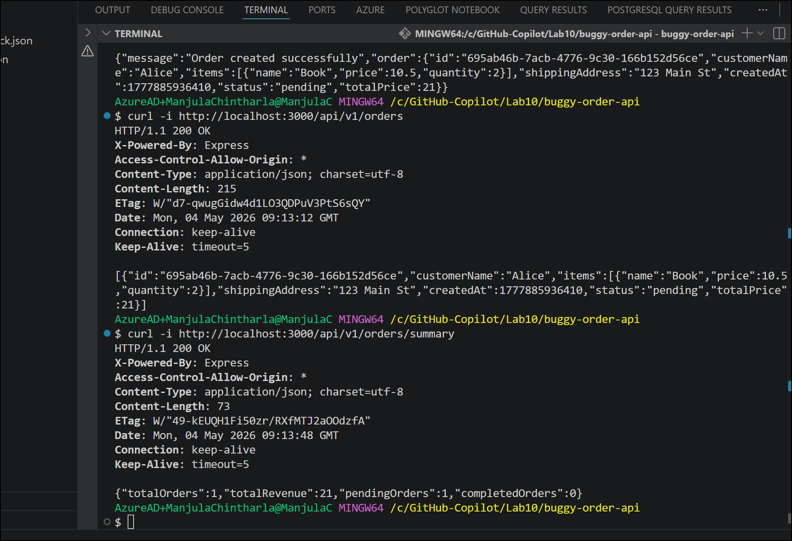

> **Congratulations** on completing the task! Now, it's time to validate it. Here are the steps:
> - Hit the Validate button for the corresponding task. If you receive a success message, you can proceed to the next task.
> - If not, carefully read the error message and retry the step, following the instructions in the lab guide.
> - If you need any assistance, please contact us at cloudlabs-support@spektrasystems.com. We are available 24/7 to help you out.
<validation step="ex10-task9-lab10-fix-helpers" />

## Review

In this lab, you have completed the following:

   - Assessed buggy Node.js code as a developer before using Copilot
   - Used /explain to understand and analyze unfamiliar code and bugs
   - Used /fix slash command to generate targeted bug fixes across 7 files
   - Fixed security vulnerabilities in authentication middleware using JWT
   - Used Agent Mode to fix complex multi-bug files in src/utils/helpers.js
   - Validated all fixes by running the API and testing endpoints with curl

### You have successfully completed the lab!
### In the Lab Guide section, click the **Next >>** button to proceed to Lab 11.


