# Lab 12: Building a Flask Customer Health Dashboard Using GitHub Copilot (Optional)

### Estimated Duration: 60 Minutes

## Overview

In this lab, you will use GitHub Copilot to scaffold a simple, server-rendered Flask customer health dashboard with mock data and Bootstrap 5 styling. You will validate the generated data, application code, and template against your own architectural decisions and a structured checklist.

You are a developer on a Customer Success team. Your product manager has requested a quick internal prototype: a **Customer Health Dashboard** that displays 10 mock customer accounts with their health scores and risk levels. The dashboard must be a simple, server-rendered Flask app with Bootstrap 5 styling no database, no REST API, no frontend framework. Your goal is to use **GitHub Copilot** to scaffold and build this prototype as fast as possible while maintaining code quality and ownership.

## Objectives

In this lab, you will complete the following tasks:

   - Task 1: Understand the Problem (Human Reasoning)
   - Task 2: Use GitHub Copilot to Scaffold the Mock Data Module
   - Task 3: Use Copilot to Generate the Flask Application (app.py)
   - Task 4: Use Copilot Chat to Generate the Dashboard Template (dashboard.html)
   - Task 5: Validate Results Run the Application

### Task 1: Understand the Problem (Human Reasoning)

In this task, you will set up the Flask project environment and think through the architecture no database, no REST API, and how risk levels map to Bootstrap badge colors. You will make these design decisions yourself before writing any code or prompting Copilot.

1. Create a new project folder **Lab12** in your `C:/` drive and open it in Visual Studio Code. Open Terminal -> GitBash and run the below commands:

   ```
   mkdir customer-health-dashboard && cd customer-health-dashboard
   python -m venv venv
   source venv/Scripts/activate
   pip install flask
   ```

   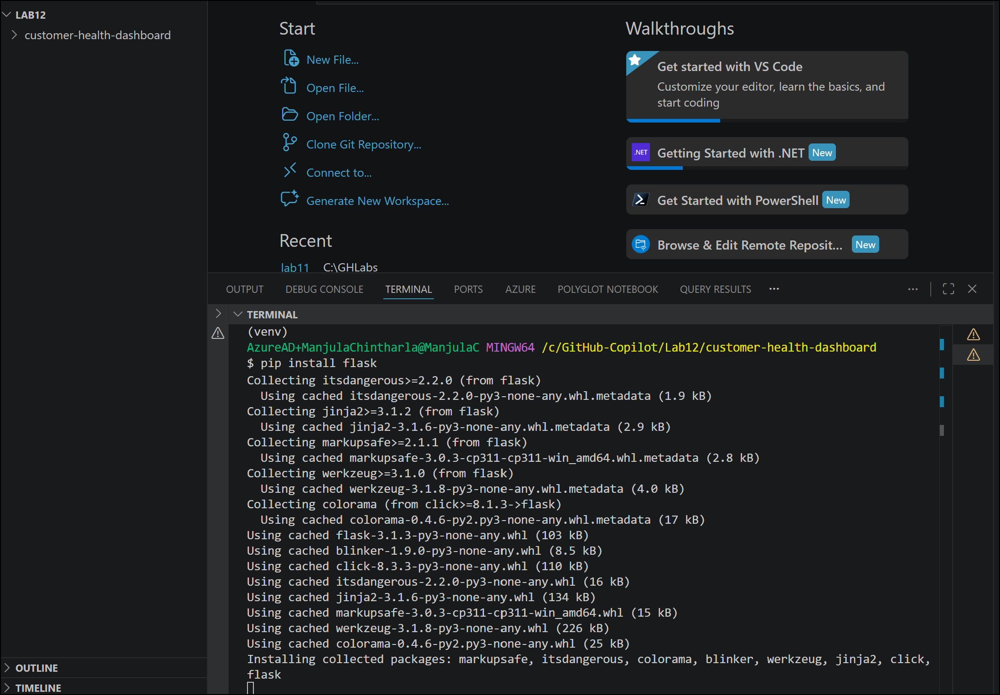

1. Before touching any code, think through the architecture:

   **Key design decisions (developer-owned, NOT Copilot's job):**

   - No database all data lives in a Python list

   - No REST API the route returns rendered HTML directly

   - Risk levels map to Bootstrap badge colors: healthy → green, at-risk → warning/yellow, critical → danger/red

      > **Note:** Instead of relying on Copilot to provide suggestions, you can provide hints about what code you expect by using code comments. Defining your architecture first ensures your prompts are precise and your review is informed.

> **Congratulations** on completing the task! Now, it's time to validate it. Here are the steps:
> - Hit the Validate button for the corresponding task. If you receive a success message, you can proceed to the next task.
> - If not, carefully read the error message and retry the step, following the instructions in the lab guide.
> - If you need any assistance, please contact us at cloudlabs-support@spektrasystems.com. We are available 24/7 to help you out.
<validation step="ex12-task1-lab12-understand-problem" />

### Task 2: Use GitHub Copilot to Scaffold the Mock Data Module

In this task, you will write an intent-driven comment in data.py to have Copilot generate 10 mock customer records. You will verify the data for correct field count, valid ranges, and that risk_level logically matches each health_score.

1. Create a new file: **data.py** in the root folder.

1. Type the following **intent-driven comment** at the top of the file and press **Enter**:

   ```
   # Mock customer data for a Customer Health Dashboard prototype.

   # Each customer has: name (str), industry (str), health_score (int 0-100), and risk_level (one of "healthy", "at-risk", "critical").

   # Generate a list of exactly 10 diverse customers across different industries.
   ```

1. **Pause and observe.** Copilot offers dimmed ghost text suggestions as you type: sometimes the completion of the current line, sometimes a whole new block of code.

1. Press **Tab** to accept the suggestion. Copilot should generate a list of 10 customer dictionaries.

   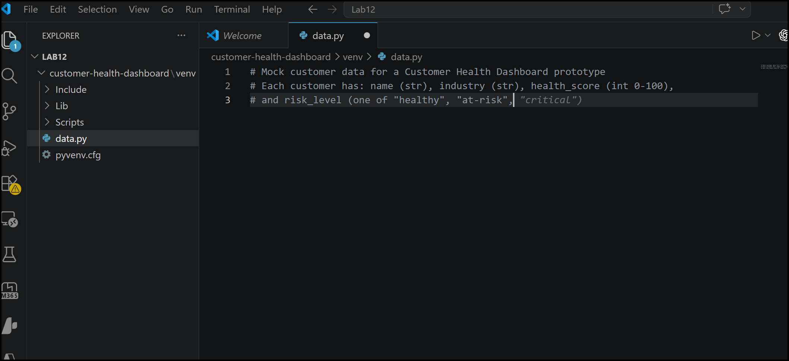

   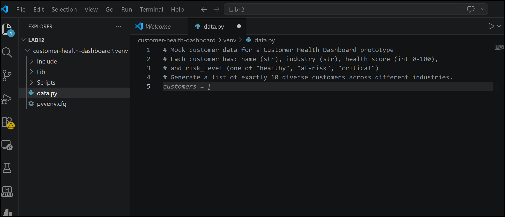

   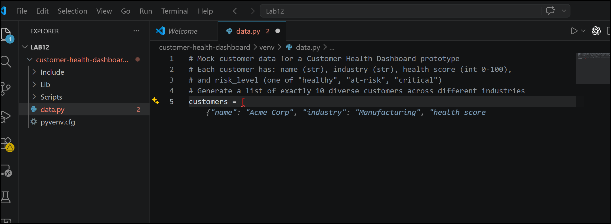

1. Do NOT blindly accept. Verify:

   - Exactly **10** customers are present

   - Each has all 4 required fields: name, industry, health_score, risk_level

   - health_score values are integers between 0–100

   - risk_level values are strictly one of: "healthy", "at-risk", "critical"

   - The risk_level logically correlates with health_score (e.g., a score of 25 shouldn't say "healthy")

   - Industries are diverse (not all "Technology")

      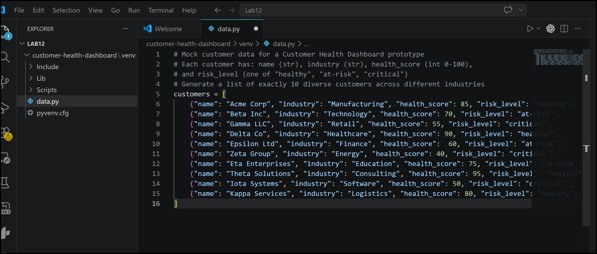

1. If Copilot's output is incomplete or has inconsistencies, **refine using Copilot Chat**. Press **Ctrl+I** and type:

   ```
   Fix this customer list: ensure health_score and risk_level are consistent.

   Scores 0-40 should be "critical", 41-70 should be "at-risk", 71-100 should be "healthy".

   Ensure exactly 10 customers with diverse industries.
   ```

1. Your final data.py should look similar to this (Copilot's output will vary):

   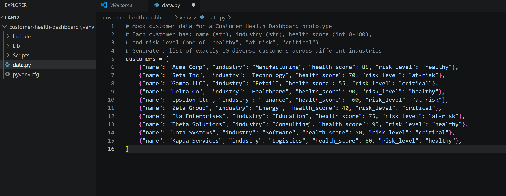

   > **Note:** Copilot generates plausible data, but it doesn't understand your business rules. A health score of 90 labeled "critical" would mislead stakeholders. **You own the data contract.**

> **Congratulations** on completing the task! Now, it's time to validate it. Here are the steps:
> - Hit the Validate button for the corresponding task. If you receive a success message, you can proceed to the next task.
> - If not, carefully read the error message and retry the step, following the instructions in the lab guide.
> - If you need any assistance, please contact us at cloudlabs-support@spektrasystems.com. We are available 24/7 to help you out.
<validation step="ex12-task2-lab12-scaffold-data-module" />

### Task 3: Use Copilot to Generate the Flask Application (app.py)

In this task, you will use comment prompts to have Copilot scaffold app.py with a single server-rendered route that passes customer data to a template. You will verify it uses render_template (not jsonify) and runs in debug mode on port 5000.

1. Create a new file: **app.py** in the root folder.

1. Type the following comment block and let Copilot suggest the implementation:

   ```
   # Flask application for Customer Health Dashboard

   # - Import customers from data.py

   # - Single route "/" renders dashboard.html with the customer list

   # - Server-rendered HTML only, no REST API

   # - Run on port 5000 in debug mode
   ```

   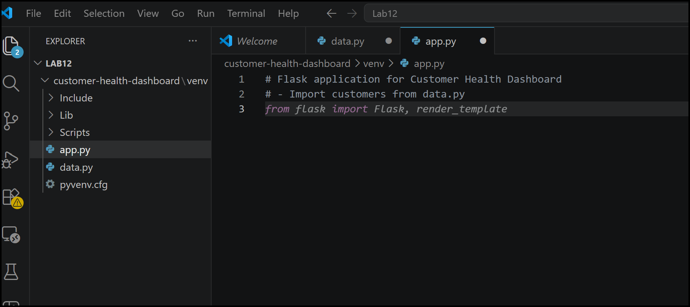

   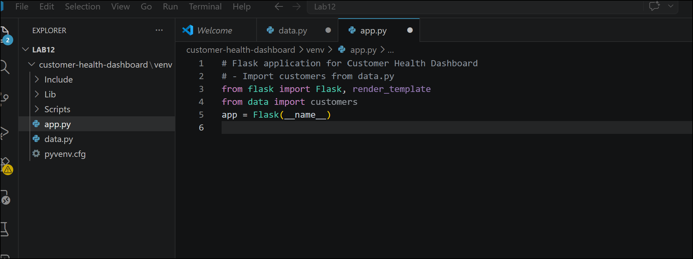

1. On the next line, type the comment `# Route to render the dashboard` and press **Enter**. Then type `@` and let Copilot suggest the route decorator and function:

   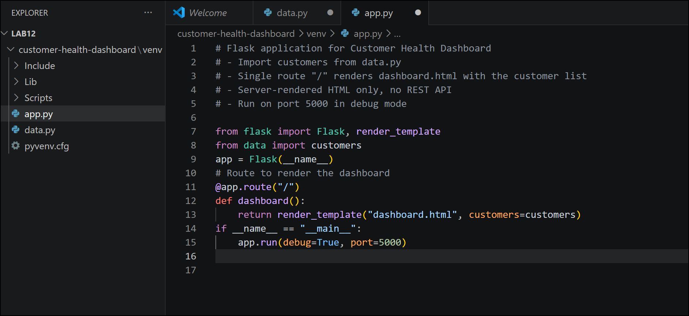

1. Verify:

   - `render_template` is imported (not `jsonify` — we're NOT building an API)

   - Template name is `"dashboard.html"` (must match the file we'll create next)

   - The `customers` variable is passed to the template context

   - Debug mode is True (acceptable for a prototype, never for production)

      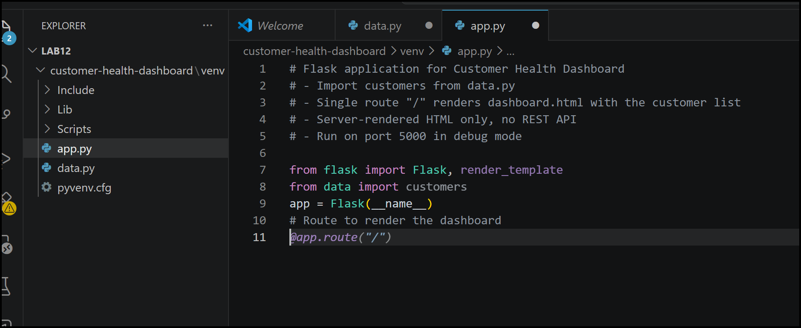

1. Your final app.py should look like:

   

   > **Note:** Having related files open in VS Code while using Copilot helps set context and lets Copilot get a bigger picture of your project. Keep data.py open in a tab while building app.py — Copilot will cross-reference field names and structure.

> **Congratulations** on completing the task! Now, it's time to validate it. Here are the steps:
> - Hit the Validate button for the corresponding task. If you receive a success message, you can proceed to the next task.
> - If not, carefully read the error message and retry the step, following the instructions in the lab guide.
> - If you need any assistance, please contact us at cloudlabs-support@spektrasystems.com. We are available 24/7 to help you out.
<validation step="ex12-task3-lab12-generate-apppy" />

### Task 4: Use Copilot Chat to Generate the Dashboard Template (dashboard.html)

In this task, you will use a detailed Copilot Chat prompt in Agent mode to generate a Bootstrap 5 Jinja2 dashboard template with color-coded risk badges. You will review the generated HTML against your requirements before accepting it.

1. Create the folder structure in the root folder:

   ```
   templates/
   ```

1. Create a new file: **templates/dashboard.html**.

   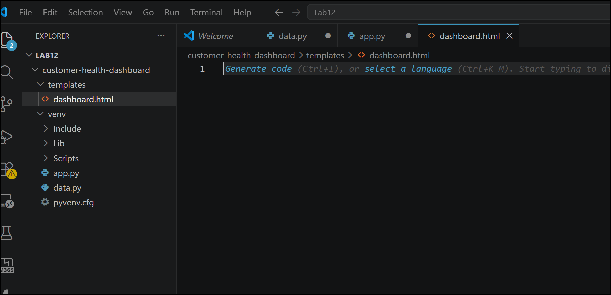

1. Open **Copilot Chat** (click the Chat icon in the sidebar or press **Ctrl+Shift+I**).

1. Enter the following **detailed prompt** in Agent mode:

   ```
   Generate a Jinja2 HTML template called dashboard.html for a Flask app.
   Requirements:
   - Use Bootstrap 5 via CDN (no local files)
   - Page title: "Customer Health Dashboard"
   - Display a responsive Bootstrap table with columns: #, Customer Name, Industry, Health Score, Risk Level
   - Iterate over a `customers` list passed from Flask
   - Each customer dict has keys: name, industry, health_score, risk_level
   - Color-code the Risk Level column using Bootstrap badges:
   - "healthy" → badge bg-success
   - "at-risk" → badge bg-warning text-dark
   - "critical" → badge bg-danger
   - Add a container with margin-top, a heading, and a brief subtitle
   - Use loop.index for the row number
   - Clean, production-quality HTML
   ```

   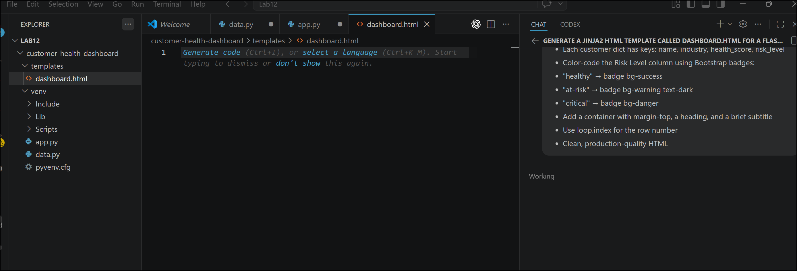

1. Review the Copilot Chat output carefully before pasting it into your file. Click on **Keep** if it matches your requirements:

   - Bootstrap 5 CDN link is present in \<head\> (not Bootstrap 4)

   - Jinja2 `` loop is correct

   - Badge classes match the specification exactly

   - The `text-dark` class is applied to the `bg-warning` badge (yellow badges need dark text for readability)

   - `{{ loop.index }}` is used for row numbering (not loop.index0)

   - No hardcoded customer data — everything comes from the template variable

      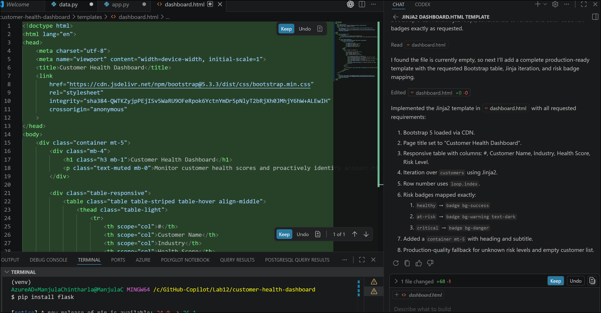

1. Your final templates/dashboard.html should look similar to:

   

   > **Note:** The template involves multiple concerns (HTML structure, Bootstrap classes, Jinja2 logic, conditional rendering). Copilot Chat excels at multi-line, multi-concern generation where a single comment prompt would be insufficient.

> **Congratulations** on completing the task! Now, it's time to validate it. Here are the steps:
> - Hit the Validate button for the corresponding task. If you receive a success message, you can proceed to the next task.
> - If not, carefully read the error message and retry the step, following the instructions in the lab guide.
> - If you need any assistance, please contact us at cloudlabs-support@spektrasystems.com. We are available 24/7 to help you out.
<validation step="ex12-task4-lab12-generate-dashboard-template" />

### Task 5: Validate Results Run the Application

In this task, you will run the Flask app and check the dashboard against a validation checklist covering page load, row count, badge colors, and layout. You will use Copilot's /fix to debug any errors that come up.

1. Open the VS Code **integrated terminal** (Ctrl+\` or **Terminal → New Terminal**) -> GitBash.

1. Ensure your virtual environment is activated, then run:

   ```
   python app.py
   ```

1. You should see output similar to:

   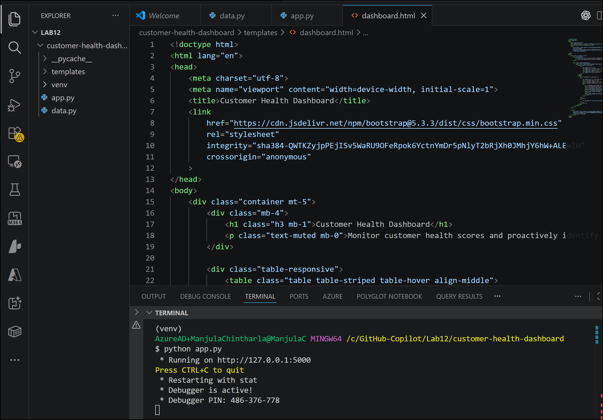

1. Open your browser and navigate to +++http://127.0.0.1:5000+++.

   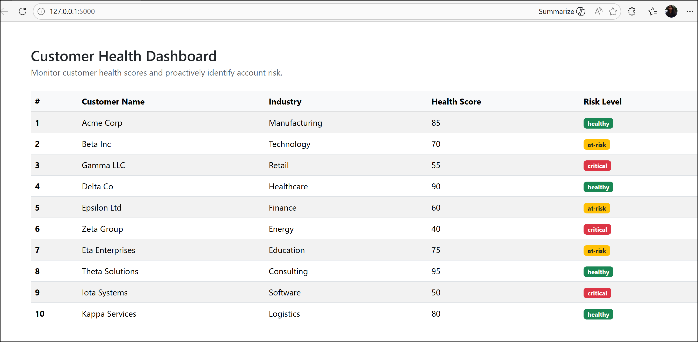

1. **Validation Checklist:**

   | Check | Expected Result |
   |--|--|
   | Page loads without errors | HTTP 200, no stack traces |
   | Title displays | "Customer Health Dashboard" in heading |
   | Table shows 10 rows | Exactly 10 customer rows rendered |
   | All columns populated | #, Name, Industry, Score, Risk Level filled in |
   | Healthy badge | Green (bg-success) badge appears |
   | At-Risk badge | Yellow (bg-warning) badge with dark text |
   | Critical badge | Red (bg-danger) badge appears |
   | Responsive layout | Table adjusts on browser resize |

1. **If errors occur**, use Copilot to debug. Select the error in the terminal, press **Ctrl+I**, and type:

   ```
   /fix Explain this Flask error and suggest a fix
   ```

   Copilot works even better if you give it an error message or highlight the part of the code that's broken.

> **Congratulations** on completing the task! Now, it's time to validate it. Here are the steps:
> - Hit the Validate button for the corresponding task. If you receive a success message, you can proceed to the next task.
> - If not, carefully read the error message and retry the step, following the instructions in the lab guide.
> - If you need any assistance, please contact us at cloudlabs-support@spektrasystems.com. We are available 24/7 to help you out.
<validation step="ex12-task5-lab12-validate-app" />

## Review

In this lab, you have completed the following:

   - Reasoned about architecture and design decisions before writing any code
   - Used intent-driven comments to scaffold a mock customer data module with Copilot
   - Generated a Flask application (app.py) using comment-driven Copilot suggestions
   - Used Copilot Chat to generate a multi-concern Jinja2 Bootstrap 5 dashboard template
   - Validated the running application against a structured checklist
   - Used /fix to debug any errors with Copilot assistance

### You have successfully completed the lab!

 
