# Hands-on Labs - GitHub Copilot

### Overall Estimated Duration: 9.5 Hours

## Overview

In this hands-on lab series, you will use **GitHub Copilot** as an AI pair programmer to accelerate real-world, day-to-day development tasks across Python and Node.js codebases. You will progress from building a Task Management REST API from scratch, through refactoring an inherited order processing module and rapidly prototyping a full-stack dashboard, to debugging a buggy Node.js REST API and resolving a simulated production incident under time pressure. Throughout, you will practice using GitHub Copilot's Autocomplete, Chat, and Agent modes, all while retaining full developer judgment over what Copilot suggests, refines, or rejects.

## Objectives

In this lab, you will:

- **Lab 1:** Build a Python Flask Task Management REST API from an empty repository using GitHub Copilot to accelerate scaffolding, feature development, and testing.
- **Lab 2:** Inherit a poorly written order processing module and use GitHub Copilot to understand, refactor, test, and document it with a code-review mindset.
- **Lab 3:** Use GitHub Copilot to rapidly scaffold a demo-ready Flask customer health scoring dashboard from a vague business request.
- **Lab 4:** Use GitHub Copilot to systematically identify, understand, and fix bugs, security vulnerabilities, and missing validation in a buggy Node.js Express REST API.
- **Lab 5:** Respond to a simulated production incident at a fintech company, using human triage first and GitHub Copilot's Agent mode to diagnose and fix critical bugs under time pressure.
- **Lab 6:** Use GitHub Copilot to scaffold a simple, server-rendered Flask customer health dashboard with mock data and Bootstrap 5 styling.

## Pre-requisites

Participants should have:

- Visual Studio Code (or another Copilot-supported IDE).
- GitHub Copilot extension installed and authenticated, with an active or trial license.
- A GitHub account with Copilot access.
- Python 3.x with `pip`.
- Node.js and `npm`.
- Basic familiarity with Python/Flask and Node.js/Express concepts.
- A modern web browser such as Microsoft Edge or Google Chrome.

## Accessing Your Lab Environment

Once you're ready to dive in, your virtual machine and **Guide** will be right at your fingertips within your web browser.


## Virtual Machine & Lab Guide

Your virtual machine is your workhorse throughout the workshop. The guide is your roadmap to success.

## Lab Guide Zoom In/Zoom Out

To adjust the zoom level for the environment page, click the **A↕ : 100%** icon located next to the timer in the lab environment.


## Exploring Your Lab Resources

To get a better understanding of your lab resources and credentials, navigate to the **Environment** tab.


## Managing Your Virtual Machine

Feel free to **start, restart, or stop (2)** your virtual machine as needed from the **Resources (1)** tab. Your experience is in your hands!


## Utilizing the Split Window Feature

For convenience, you can open the lab guide in a separate window by selecting the **Split Window** button from the top right corner.


## Resize the Virtual Machine View

Use the **slider (three vertical dots)** located between the **Virtual Machine** and the **Lab Guide** panes to adjust the display size, allowing you to customize the layout based on your preference.


### Login to GitHub

1. In the **Lab VM**, open the **Microsoft Edge** browser from the desktop.

   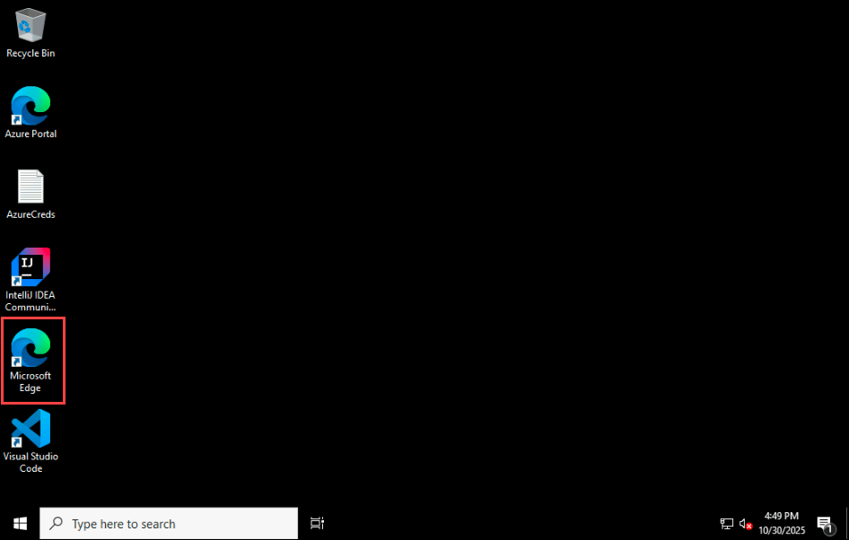

1. Navigate to the **GitHub login** page by copying and pasting the following URL into the address bar:

   ```
   https://github.com/login
   ```

1. On the **Sign in to GitHub** tab, enter the provided **GitHub username** in the input field, and click on **Sign in with your identity provider** **(2)**.

    - **Email/Username:** <inject key="githubUsername" enableCopy="true"/> **(1)**

      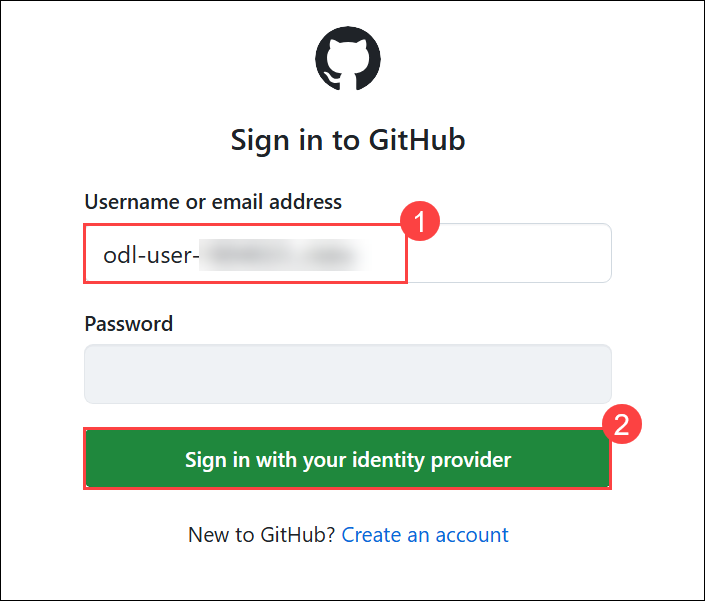

1. Click on **Continue** on the **Single sign-on to CloudLabs Organizations** page to proceed.

   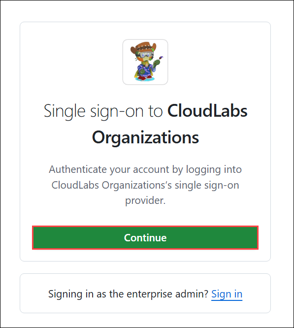

1. You'll see the **Sign in** tab. Here, enter your Azure Entra credentials and click **Next (2)**.

   - **Email/Username:** <inject key="githubEmail"></inject> **(1)**

     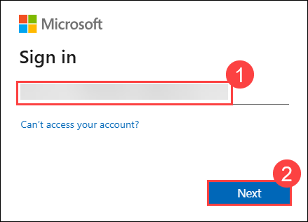

1. Next, provide your Temporary Password and click on **Sign in (2)**

   - **Temporary Access Pass:** <inject key="githubPassword"></inject> **(1)**

     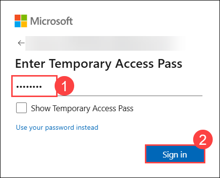

1. On the **Stay Signed in?** pop-up, click on No.

   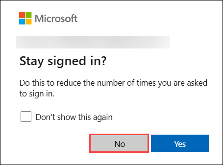

1. You are now successfully logged in to **GitHub** and have been redirected to the **GitHub homepage**.

   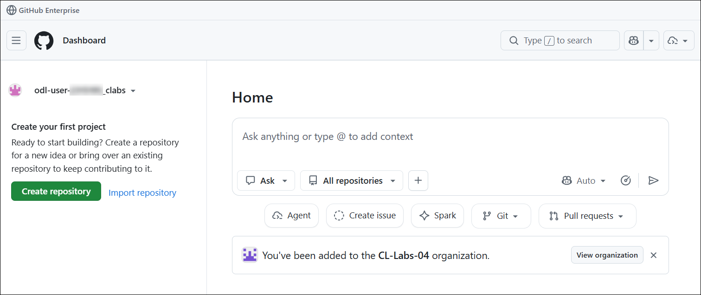

   >**Note** : If **Start using Copilot** pop-up appears, click on **X** to close it
    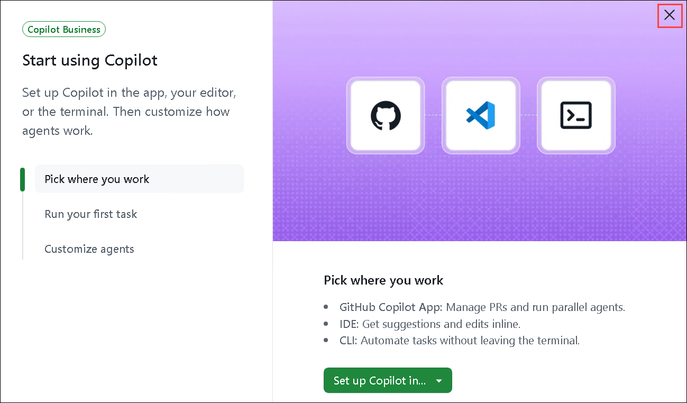

### GitHub Copilot is moving to usage-based billing

Instead of counting premium requests, every Copilot plan will include a monthly allotment of **GitHub AI Credits**, with the option for paid plans to purchase additional usage. Usage will be calculated based on token consumption, including input, output, and cached tokens, using the listed API rates for each model.​

​**What's changing**

- Starting June 1, GitHub will replace Premium Request Units with GitHub AI Credits. ​
- Credits will be consumed based on actual AI token usage. ​
- Base pricing for all GitHub Copilot plans will remain unchanged. ​
- Code completions and Next Edit Suggestions will continue to be included at no extra cost. ​
- The fallback experience to lower-cost AI models will no longer be available after credits are exhausted. ​
- Copilot Code Review will also consume GitHub Actions minutes in addition to GitHub AI Credits.​

### GitHub Copilot Plan updates and AI Credit changes​

| Plan | Monthly Price | Included Monthly AI Credits | Key Update |
|:---|:---|:---|:---|
| **Copilot Pro** | $10/month | $10 AI Credits | Migrates to usage-based billing from June 1 |
| **Copilot Pro+** | $39/month | $39 AI Credits | Includes higher AI credit allocation |
| **Copilot Business** | $19/user/month | $19 AI Credits | Includes pooled organizational credits |
| **Copilot Enterprise** | $39/user/month | $39 AI Credits | Adds advanced budget and spending controls |

### Managing roles and governance via enterprise teams:

GitHub Enterprise Cloud has introduced new enterprise-level governance and management capabilities to help enterprises manage access, security, and policies at scale.

As of today, enterprise owners can use GitHub’s API or the enterprise settings UI to:

- Assign enterprise teams to organizations.
- Create and assign custom enterprise roles.
- Assign enterprise roles to both enterprise teams and users, including the new predefined Enterprise Security Manager role.
- Empower organization and repository owners to assign roles to enterprise teams within their scope.
- Assign enterprise teams and roles to ruleset bypass lists.

### Copilot Insights:

The Copilot usage metrics dashboard gives enterprise administrators and billing managers clear visibility into Copilot adoption and usage under the Insights tab.

These metrics help you understand:

- **Overall usage and adoption:** Review indicators like weekly usage provide a broad view of Copilot adoption across your enterprise.
- **Specific model, feature, and language usage:** See which AI models and programming languages are most utilized by your teams, highlighting areas for even greater value.
- **Agent adoption percentage:** Track how many developers are using Copilot for advanced tasks like refactoring, debugging, and complex problem solving. High agent adoption signals a shift toward truly transformative coding.


## Setting up IDE

1. Open the **Visual Studio Code** shortcut from the desktop of your **Lab VM**.

   

1. To sign in to **GitHub Copilot**, follow the steps below:

   - In Visual Studio Code, click on the **Icon (1)** in the GitHub Copilot Chat panel located at the bottom-right corner of the window, and select **Use AI Features (2)**.

     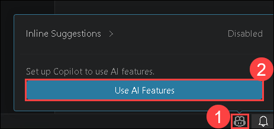

   - On the *Sign in to use GitHub Copilot* screen, select **Continue with GitHub** to sign in.
  
     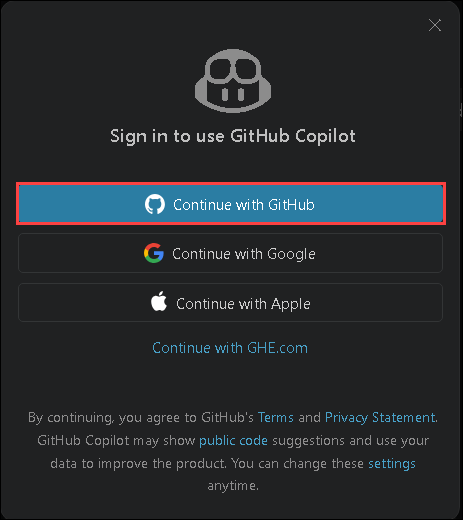

   - Now, in the browser, click on **Continue** to Authorize Visual Studio Code. 

     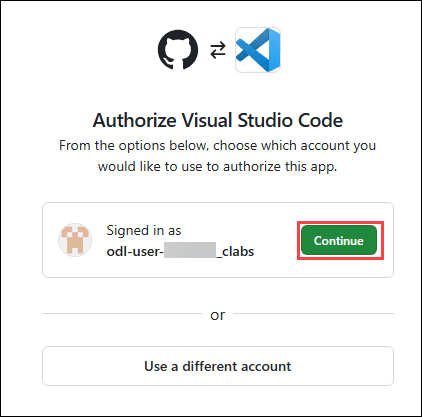

   - On the next window, click on **Authrize Visual-Studio-Code**.

     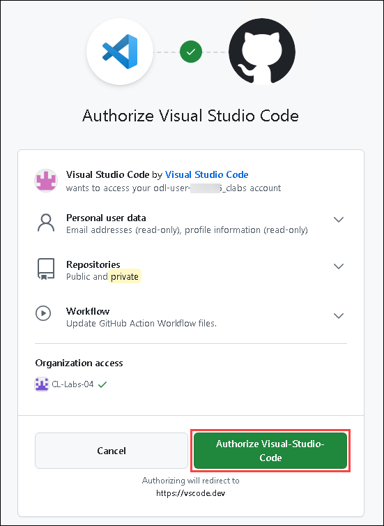

   - You will see a pop-up asking **This site is trying to open Visual Studio Code**. Enable the **CheckBox (1)** and then click on **Open (2)**. It will take you to VS Code. 

     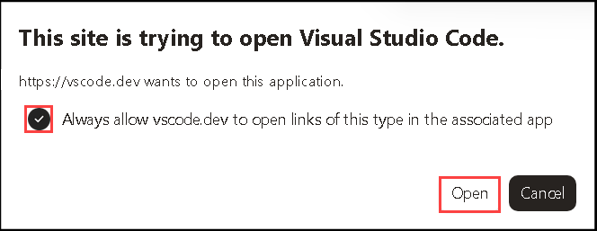

## Summary

In this lab, you successfully set up your development environment, logged into GitHub, created a new repository, and configured Visual Studio Code with GitHub Copilot.  

## Support Contact

The CloudLabs support team is available 24/7, 365 days a year, via email and live chat to ensure seamless assistance at any time. We offer dedicated support channels tailored specifically for both learners and instructors, ensuring that all your needs are promptly and efficiently addressed.

Learner Support Contacts:

- Email Support: cloudlabs-support@spektrasystems.com
- Live Chat Support: https://cloudlabs.ai/labs-support

#### You have successfully completed the lab. Click on **Next >>** to continue to the next lab.
