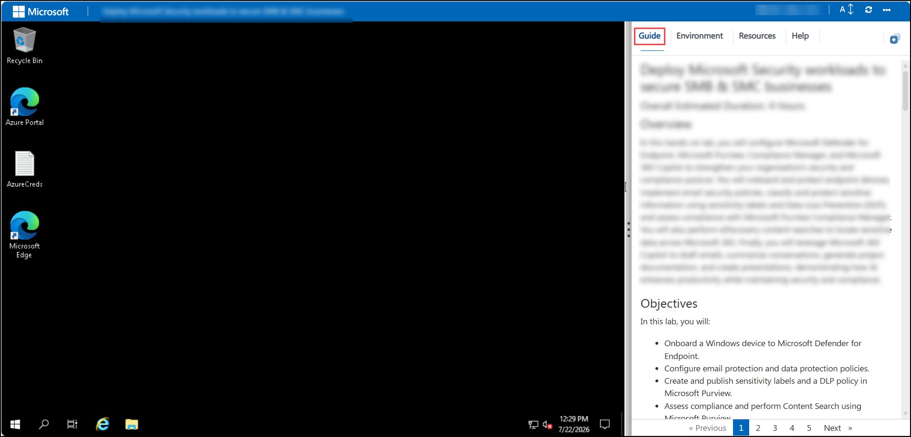
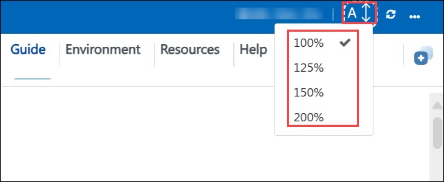
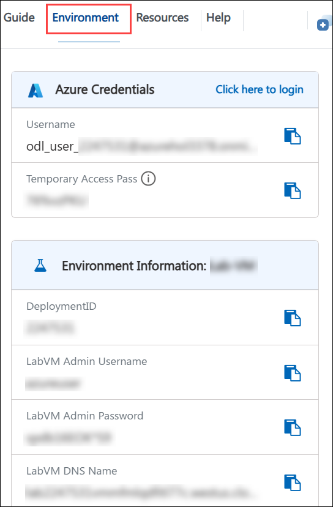
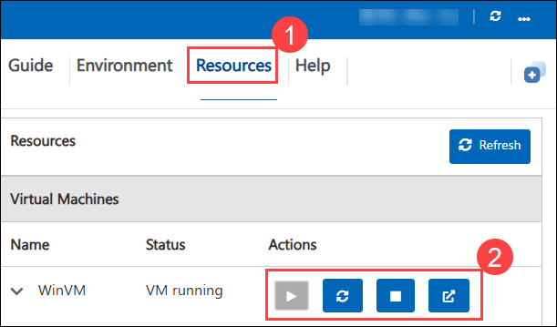
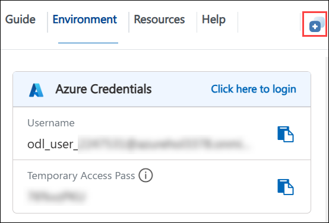
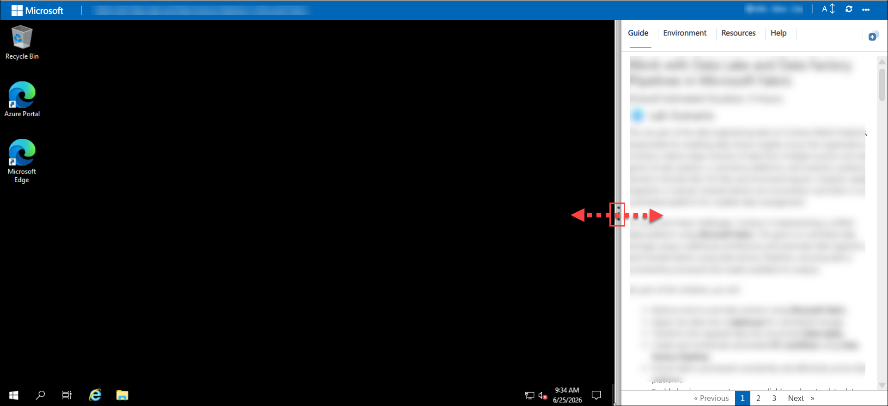
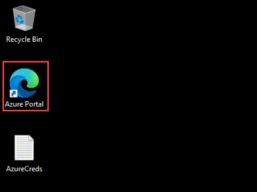
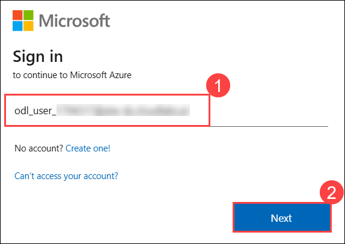
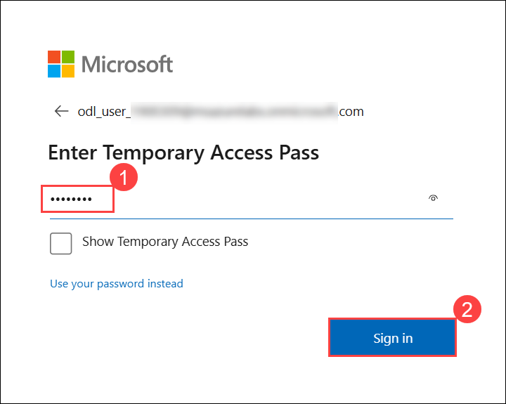
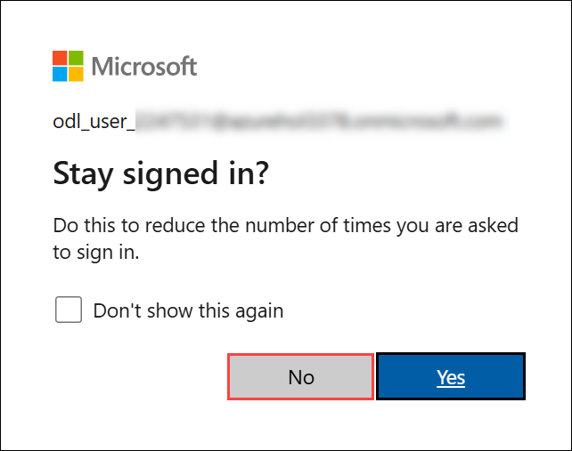

# Accelerating day-to-day development tasks with GitHub Copilot

### Overall Estimated Duration: 17 Hours 15 Minutes

## Overview

In this hands-on lab series, you will use **GitHub Copilot** as an AI pair programmer to accelerate real-world, day-to-day development tasks across Java, Python, and Node.js codebases. You will progress from understanding and testing an existing Java Spring Boot API, through debugging, documentation, and refactoring exercises, to building full-stack prototypes from scratch, fixing buggy REST APIs, and resolving a simulated production incident under time pressure. Throughout, you will practice using Copilot's Autocomplete, Chat, Agent, and custom prompt modes, and building your own MCP (Model Context Protocol) server — all while retaining full developer judgment over what Copilot suggests, refines, or rejects.

## Objectives

In this lab, you will:

- **Lab 1:** Use GitHub Copilot to understand an existing Java Spring Boot REST API and write unit tests across the repository, service, and controller layers, then extend the application with a new feature.
- **Lab 2:** Use GitHub Copilot as a debugging partner to interpret compile-time and runtime errors in a Java Spring Boot application, identify root causes, and apply validated fixes.
- **Lab 3:** Use GitHub Copilot to generate and refine functional and technical documentation for a Java Spring Boot API, including Swagger/OpenAPI support and JavaDoc.
- **Lab 4:** Use GitHub Copilot to migrate Markdown documentation into working code, then refactor methods, add error handling, extract reusable logic, and generate documentation.
- **Lab 5 (Optional):** Explore GitHub Copilot's Autocomplete, Chat, and Agent modes, and create reusable custom prompt files for explaining, reviewing, and testing code.
- **Lab 6 (Optional):** Build a custom Java MCP server that exposes tools GitHub Copilot can discover and invoke, and build an MCP client to connect to it.
- **Lab 7:** Build a Python Flask Task Management REST API from an empty repository using GitHub Copilot to accelerate scaffolding, feature development, and testing.
- **Lab 8:** Inherit a poorly written order processing module and use GitHub Copilot to understand, refactor, test, and document it with a code-review mindset.
- **Lab 9:** Use GitHub Copilot to rapidly scaffold a demo-ready Flask customer health scoring dashboard from a vague business request.
- **Lab 10:** Use GitHub Copilot to systematically identify, understand, and fix bugs, security vulnerabilities, and missing validation in a buggy Node.js Express REST API.
- **Lab 11 (Optional):** Respond to a simulated production incident at a fintech company, using human triage first and GitHub Copilot's Agent mode to diagnose and fix critical bugs under time pressure.
- **Lab 12 (Optional):** Use GitHub Copilot to scaffold a simple, server-rendered Flask customer health dashboard with mock data and Bootstrap 5 styling.

## Pre-requisites

Participants should have:

- Visual Studio Code (or another Copilot-supported IDE).
- GitHub Copilot extension installed and authenticated, with an active or trial license.
- A GitHub account with Copilot access.
- Java Development Kit (JDK) 17 or higher, and Apache Maven (or the Maven Wrapper `mvnw`).
- Python 3.x with `pip`.
- Node.js and `npm`.
- Basic familiarity with Java/Spring Boot, Python/Flask, and Node.js/Express concepts.
- A modern web browser such as Microsoft Edge or Google Chrome.

## Accessing Your Lab Environment

Once you're ready to dive in, your virtual machine and **Guide** will be right at your fingertips within your web browser.

## Virtual Machine & Lab Guide

Your virtual machine is your workhorse throughout the workshop. The guide is your roadmap to success.

## Lab Guide Zoom In/Zoom Out

To adjust the zoom level for the environment page, click the **A↕ : 100%** icon located next to the timer in the lab environment.

## Exploring Your Lab Resources

To get a better understanding of your lab resources and credentials, navigate to the **Environment** tab.

## Managing Your Virtual Machine

Feel free to **start, restart, or stop (2)** your virtual machine as needed from the **Resources (1)** tab. Your experience is in your hands!

## Utilizing the Split Window Feature

For convenience, you can open the lab guide in a separate window by selecting the **Split Window** button from the top right corner.

## Resize the Virtual Machine View

Use the **slider (three vertical dots)** located between the **Virtual Machine** and the **Lab Guide** panes to adjust the display size, allowing you to customize the layout based on your preference.

## Let's Get Started with Azure Portal
 
1. On your virtual machine, click on the **Azure Portal** icon.

    

1. On the **Sign in to Microsoft Azure** tab you will see the login screen, in that enter the following email/username, and click on **Next (2)**. 

   * **Email/Username**: <inject key="AzureAdUserEmail"></inject> **(1)**
   
      
     
1. Now enter the following password and click on **Sign in (2)**.
   
   * **Temporary Access Pass**: <inject key="AzureAdUserPassword"></inject> **(1)**
   
      

1. Click **No** on the Stay signed in? page.

    

1. If a **Welcome to Microsoft Azure** popup window appears, select **Maybe Later** to skip the tour.

## Support Contact

The CloudLabs support team is available 24/7, 365 days a year, via email and live chat to ensure seamless assistance at any time. We offer dedicated support channels tailored specifically for both learners and instructors, ensuring that all your needs are promptly and efficiently addressed.

Learner Support Contacts:

- Email Support: cloudlabs-support@spektrasystems.com
- Live Chat Support: https://cloudlabs.ai/labs-support

Click **Next >>** from the bottom right corner to embark on your Lab journey!

### Happy Learning!!